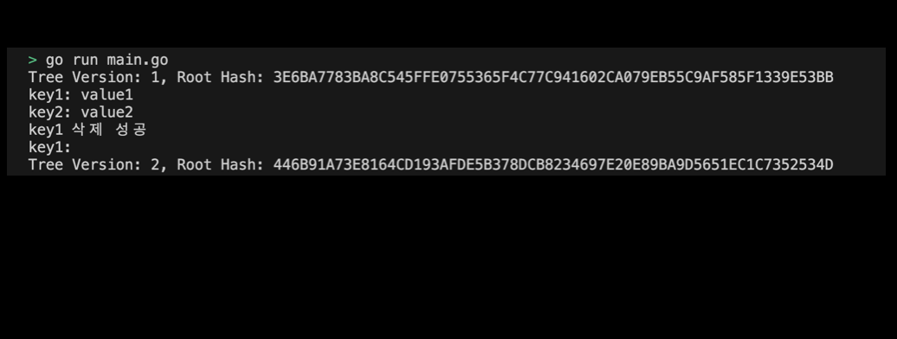

# 04-06. Handling of IAVL by Cosmos-SDK

### 00. (Practice) Treat Cosmos-SDK's IAVL
The IAVL tree provides the following main operations:
- Insertion: Adds a new key-value pair to the tree.
- Delete—Deletes a particular key from the tree.
- Search: Look up the value of a particular key.
- Verification: The integrity of the data is verified through the hash value of the Merkle tree.

Let's use the following calculations directly through practice.

## 1. Setting Preferences
The default settings are as follows:
```sh
# Create iavl directory
$ mkdir iavl && cd iavl

# Create iavl go module 
$ go mod init iavl
```

## 2. Creating code
Let's get the cosmos iavl binary of the code and try it ourselves as follows.
```go
package main

import (
	"fmt"

	"cosmossdk.io/log"
	"github.com/cosmos/iavl"
	idb "github.com/cosmos/iavl/db"
)

func main() {
	// Create memory database
	idb := idb.NewMemDB()

	// Create IAVL tree
	tree := iavl.NewMutableTree(idb, 100, false, log.NewNopLogger())
	
	// Insert key-value pair
	var value1 = []byte("value1")
	_, err := tree.Set([]byte("key1"), value1)
	if err != nil {
		fmt.Println(err)
	}
	_, err = tree.Set([]byte("key2"), []byte("value2"))
	if err != nil {
		fmt.Println(err)
	}
	
	// Commit Tree (Create root hash)
	hash, version, err := tree.SaveVersion()
	if err != nil {
		fmt.Println(err)
	}
	fmt.Printf("Tree Version: %d, Root Hash: %X\n", version, hash) // Tree Version: 1, Root Hash: 3E6BA7783BA8C545FFE0755365F4C77C941602CA079EB55C9AF585F1339E53BB

	// Search value
	val, err := tree.Get([]byte("key1"))
	if err != nil {
		fmt.Println(err)
	}
	fmt.Printf("key1: %s\n", val) // key1: value1

	val, err = tree.Get([]byte("key2"))
	if err != nil {
		fmt.Println(err)
	}
	fmt.Printf("key2: %s\n", val) // key2: value2
	
	// Delete key-value pair
	_, success, err := tree.Remove([]byte("key1"))
	if success {
		fmt.Println("Successfully deleted key1")
	}
	if err != nil {
		fmt.Println(err)
	}

	// 삭제 후 값 조회
	val, err = tree.Get([]byte("key1"))
	if err != nil {
		fmt.Println(err)
	}
	fmt.Printf("key1: %s\n", val) // key1: 

	// 트리 커밋 후 루트 해시 출력
	hash, version, err = tree.SaveVersion()
	if err != nil {
		fmt.Println(err)
	}
	fmt.Printf("Tree Version: %d, Root Hash: %X\n", version, hash) // Tree Version: 2, Root Hash: 446B91A73E8164CD193AFDE5B378DCB8234697E20E89BA9D5651EC1C7352534D
}
```
> Check the practice code: [04_iavl](../code/04_iavl/)

## 3. Example of submitting an IAVL execution screen
The results printed by running the program are as follows:
<div style="text-align: center;">
   
</div>

