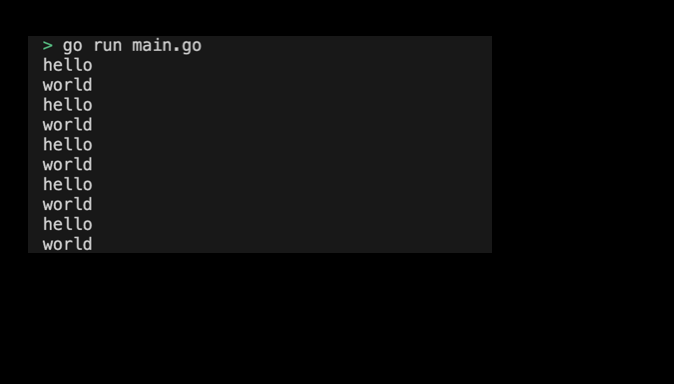

# 05-00. Try goroutine

## 0. Try goroutine
Let's use Gorutin in practice.

## 1. Setting Preferences
The default settings are as follows:
```sh
# Create goroutine directory
$ mkdir goroutine && cd goroutine

# Create goroutine go module 
$ go mod init goroutine
```

## 2. Creating code
Gorroutine is created using the `go` keyword and is used to invoke a function. Run the say function as a gorroutine to write a code that outputs "hello" and "world" at the same time:
```go
package main

import (
	"fmt"
	"time"
)

func say(s string) {
	for i := 0; i < 5; i++ {
		fmt.Println(s)
		time.Sleep(100 * time.Millisecond)
	}
}

func main() {
	go say("world")
	say("hello")
}
```
> Check the practice code: [05_goroutine](../code/05_goroutine/)


## 3. Example of submitting a goroutine execution screen
The results printed by running the program are as follows:
<div style="text-align: center;">
   
</div>


