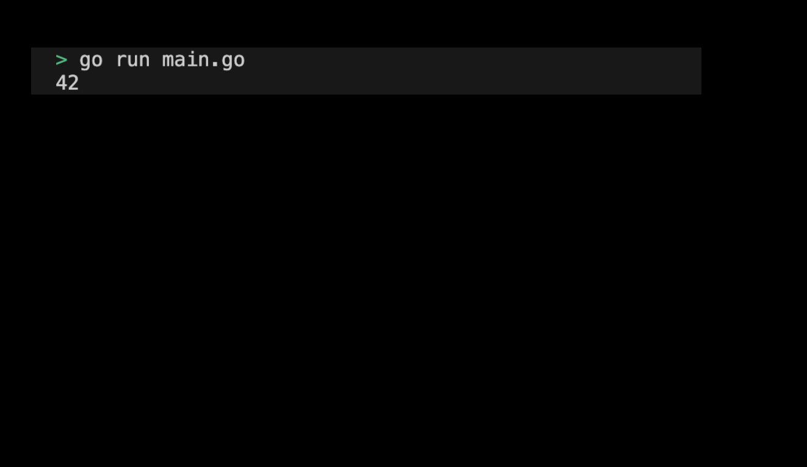

# 05m01. 송신 전용 및 수신 전용 channel 만들어보기

## 목차
0. 송신 전용 및 수신 전용 channel 만들어보기
1. 기본 설정하기
2. 코드 작성하기 
3. 송신 전용 및 수신 전용 channel 실행화면 제출 예시

## 0. 송신 전용 및 수신 전용 channel 만들어보기
채널은 송신 전용 또는 수신 전용으로 선언할 수 있다. 송신 전용 채널은 값을 보내기만 할 수 있고, 수신 전용 채널은 값을 받기만 할 수 있다. 실습을 통해 송신 전용 채널과 수신 전용 채널을 만들어보자.  실습을 통해 송신 전용 채널과 수신 전용 채널을 만들어보자.

## 1. 기본 설정하기
기본 설정은 다음과 같다:
```sh
# send_recv_channel 디렉토리 생성
$ mkdir send_recv_channel && cd send_recv_channel

# send_recv_channel go module 생성 
$ go mod init send_recv_channel
```

## 2. 코드 작성하기 
전체 코드는 다음과 같다: 
```go
package main

import (
	"fmt"
)

func send(ch chan<- int, val int) {
	ch <- val
}

func receive(ch <-chan int) int {
	return <-ch
}

func main() {
	ch := make(chan int)

	go send(ch, 42)
	val := receive(ch)
	fmt.Println(val) // 42
}
```
> 실습 코드 확인하기: [05_send_recv_channel](../code/05_send_recv_channel/)

## 3. 송신 전용 및 수신 전용 channel 실행화면 제출 예시
프로그램을 실행하여 출력된 결과는 다음과 같다:
<div style="text-align: center;">
   
</div>
