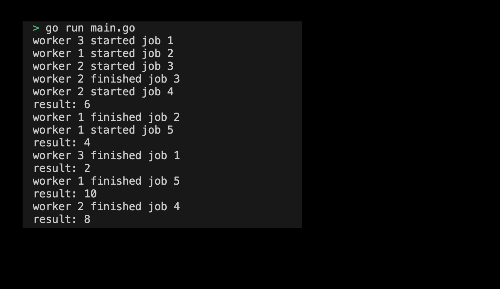

# 05-02. Using concurrent working patterns with channels

## 0. Using concurrent working patterns with channels
You can use the channel to distribute tasks to multiple goroutines. The worker pattern is a method of distributing tasks to multiple goroutines using the channel. Allow multiple worker goroutines to distribute tasks and process them simultaneously. Let's learn how to use worker patterns through practice.

## 1. Setting Preferences
The default settings are as follows:
```sh
# Create worker directory
$ mkdir worker && cd worker

# Create worker go module 
$ go mod init worker
```

## 2. Creating code
Write a code that uses the worker pattern as follows:
```go
package main

import (
	"fmt"
	"time"
)

// Worker function
func worker(id int, jobs <-chan int, results chan<- int) {
	for j := range jobs {
		fmt.Printf("worker %d started job %d\n", id, j)
		time.Sleep(time.Second)
		fmt.Printf("worker %d finished job %d\n", id, j)
		results <- j * 2
	}
}

func main() {
	const numJobs = 5
	jobs := make(chan int, numJobs)
	results := make(chan int, numJobs)

	// Create 3 worker gorouting
	for w := 1; w <= 3; w++ {
		go worker(w, jobs, results)
	}

	// Send jobs to work channel
	for j := 1; j <= numJobs; j++ {
		jobs <- j
	}
	close(jobs)

	// Receive results
	for a := 1; a <= numJobs; a++ {
		fmt.Printf("result: %d\n", <-results)
	}
}
```
> Check the practice code: [05_worker](../code/05_worker/)

## 3. Example of simultaneous task pattern execution screen submission using channel
The results printed by running the program are as follows:
<div style="text-align: center;">
   
</div>

