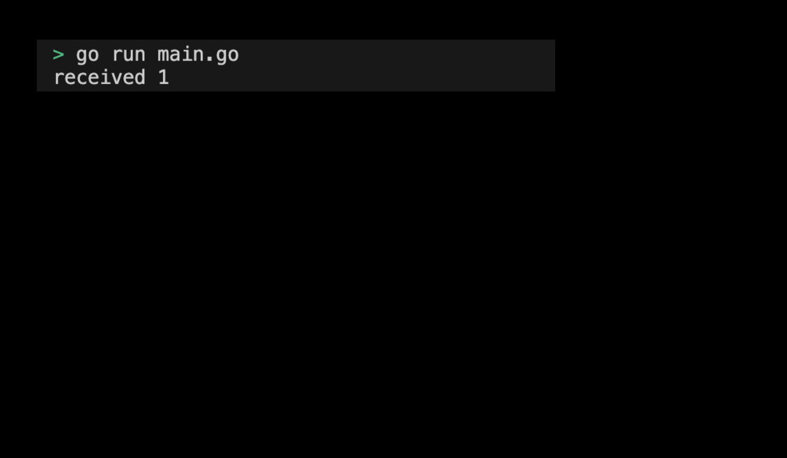

# 05-03. Try using the select statement

## 0. Try using select statement
The select statement waits for multiple channel tasks, and when one of them is ready, it executes that task. This is useful for controlling multichannel behavior. If you use the default case in the select statement, it runs immediately even if all channels are not ready. Let's learn how to use the select statement through practice.

## 1. Setting Preferences
The default settings are as follows:
```sh
# Create select directory
$ mkdir select && cd select

# Create select go module
$ go mod init select
```

## 2. Creating code
The full code is as follows:
```go
package main

import (
	"fmt"
)

func main() {
	ch := make(chan int, 1)
	ch <- 1
	select {
	case val := <-ch:
		fmt.Println("received", val)
	default:
		fmt.Println("no value received")
	}
}
```
> Check the practice code: [05_select](../code/05_select/)

## 3. Example of submitting a select statement execution screen
The results printed by running the program are as follows:
<div style="text-align: center;">
   
</div>

