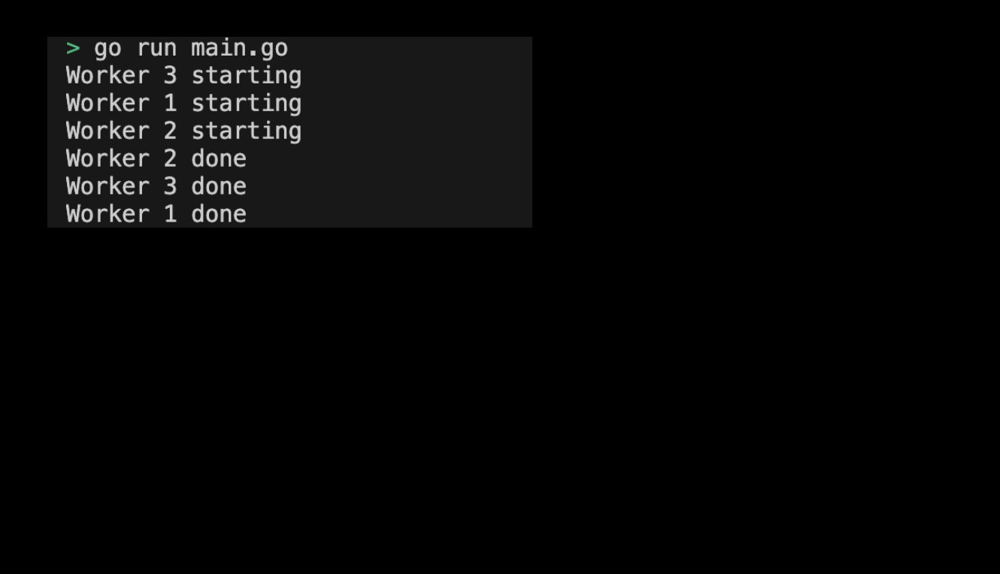

# 05-04. Try the sync package - WaitGroup

## Try 0.sync Package - WaitGroup
Go's sync package provides several tools for simultaneous programming. This includes WaitGroup and Mutex. WaitGroup is used to wait for the completion of several goroutines. In this practice, let's use 'WaitGroup' using the 'sync' package in the Go language.

## 1. Setting Preferences
The default settings are as follows:
```sh
# Create wait_group directory
$ mkdir wait_group && cd wait_group

# Create wait_group go module
$ go mod init wait_group
```

## 2. Creating code
The full code is as follows: 
```go
package main

import (
	"fmt"
	"sync"
	"time"
)

func worker(id int, wg *sync.WaitGroup) {
	defer wg.Done()
	fmt.Printf("Worker %d starting\n", id)
	time.Sleep(time.Second)
	fmt.Printf("Worker %d done\n", id)
}

func main() {
	var wg sync.WaitGroup

	for i := 1; i <= 3; i++ {
		wg.Add(1)
		go worker(i, &wg)
	}

	wg.Wait()
}
```
> Check the practice code: [05_wait_group](../code/05_wait_group/)

## 3. Example of submitting a WaitGroup execution screen
The results printed by running the program are as follows:
<div style="text-align: center;">
   
</div>

