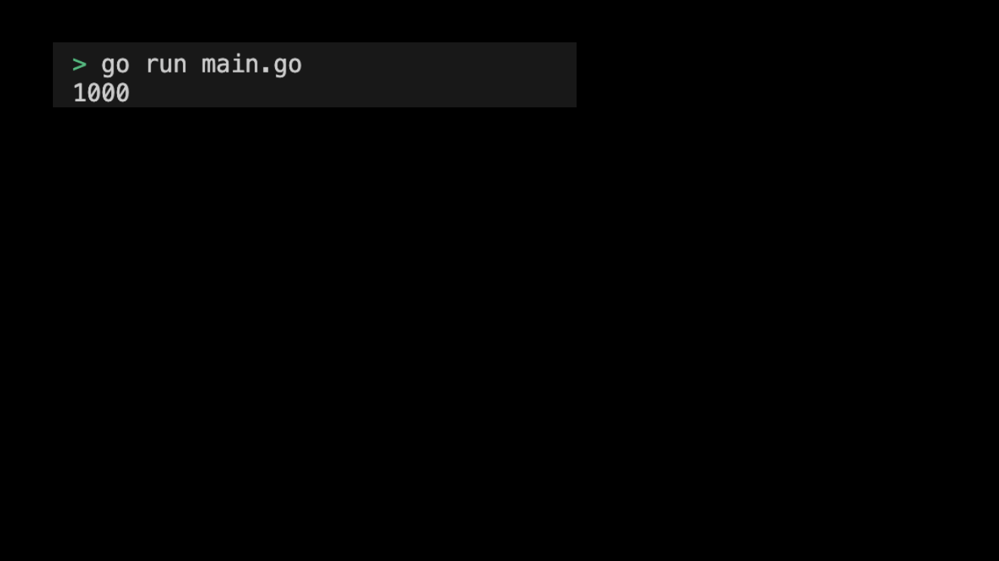

# 05-05. Try the sync package - Mutex

## 0. Try the sync package - Mutex
Mutex controls simultaneous access by protecting critical areas. In this practice, let's use 'Mutex' using the 'sync' package in the Go language.

## 1. Setting Preferences
The default settings are as follows:
```sh
# Create mutex directory
$ mkdir mutex && cd mutex

# Create mutex go module
$ go mod init mutex
```

## 2. Creating code
The full code is as follows:
```go
package main

import (
	"fmt"
	"sync"
)

type SafeCounter struct {
	mu sync.Mutex
	v  map[string]int
}

func (c *SafeCounter) Inc(key string) {
	c.mu.Lock()
	c.v[key]++
	c.mu.Unlock()
}

func (c *SafeCounter) Value(key string) int {
	c.mu.Lock()
	defer c.mu.Unlock()
	return c.v[key]
}

func main() {
	c := SafeCounter{v: make(map[string]int)}
	var wg sync.WaitGroup

	for i := 0; i < 1000; i++ {
		wg.Add(1)
		go func() {
			defer wg.Done()
			c.Inc("somekey")
		}()
	}

	wg.Wait()
	fmt.Println(c.Value("somekey")) // 1000
}
```
> Check the practice code: [05_mutex](../code/05_mutex/)

## 3. Example of submitting Mutex execution screen
The results printed by running the program are as follows:
<div style="text-align: center;">
   
</div>
