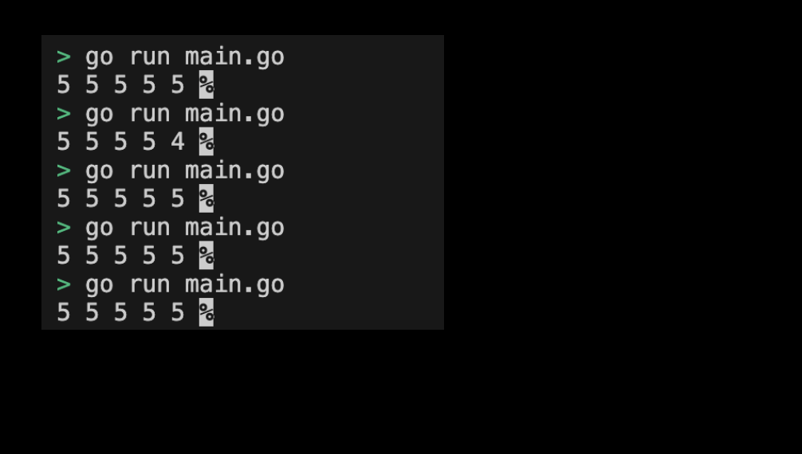
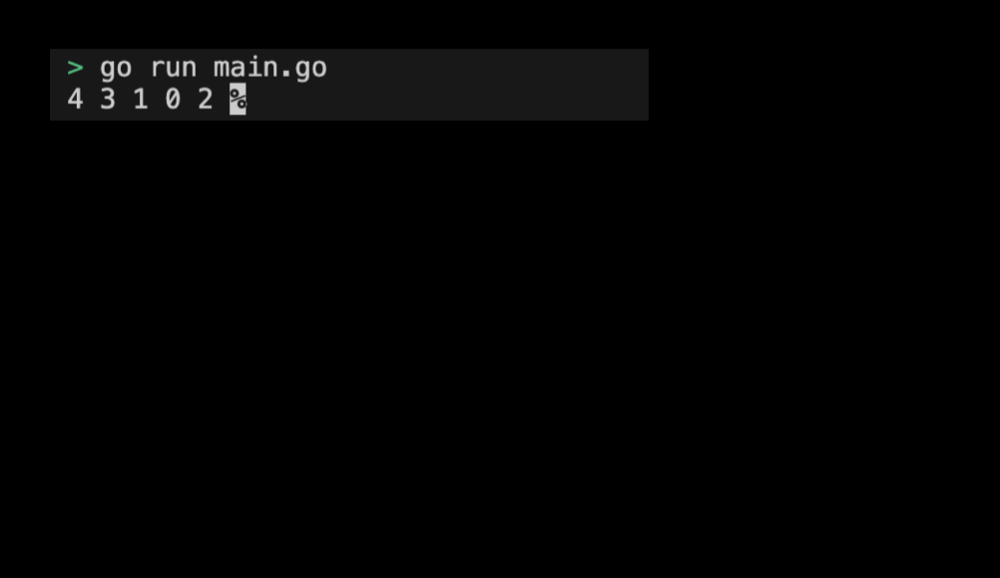

# 05-06. Use a closure to try high-routine

## 0. Use a closure to try high-routine
The closure recognized in [01_basic.md#8-closure](./01_basic.md#8-closure) is very important when using goroutine and channel. The closure allows access to external variables within the function, allowing goroutine to maintain a state or safely change the shared state.

When using a closure in goreutin, it should be noted that the closure captures a reference to an external variable. This may lead to unintended behavior:
```go
package main

import (
	"fmt"
)

func main() {
	done := make(chan bool)

	for i := 0; i < 5; i++ {
		go func() {
            fmt.Printf("%d ", i) // may print results different from expected
			done <- true
		}()
	}

	for i := 0; i < 5; i++ {
		<-done
	}
}
```
> Check the example code: [05_goroutine_no_closure](../code/05_goroutine_no_closure/)

In the example, the i-variable is captured as a closure in the gorutin. Normally, numbers from 0 to 4 should be randomly output. However, the actual output is as follows: 
```sh
5 5 5 5 5
```

Here's what we've done in practice multiple times:
<div style="text-align: center;">
   
</div>

This causes problems at the time when gorutin is actually implemented.
1. The for loop in the main thread runs fast.
2. Goroutine is not executed as soon as it is created, but a slight delay may occur.
3. Goroutine refers to the current value of i through the closure, but this value is the i value when Gorroutine is run.

That's why in the example above, goroutine was not actually executed until the for loop ended when i was 5. These bugs can have unpredictable and strange effects, depending on the variables that are shared. Especially in blockchain system environments, where most of them have to be deterministic, they should be treated more importantly. To avoid this problem, when generating gorutin within a repetition sentence, the value of the variable should be explicitly captured. Let's write gorutin using the closure through practice.

## 1. Setting Preferences
The default settings are as follows:
```sh
# Create goroutine_with_closure dirctory
$ mkdir goroutine_with_closure && cd goroutine_with_closure

# Create goroutine_with_closure go module
$ go mod init goroutine_with_closure
```

## 2. Write a high-routine program using the closure function
Let's modify the high-routine function to use `num int` as a factor as follows:
```go
package main

import (
	"fmt"
)

func main() {
	done := make(chan bool)

	for i := 0; i < 5; i++ {
		go func(num int) {
			fmt.Printf("%d ", num) // 예상한 대로 출력됨
			done <- true
		}(i)
	}

	for i := 0; i < 5; i++ {
		<-done
	}
}
```
> Check the practice code: [05_goroutine_with_closure](../code/05_goroutine_with_closure/)

In this case, it can be confirmed that numbers from 0 to 4 are arbitrarily output as expected.

## 3. Example of submitting a close-up gortin execution screen
The results printed by running the program are as follows:
<div style="text-align: center;">
   
</div>

