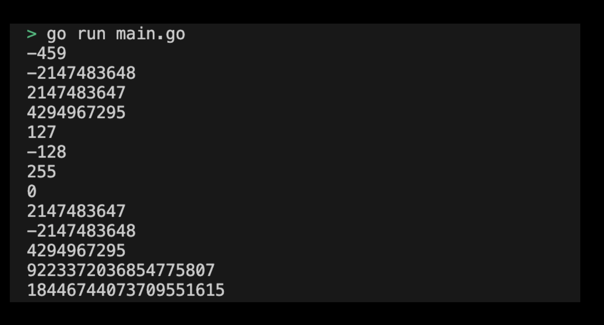

# 01m00. Integer 사용해보기

## 목차
0. Integer 사용해보기
1. 기본 설정하기
2. main 함수 작성하기 
3. Integer 프로그램 실행하기
4. 실행 결과 제출 예시

## 2. Integer 사용해보기
실습으로 Integer 타입을 사용해보도록 하자. 앞으로의 실습은 직접 디렉토리를 생성하여 프로그램을 작성하는 방식으로 진행된다.

## 1. 기본 설정하기
기본 설정은 다음과 같다:
```sh
# integer 디렉토리 생성
$ mkdir integer && cd integer

# integer go module 생성 
$ go mod init integer
```

## 2. main 함수 작성하기 
이제 Integer 타입을 사용할 main 함수 코드를 작성하도록 하자. main 함수에서 실행할 코드는 다음과 같다:
```go
package main

import (
	"fmt"
)

func main() {
    var a int = -459
    var b int32 = -2147483648
    var c int32 = 2147483647
    var d uint32 = 4294967295

    fmt.Println(a) // -459
    fmt.Println(b) // -2147483648
    fmt.Println(c) // 2147483647
    fmt.Println(d) // 4294967295

    // Overflow examples
    var e int8 = 127
    fmt.Println(e)  // 127
    e++
    fmt.Println(e)  // -128 (overflow)

    var f uint8 = 255
    fmt.Println(f)  // 255
    f++
    fmt.Println(f)  // 0 (overflow)

    // Using math package for max values
    fmt.Println(math.MaxInt32) // 2147483647
    fmt.Println(math.MinInt32) // -2147483648
    fmt.Println(math.MaxUint32) // 4294967295
    fmt.Println(math.MaxInt64) // 9223372036854775807

    var maxUint64 uint64 = math.MaxUint64
    fmt.Println(maxUint64) // 18446744073709551615
}
```
> 실습 코드 확인하기: [01_integer](../code/01_integer/)

## 3. Integer 프로그램 실행하기
`go run {go 파일이름}.go` 명령어를 사용하면 main 함수가 작성된 go 프로그램을 실행할 수 있다. 다음과 같이 명령어를 입력해보자:
```sh
$ go run main.go
```

## 4. 실행 결과 제출 예시 
실행하여 출력된 결과는 다음과 같다:
<div style="text-align: center;">
   
</div>


