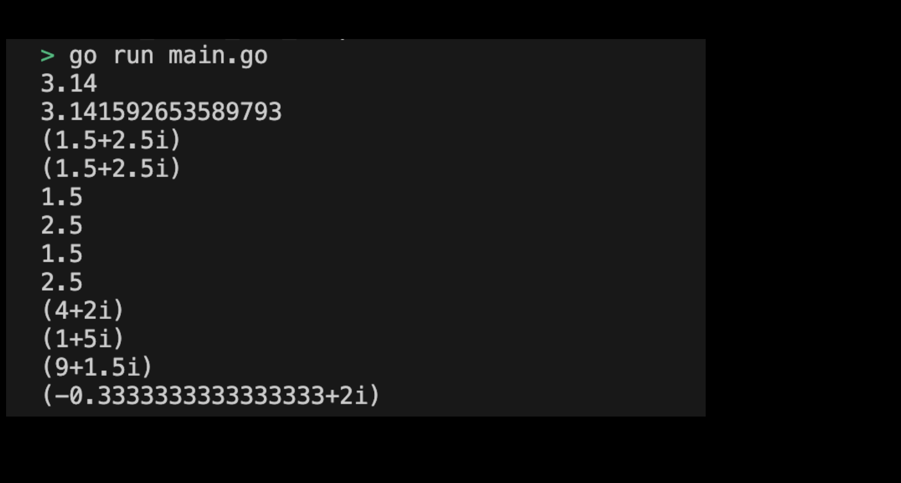

# 01m01. Float & Complex 사용해보기

## 목차
0. Float & Complex 사용해보기
1. 기본 설정하기
2. main 함수 작성하기 
3. Float & Complex 프로그램 실행화면 제출 예시


## 0. Float & Complex 사용해보기
실습으로 Float & Complex 타입을 사용해보도록 하자.

## 1. 기본 설정하기
기본 설정은 다음과 같다:
```sh
# float_and_complex 디렉토리 생성
$ mkdir float_and_complex && cd float_and_complex

# float_and_complex go module 생성 
$ go mod init float_and_complex
```

## 2. main 함수 작성하기
이제 Float & Complex 타입을 사용할 main 함수 코드를 작성하도록 하자. main 함수에서 실행할 코드는 다음과 같다:
``` go
package main

import (
	"fmt"
)

func main() {
	// Float
	var f1 float32 = 3.14
	var f2 float64 = 3.141592653589793

	fmt.Println(f1) // 3.14
	fmt.Println(f2) // 3.141592653589793

	// Complex
	var c1 complex64 = complex(1.5, 2.5)
	var c2 complex128 = complex(1.5, 2.5)

	fmt.Println(c1) // (1.5+2.5i)
	fmt.Println(c2) // (1.5+2.5i)

	// 실수와 허수 출력하기
	fmt.Println(real(c1)) // 1.5
	fmt.Println(imag(c1)) // 2.5

	fmt.Println(real(c2)) // 1.5
	fmt.Println(imag(c2)) // 2.5

	// complex 타입의 수로 연산 수행하기 
	var c3 complex128 = complex(2.5, 3.5)
	var c4 complex128 = complex(1.5, -1.5)

	fmt.Println(c3 + c4) // (4+2i)
	fmt.Println(c3 - c4) // (1+5i)
	fmt.Println(c3 * c4) // (9+2i)
	fmt.Println(c3 / c4) // (0.5+2i)
}
```
> 실습 코드 확인하기: [01_float_and_complex](../code/01_float_and_complex/)

## 3. Float & Complex 프로그램 실행화면 제출 예시
프로그램을 실행하여 출력된 결과는 다음과 같다:
<div style="text-align: center;">
   
</div>
