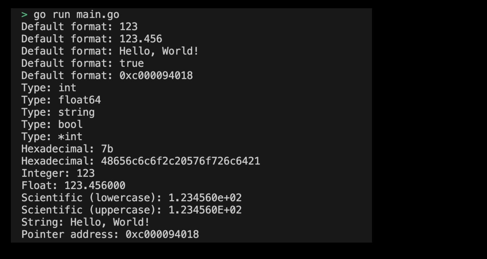

# 01m03. String Formatting 사용해보기

## 목차
0. String Formatting 사용해보기
1. 기본 설정하기
2. main 함수 작성하기 
3. String Formatting 프로그램 실행화면 제출 예시

## 0. String Formatting 사용해보기
실습으로 String Formatting 기능을 사용해보도록 하자.

## 1. 기본 설정하기
기본 설정은 다음과 같다:
```sh
# string_formatting 디렉토리 생성
$ mkdir string_formatting && cd string_formatting

# string_formatting go module 생성 
$ go mod init string_formatting
```

## 2. main 함수 작성하기
이제 String Formatting 기능을 사용할 main 함수 코드를 작성하도록 하자. main 함수에서 실행할 코드는 다음과 같다:
```go
package main

import (
	"fmt"
)

func main() {
	intVar := 123
	floatVar := 123.456
	strVar := "Hello, World!"
	boolVar := true
	pointerVar := &intVar

	// %v
	fmt.Printf("Default format: %v\n", intVar)         // 123
	fmt.Printf("Default format: %v\n", floatVar)       // 123.456
	fmt.Printf("Default format: %v\n", strVar)         // Hello, World!
	fmt.Printf("Default format: %v\n", boolVar)        // true
	fmt.Printf("Default format: %v\n", pointerVar)     // 0xc0000a6010

	// %T
	fmt.Printf("Type: %T\n", intVar)                   // int
	fmt.Printf("Type: %T\n", floatVar)                 // float64
	fmt.Printf("Type: %T\n", strVar)                   // string
	fmt.Printf("Type: %T\n", boolVar)                  // bool
	fmt.Printf("Type: %T\n", pointerVar)               // *int

	// %x
	fmt.Printf("Hexadecimal: %x\n", intVar)            // 7b
	fmt.Printf("Hexadecimal: %x\n", strVar)            // 48656c6c6f2c20576f726c6421

	// %d 
	fmt.Printf("Integer: %d\n", intVar)                // 123

	// %f, %e, %E 
	fmt.Printf("Float: %f\n", floatVar)                // 123.456000
	fmt.Printf("Scientific (lowercase): %e\n", floatVar) // 1.234560e+02
	fmt.Printf("Scientific (uppercase): %E\n", floatVar) // 1.234560E+02

	// %s 
	fmt.Printf("String: %s\n", strVar)                 // Hello, World!

	// %p
	fmt.Printf("Pointer address: %p\n", pointerVar)    // 0xc0000a6010
}
```
> 실습 코드 확인하기: [01_string_formatting](../code/01_string_formatting/)

## 3. String Formatting 프로그램 실행화면 제출 예시
프로그램을 실행하여 출력된 결과는 다음과 같다:
<div style="text-align: center;">
   
</div>
