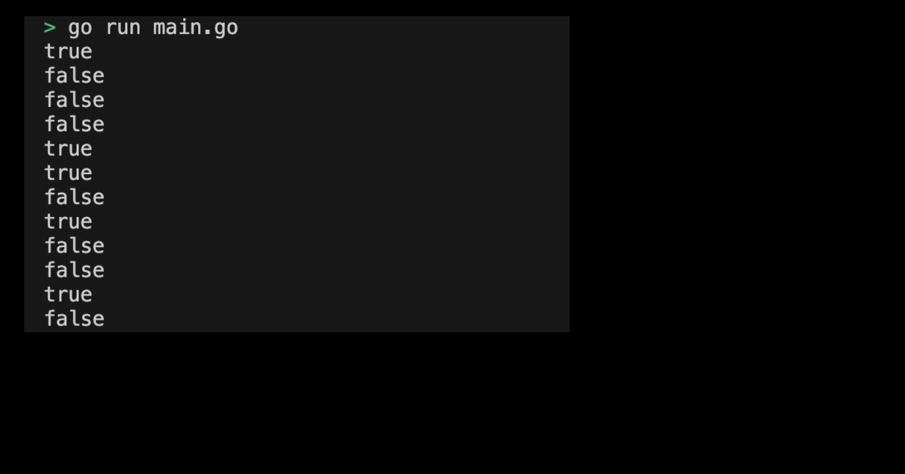

# 01m04. Boolean 사용해보기

## 목차
0. Boolean 사용해보기
1. 기본 설정하기
2. main 함수 작성하기 
3. Boolean 프로그램 실행화면 제출 예시

## 0. (실습) Booleans 사용해보기
실습으로 `bool` 타입 기능을 사용해보도록 하자.

## 1. 기본 설정하기
기본 설정은 다음과 같다:
```sh
# boolean 디렉토리 생성
$ mkdir boolean && cd boolean

# boolean go module 생성 
$ go mod init boolean
```

## 2. main 함수 작성하기
이제 bool 타입을 사용할 main 함수 코드를 작성하도록 하자. main 함수에서 실행할 코드는 다음과 같다:
```go
package main

import (
	"fmt"
)

func main() {
	var b1 bool = true
	var b2 bool = false

	fmt.Println(b1) // true
	fmt.Println(b2) // false

	// bool 타입의 기본값 
	var b3 bool
	fmt.Println(b3) // false

	// 비교 연산자 
	a := 10
	b := 20
	fmt.Println(a == b) // false
	fmt.Println(a != b) // true
	fmt.Println(a < b)  // true
	fmt.Println(a > b)  // false
	fmt.Println(a <= b) // true
	fmt.Println(a >= b) // false

	// 논리 연산자 
	c := true
	d := false
	fmt.Println(c && d) // false
	fmt.Println(c || d) // true
	fmt.Println(!c)     // false
}
```
> 실습 코드 확인하기: [01_boolean](../code/01_boolean/)

## 3. Boolean 프로그램 실행화면 제출 예시
프로그램을 실행하여 출력된 결과는 다음과 같다:
<div style="text-align: center;">
   
</div>
