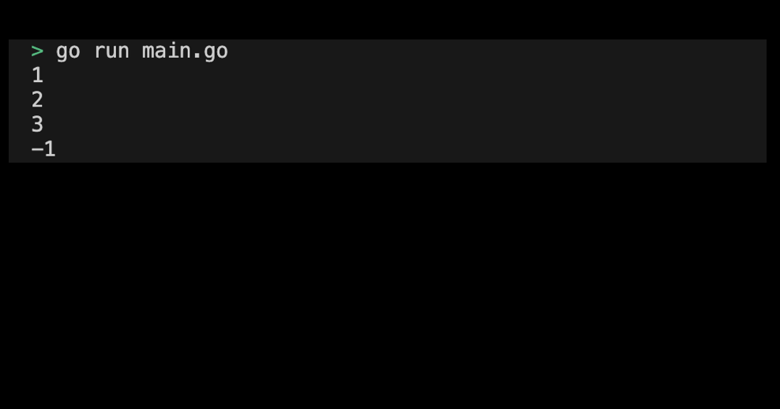
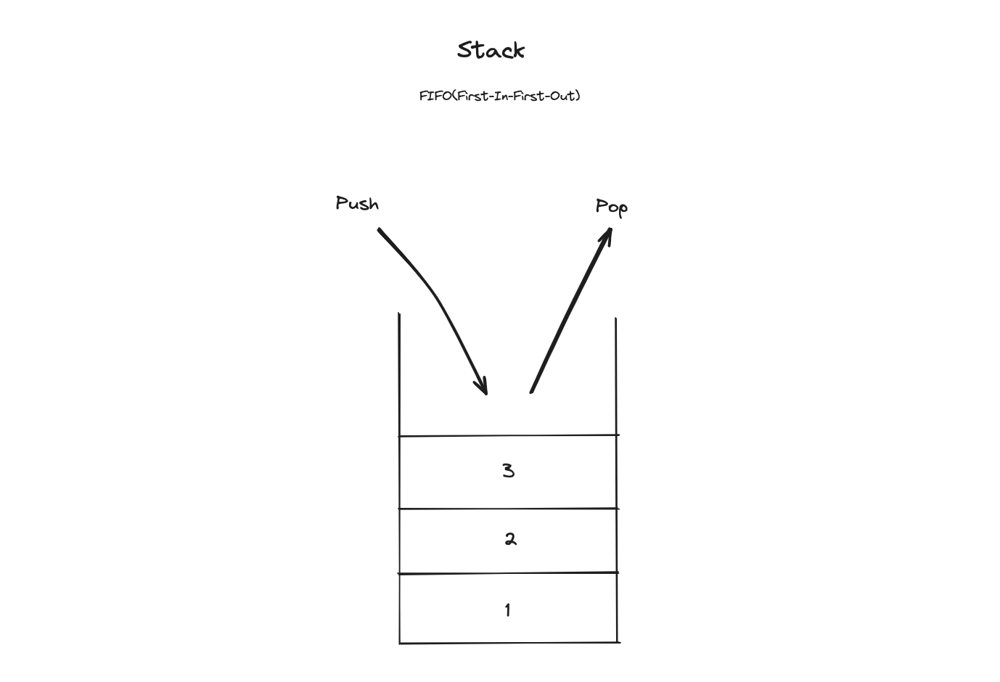
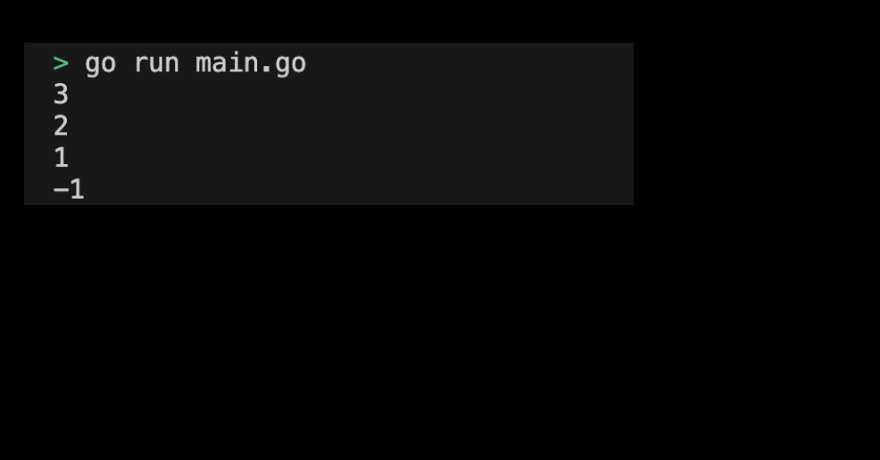
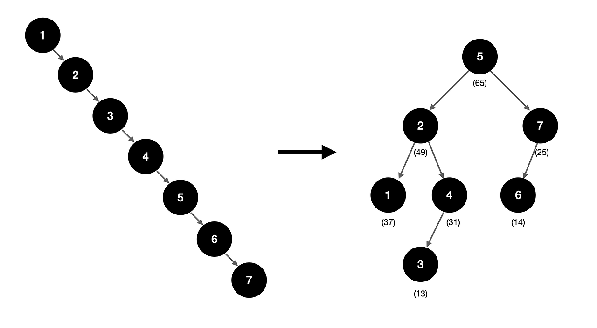
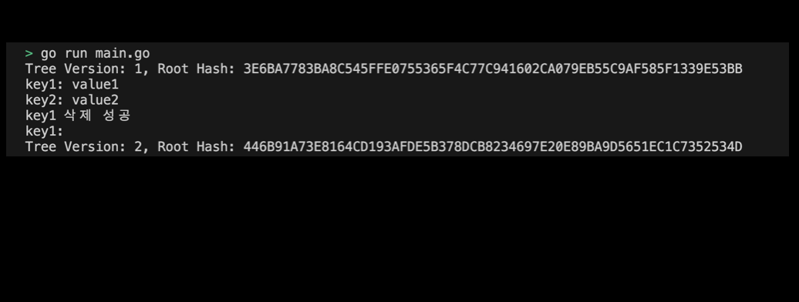

# 004. Go Data Structure
> 이 아티클에서는 Go 언어의 주요 데이터 구조에 대해 다룬다. 배열(Array)과 슬라이스(Slice), 맵(Map), 큐(Queue), 스택(Stack), 트리(Tree) 등을 통해 데이터를 효율적으로 관리하고 사용할 수 있는 방법을 설명한다. 특히, 트리 구조를 이해하는 것은 Cosmos-SDK의 상태 저장에 사용되는 IAVL 트리를 이해하는 데 도움이 된다. 이를 활용한 실습 과제를 통해 자료구조의 이해도를 더욱 높이는 것을 목표로 한다. 

## 목차 
1. (Built-in) 배열(Array)과 슬라이스(Slice)
   1. Array
   2. (실습) Array 초기화 및 선언하기
   3. Slice
   4. (실습) Slice 초기화 및 선언하기
   5. Array와 Slice의 차이점
2. 큐(Queue)와 스택(Stack)
   1. (실습) Slice로 Queue 구현하기
   2. (실습) Slice로 Stack 구현하기
3. (Built-in) 맵(Map)
   1. (실습) Map 초기화 및 선언하기
4. 트리(Tree)
   1. 이진 검색 트리(BST, Binary Search Tree)
   2. AVL Tree
   3. (실습) AVL Tree 다뤄보기
5. Cosmos-SDK의 IAVL 트리 
   1. IAVL 트리란 무엇인가?
   3. (실습) Cosmos-SDK의 IAVL 다뤄보기

## 1. 배열(Array)과 슬라이스(Slice)
Array와 Slices는 가장 기본적인 자료구조로, Go에서 직접적으로 지원해준다. 

### 1. Array
배열(Array)은 고정된 크기의 동일한 타입 요소의 집합이다. 배열의 크기는 선언 시 정해지며 변경할 수 없다.

### 2. (실습) Array 초기화 및 선언하기
이번 실습에서는 Array를 직접 선언하고 초기화해보도록 하자. 

#### 1. 기본 설정하기
기본 설정은 다음과 같다:
```sh
# array 디렉토리 생성
$ mkdir array && cd array

# array go module 생성 
$ go mod init array
```

#### 2. 코드 작성하기
전체 코드는 다음과 같다: 
```go
package main

import (
	"fmt"
)

func main() {
	// 배열 선언
	var arr1 [5]int
	fmt.Println(arr1) // [0 0 0 0 0]

	// 배열 초기화
	arr2 := [5]int{1, 2, 3, 4, 5}
	fmt.Println(arr2) // [1 2 3 4 5]

	// 부분 초기화
	arr3 := [5]int{1, 2}
	fmt.Println(arr3) // [1 2 0 0 0]

	// 배열의 요소 접근
	fmt.Println(arr2[0]) // 1
	arr2[0] = 10
	fmt.Println(arr2[0]) // 10
}
```
> 실습 코드 확인하기: [04_array](../code/04_array/)


#### 3. Array 실행화면 제출하기
프로그램을 실행하여 출력된 결과는 다음과 같다:
<div style="text-align: center;">
   
</div>


### 3. Slice
슬라이스(Slice)는 동적 배열로, 배열과 달리 크기를 유연하게 조절할 수 있다. Slice는 배열의 부분집합을 참조할 수 있으며, 배열보다 훨씬 더 자주 사용된다.

### 4. (실습) Slice 초기화 및 선언하기
이번 실습에서는 Slice를 직접 선언하고 초기화해보도록 하자. 

#### 1. 기본 설정하기
기본 설정은 다음과 같다:
```sh
# slice 디렉토리 생성
$ mkdir slice && cd slice

# slice go module 생성 
$ go mod init slice
```

#### 2. 코드 작성하기
전체 코드는 다음과 같다: 
```go
package main

import (
	"fmt"
)

func main() {
	// 슬라이스 선언
	var s1 []int
	fmt.Println(s1) // []

	// 슬라이스 초기화
	s2 := []int{1, 2, 3, 4, 5}
	fmt.Println(s2) // [1 2 3 4 5]

	// make 함수로 슬라이스 생성
	s3 := make([]int, 5)
	fmt.Println(s3) // [0 0 0 0 0]

	// 슬라이스의 요소 접근 및 수정
	fmt.Println(s2[0]) // 1
	s2[0] = 10
	fmt.Println(s2[0]) // 10

	// 슬라이스 부분 선택
	subSlice := s2[1:3]
	fmt.Println(subSlice) // [2 3]

	// 슬라이스의 길이와 용량
	fmt.Println(len(s2)) // 5
	fmt.Println(cap(s2)) // 5

	// append 함수로 요소 추가
	s2 = append(s2, 6)
	fmt.Println(s2) // [10 2 3 4 5 6]
}
```
> 실습 코드 확인하기: [04_slice](../code/04_slice/)

#### 3. Slice 실행화면 제출하기
프로그램을 실행하여 출력된 결과는 다음과 같다:
<div style="text-align: center;">
   
</div>

### 5. Array와 Slice의 차이점
- Array는 크기를 고정으로 할당이고, Slice는 크기를 동적으로 할당한다. Slice는 Array와 달리 선언에 미리 크기를 지정하지 않아도 된다. 
- Slice는 배열의 부분집합을 참조할 수 있다.
- Slice는 더 많은 기능을 제공하며, Array보다 더 자주 사용된다. 

## 2. 큐(Queue)와 스택(Stack)
큐(Queue) 스택(Stack)은 각각 FIFO(First-In-First-Out)와 LIFO(Last-In-First-Out) 원칙을 따르는 데이터 구이다. 

### 1. (실습) Slice로 큐(Queue) 구현하기
Go에 built-in 되어있는 Slice를 사용하여 Queue를 구현해보도록 하자. 

#### 1. 기본 설정하기
기본 설정은 다음과 같다:
```sh
# queue 디렉토리 생성
$ mkdir queue && cd queue

# queue go module 생성 
$ go mod init queue
```

#### 2. 코드 작성하기
프로그램 구현 요구 사항은 다음과 같다:
1. queue에 int 타입의 데이터를 추가하는 `Enqueue` 메서드를 구현한다.
2. queue에 가장 먼저 저장된 int 타입의 데이터를 제거하는 `Dequeue` 메서드를 구현한다. queue가 비었을 경우에는 -1을 반환한다. 

<div style="text-align: center;">
   
</div>

구현된 전체 코드는 다음과 같다:
```go
package main

import (
	"fmt"
)

type Queue []int

// 큐에 요소 추가
func (q *Queue) Enqueue(val int) {
	*q = append(*q, val)
}

// 큐에서 요소 제거
func (q *Queue) Dequeue() int {
	if len(*q) == 0 {
		return -1 // 큐가 비었을 경우
	}
	val := (*q)[0]
	*q = (*q)[1:]
	return val
}

func main() {
	q := Queue{}
	q.Enqueue(1)
	q.Enqueue(2)
	q.Enqueue(3)

	fmt.Println(q.Dequeue()) // 1
	fmt.Println(q.Dequeue()) // 2
	fmt.Println(q.Dequeue()) // 3
    fmt.Println(q.Dequeue()) // -1
}
```
> 실습 코드 확인하기: [04_queue](../code/04_queue/)


#### 3. Queue 실행화면 제출하기
프로그램을 실행하여 출력된 결과는 다음과 같다:
<div style="text-align: center;">
   
</div>


### 2. (실습) Slice로 Stack 구현하기
Go에 built-in 되어있는 Slice를 사용하여 Stack을 구현해보도록 하자. 

#### 1. 기본 설정하기
기본 설정은 다음과 같다:
```sh
# stack 디렉토리 생성
$ mkdir stack && cd stack

# stack go module 생성 
$ go mod init stack
```

#### 2. 코드 작성하기
프로그램 구현 요구 사항은 다음과 같다:
1. stack에 int 타입 데이터를 추가하는 `Push` 메서드를 구현한다. 
2. stack에 가장 나중에 저장된 int 타입 데이터를 제거하는 `Pop` 메서드를 구현한다. stack이 비었을 경우 -1을 반환한다.

<div style="text-align: center;">
   
</div>

구현된 전체 코드는 다음과 같다:
```go
package main

import (
	"fmt"
)

type Stack []int

// 스택에 요소 추가
func (s *Stack) Push(val int) {
	*s = append(*s, val)
}

// 스택에서 요소 제거
func (s *Stack) Pop() int {
	if len(*s) == 0 {
		return -1 // 스택이 비었을 경우
	}
	val := (*s)[len(*s)-1]
	*s = (*s)[:len(*s)-1]
	return val
}

func main() {
	s := Stack{}
	s.Push(1)
	s.Push(2)
	s.Push(3)

	fmt.Println(s.Pop()) // 3
	fmt.Println(s.Pop()) // 2
	fmt.Println(s.Pop()) // 1
    fmt.Println(s.Pop()) // -1
}
```
> 실습 코드 확인하기: [04_stack](../code/04_stack/)


#### 3. Stack 실행화면 제출하기
프로그램을 실행하여 출력된 결과는 다음과 같다:
<div style="text-align: center;">
   
</div>

## 3. 맵(Map)
맵(Map)은 Key-Value 쌍을 저장하는 데이터 구조이다. Map의 주요 특성은 다음과 같다:
- Key는 유니크해야 한다. 
- Key와 Value의 타입은 같아야 한다. 
- 크기는 동적으로 할당된다. 
- Key를 통해 Map에 저장된 데이터의 빠른 접근(O(1))이 가능하다.

### 1. (실습) Map 초기화 및 선언하기
이번 실습에서는 직접 Map을 선언하고 초기화해보도록 하자. 

#### 1. 기본 설정하기
기본 설정은 다음과 같다:
```sh
# map 디렉토리 생성
$ mkdir map && cd map

# map go module 생성 
$ go mod init map
```

#### 2. 코드 작성하기
전체 코드는 다음과 같다:
```go
package main

import (
	"fmt"
)

func main() {
	// 맵 선언
	var m1 map[string]int
	fmt.Println(m1) // map[]

	// 맵 초기화
	m2 := map[string]int{"a": 1, "b": 2}
	fmt.Println(m2) // map[a:1 b:2]

	// make 함수로 맵 생성
	m3 := make(map[string]int)
	fmt.Println(m3) // map[]

	// 맵에 값 추가 및 수정
	m3["a"] = 1
	fmt.Println(m3) // map[a:1]
	m3["a"] = 10
	fmt.Println(m3) // map[a:10]

	// 값 접근
	val := m3["a"]
	fmt.Println(val) // 10

	// 존재하지 않는 키 접근
	val2 := m3["b"]
	fmt.Println(val2) // 0

	// 값 삭제
	delete(m3, "a")
	fmt.Println(m3) // map[]
}
```
> 실습 코드 확인하기: [04_map](../code/04_map/)


#### 3. Map 실행화면 제출하기
프로그램을 실행하여 출력된 결과는 다음과 같다:
<div style="text-align: center;">
   
</div>


## 4. 트리(Tree)
트리(Tree)는 계층적인 데이터 구조로, 노드로 구성되며 각 노드는 자식 노드를 가질 수 있다. Array, Slice와 같이 선형적인 구조가 아니라 부모-자식 개념을 가지는 비선형적인 구조를 가지는 자료구조이다. 가장 흔한 트리 형태는 이진 트리(Binary Tree)와 그 변형인 이진 검색 트리(Binary Search Tree)이다. Go에서는 다양한 트리 구조를 구현할 수 있다.

### 1. 이진 검색 트리(BST, Binary Search Tree)
이진 검색 트리는 각 노드가 최대 두 개의 자식 노드를 가지며, 왼쪽 자식 노드는 부모 노드보다 작고, 오른쪽 자식 노드는 부모 노드보다 크다. 
- 계층적 구조: 데이터의 계층적 표현을 가능하게 한다.
- 효율적인 검색: 이진 검색 트리는 평균적으로 O(log n)의 검색 시간 복잡도를 제공한다.

이진 검색 트리의 구현된 코드는 다음과 같다:
```go
package main

import (
	"fmt"
)

type Node struct {
	value int
	left  *Node
	right *Node
}

// 새로운 노드를 추가하는 함수
func (n *Node) Insert(value int) {
	if value < n.value {
		if n.left == nil {
			n.left = &Node{value: value}
		} else {
			n.left.Insert(value)
		}
	} else {
		if n.right == nil {
			n.right = &Node{value: value}
		} else {
			n.right.Insert(value)
		}
	}
}

// 트리에서 값을 찾는 함수
func (n *Node) Search(value int) bool {
	if n == nil {
		return false
	}
	if value < n.value {
		return n.left.Search(value)
	} else if value > n.value {
		return n.right.Search(value)
	}
	return true
}

func main() {
	root := &Node{value: 10}
	root.Insert(5)
	root.Insert(15)
	root.Insert(3)
	root.Insert(7)

	fmt.Println(root.Search(7))  // true
    fmt.Println(root.Search(3))  // true
	fmt.Println(root.Search(12)) // false
}
```
> 예제 코드 확인하기: [04_bst](../code/04_bst/)


#### 이진 검색 트리의 문제점 
이진 검색 트리(Binary Search Tree, BST)는 간단하고 직관적인 트리 구조로 데이터의 삽입, 삭제, 검색을 평균적으로 O(log n) 시간 복잡도로 수행할 수 있다. 하지만, 특정한 상황에서는 성능이 크게 저하될 수 있는 문제점이 존재한다. 해당 트리는 기본적으로 검색, 삽입, 삭제는 모두 트리의 높이에 의존되는 구조이기 때문이다. 

자체적으로 균형을 잡을 수 없기 때문에 데이터 순서에 따라 편향 트리(skewed tree)가 될 수도 있다. 편향 트리에서는 트리의 높이가 n에 가까워지며, 이 경우 검색, 삽입, 삭제의 시간 복잡도가 O(n)으로 증가한다. 이는 리스트 구조와 동일하게 되어, BST의 장점을 잃게 된다. 그래서 고안된 것이 Balanced BST이다.  

가장 간단한 예시로는, 만약 각 노드에 무작위로 우선순위를 두면 다음과 같이 밸런스있는 트리를 만들 수 있다:
<div style="text-align: center;">
   
</div>

### 2. AVL 트리(AVL Tree)
AVL 트리는 위에서 구현해 본 균형 이진 검색 트리(Balanced BST)의 일종으로, 각 노드의 왼쪽과 오른쪽 서브트리의 높이 차이가 1 이하가 되도록 균형을 유지한다. 이는 삽입과 삭제 시 트리가 자동으로 균형을 유지하도록 회전 연산을 수행하여 검색, 삽입, 삭제 연산이 항상 O(log n)의 시간 복잡도를 가지도록 한다.
- 기본 이진 탐색 트리에서 편향 트리와 같은 불균형 구조의 단점을 극복하기 위해 고안되었다.
- 균형 유지: AVL 트리와 같은 균형 트리는 삽입과 삭제 연산 후에도 트리의 균형을 유지하여 성능을 보장한다.


### 3. (실습) AVL Tree 다뤄보기
AVL 트리나 RB 트리와 같은 Balanced BST는 다양한 경우의 수를 따져서 구현해야 하기 때문에 비교적 코드가 길다. 그래서 해당 실습에서는 이미 구현된 AVL 트리의 일부 주요 함수를 이해하고 간단하게 트리 구조를 출력하는 함수를 구현해보도록 한다.

#### 1. 기본 설정하기
기본 설정은 다음과 같다:
```sh
# map 디렉토리 생성
$ mkdir avl_tree && cd avl_tree

# map go module 생성 
$ go mod init avl_tree
```

#### 2. AVL Tree 함수 이해하기 
현재 코드에는 AVL 트리에 값을 삽입하는 `Insert` 함수만 구현되어 있다. 해당 함수에는 호출하는 다양한 함수들을 존재한다: 
- `height`: AVL 트리의 노드 높이를 반환한다. 
- `getBalance`: 왼쪽 트리와 오른쪽 트리의 높이의 차를 계산하여 이를 반환한다. 한 쪽의 높이가 쏠리게 되면 skewed tree가 되기 때문에 밸런스를 잡는 데 중요한 지표로 사용된다. 
- `rightRotate`: AVL 트리의 노드를 오른쪽으로 회전하는 함수이다. 이는 전체적인 노드의 높이가 왼쪽으로 치우친 경우에 동작한다.
- `leftRotate`: AVL 트리의 노드를 왼쪽으로 회전한다. 이는 전체적인 노드의 높이가 오른쪽으로 치우진 경우에 동작한다.

`Insert` 함수에서 호출되는 이들 함수들은 트리의 균형을 유지하는 데 필수적이다. AVL 트리의 균형 상태를 유지하기 위해 노드를 삽입할 때 트리의 밸런스를 계산하고, 필요할 경우 회전 연산을 수행한다. 다음 코드는 Insert 함수 내에서 사용되는 회전 조건을 보여준다:
```go
// Left Left Case
if balance > 1 && value < n.left.value {
	return rightRotate(n)
}

// Right Right Case
if balance < -1 && value > n.right.value {
	return leftRotate(n)
}

// Left Right Case
if balance > 1 && value > n.left.value {
	n.left = leftRotate(n.left)
	return rightRotate(n)
}

// Right Left Case
if balance < -1 && value < n.right.value {
	n.right = rightRotate(n.right)
	return leftRotate(n)
}
```
이 조건들은 삽입된 값에 따라 트리의 균형을 맞추기 위해 필요하다. AVL 트리는 각 노드의 왼쪽 서브트리와 오른쪽 서브트리의 높이 차이가 1 이하가 되도록 유지해야 하므로, 이러한 회전 연산을 통해 균형을 유지한다.


주어진 코드는 다음과 같다: 
```go
package main

import (
	"fmt"
)

type AVLNode struct {
	value int
	left  *AVLNode
	right *AVLNode
	height int
}

func NewAVLNode(value int) *AVLNode {
	return &AVLNode{value: value, height: 1}
}

// AVL 트리의 높이를 계산하는 함수
func height(n *AVLNode) int {
	if n == nil {
		return 0
	}
	return n.height
}

// AVL 트리의 균형 인수를 계산하는 함수
func getBalance(n *AVLNode) int {
	if n == nil {
		return 0
	}
	return height(n.left) - height(n.right)
}

// 오른쪽 회전
func rightRotate(y *AVLNode) *AVLNode {
	x := y.left
	T2 := x.right

	// 회전 수행
	x.right = y
	y.left = T2

	// 높이 업데이트
	y.height = max(height(y.left), height(y.right)) + 1
	x.height = max(height(x.left), height(x.right)) + 1

	return x
}

// 왼쪽 회전
func leftRotate(x *AVLNode) *AVLNode {
	y := x.right
	T2 := y.left

	// 회전 수행
	y.left = x
	x.right = T2

	// 높이 업데이트
	x.height = max(height(x.left), height(x.right)) + 1
	y.height = max(height(y.left), height(y.right)) + 1

	return y
}

// 최대값을 계산하는 함수
func max(a, b int) int {
	if a > b {
		return a
	}
	return b
}

// AVL 트리에 값을 삽입하는 함수
func (n *AVLNode) Insert(value int) *AVLNode {
	if n == nil {
		return NewAVLNode(value)
	}

	if value < n.value {
		n.left = n.left.Insert(value)
	} else if value > n.value {
		n.right = n.right.Insert(value)
	} else {
		return n
	}

	n.height = 1 + max(height(n.left), height(n.right))

	balance := getBalance(n)

	// Left Left Case
	if balance > 1 && value < n.left.value {
		return rightRotate(n)
	}

	// Right Right Case
	if balance < -1 && value > n.right.value {
		return leftRotate(n)
	}

	// Left Right Case
	if balance > 1 && value > n.left.value {
		n.left = leftRotate(n.left)
		return rightRotate(n)
	}

	// Right Left Case
	if balance < -1 && value < n.right.value {
		n.right = rightRotate(n.right)
		return leftRotate(n)
	}

	return n
}

// todo: implementation
func printTree(root *AVLNode) {
	// fill out 
}

func main() {
	root := NewAVLNode(10)
	root = root.Insert(20)
    root = root.Insert(25)
	root = root.Insert(30)
	root = root.Insert(40)
	root = root.Insert(50)

	fmt.Println("Root:", root.value) // Root: 30
    // todo: printTree(root)

    root = root.Insert(5)
	root = root.Insert(7)
	root = root.Insert(9)
	root = root.Insert(11)
	root = root.Insert(15)
	fmt.Println("Root:", root.value) // Root: 20
    // todo: printTree(root)
   
}
```

#### 3. print 함수 작성하기 
이미 구현된 AVL Tree를 직접 출력해보면서 이해해보고 이러한 트리 구조를 쉽게 디버깅할 수 있도록 `printTree` 함수를 직접 작성해보도록 하자. 
> 구현된 실습 코드 확인하기: [04_avl_tree](../code/04_avl_tree/)


#### 3. AVL Tree 실행화면 제출하기
프로그램을 실행하여 출력된 예시 결과는 다음과 같다:
<div style="text-align: center;">
   
</div>


## 5. Cosmos-SDK의 IAVL 트리 
Cosmos SDK에서는 AVL 트리의 변형인 IAVL 트리를 사용한다. 블록체인은 상태를 저장하는 데이터베이스이고 합의를 통해 상태를 변경하는 SMR(상태 머신 복제) 분산 시스템이다. IAVL 트리는 이러한 블록체인 상태를 효율적으로 관리하고 검증하는 데 중요한 역할을 한다.

### 1. IAVL 트리란 무엇인가?
IAVL 트리는 이진 검색 트리, AVL 트리, 그리고 Merkle 트리의 특성을 결합한 데이터 구조이다. 이는 주로 블록체인에서 상태를 저장하고 검증하는 데 사용된다. IAVL 트리는 다음과 같은 주요 특성을 가진다:
- 이진 검색 트리: 각 노드는 최대 두 개의 자식 노드를 가지며, 왼쪽 자식 노드는 부모 노드보다 작고, 오른쪽 자식 노드는 부모 노드보다 크다.
- AVL 트리: 각 노드의 왼쪽과 오른쪽 서브트리의 높이 차이가 1 이하가 되도록 균형을 유지한다. 이는 삽입과 삭제 시 트리가 자동으로 균형을 유지하여 검색, 삽입, 삭제 연산이 항상 O(log n)의 시간 복잡도를 가지도록 한다.
- Merkle 트리: 각 노드가 해시 값을 가지며, 이를 통해 트리의 모든 하위 노드의 데이터 무결성을 검증할 수 있다. Merkle 트리는 블록체인의 상태를 암호학적으로 안전하게 관리하는 데 필수적이다.


### 2. IAVL 트리의 장점
IAVL 트리는 블록체인 상태 관리를 위해 특별히 설계된 데이터 구조로, 다음과 같은 장점을 제공한다:
- 효율적인 검색, 삽입, 삭제: 트리의 균형을 유지하여 이러한 연산이 항상 O(log n)의 시간 복잡도를 가지도록 한다.
- 암호학적 검증: Merkle 트리의 특성을 이용하여 데이터의 무결성을 검증할 수 있다. 이는 블록체인의 상태를 안전하게 관리하는 데 필수적이다.
- 버전 관리: IAVL 트리는 상태의 버전을 관리하여, 특정 시점의 상태로 되돌아갈 수 있는 기능을 제공한다. 이는 블록체인의 상태 롤백과 검증에 유용하다.


### 3. (실습) Cosmos-SDK의 IAVL 다뤄보기
IAVL 트리는 다음과 같은 주요 연산을 제공한다:
- 삽입(Insertion): 새로운 키-값 쌍을 트리에 추가한다.
- 삭제(Deletion): 트리에서 특정 키를 삭제한다.
- 검색(Search): 특정 키의 값을 조회한다. 
- 검증(Verification): Merkle 트리의 해시 값을 통해 데이터의 무결성을 검증한다.

#### 1. 기본 설정하기
기본 설정은 다음과 같다:
```sh
# iavl 디렉토리 생성
$ mkdir iavl && cd iavl

# iavl go module 생성 
$ go mod init iavl
```

#### 2. 코드 작성하기
다음과 같이 코드를 cosmos iavl 바이너리를 가져와서 직접 사용해보도록 하자.
```go
package main

import (
	"fmt"

	"cosmossdk.io/log"
	"github.com/cosmos/iavl"
	idb "github.com/cosmos/iavl/db"
)

func main() {
	// 메모리 데이터베이스 생성
	idb := idb.NewMemDB()

	// IAVL 트리 생성
	tree := iavl.NewMutableTree(idb, 100, false, log.NewNopLogger())
	
	// 키-값 쌍 삽입
	var value1 = []byte("value1")
	_, err := tree.Set([]byte("key1"), value1)
	if err != nil {
		fmt.Println(err)
	}
	_, err = tree.Set([]byte("key2"), []byte("value2"))
	if err != nil {
		fmt.Println(err)
	}
	
	// 트리 커밋 (루트 해시 생성)
	hash, version, err := tree.SaveVersion()
	if err != nil {
		fmt.Println(err)
	}
	fmt.Printf("Tree Version: %d, Root Hash: %X\n", version, hash) // Tree Version: 1, Root Hash: 3E6BA7783BA8C545FFE0755365F4C77C941602CA079EB55C9AF585F1339E53BB

	// 값 조회
	val, err := tree.Get([]byte("key1"))
	if err != nil {
		fmt.Println(err)
	}
	fmt.Printf("key1: %s\n", val) // key1: value1

	val, err = tree.Get([]byte("key2"))
	if err != nil {
		fmt.Println(err)
	}
	fmt.Printf("key2: %s\n", val) // key2: value2
	
	// 키-값 쌍 삭제
	_, success, err := tree.Remove([]byte("key1"))
	if success {
		fmt.Println("key1 삭제 성공")
	}
	if err != nil {
		fmt.Println(err)
	}

	// 삭제 후 값 조회
	val, err = tree.Get([]byte("key1"))
	if err != nil {
		fmt.Println(err)
	}
	fmt.Printf("key1: %s\n", val) // key1: 

	// 트리 커밋 후 루트 해시 출력
	hash, version, err = tree.SaveVersion()
	if err != nil {
		fmt.Println(err)
	}
	fmt.Printf("Tree Version: %d, Root Hash: %X\n", version, hash) // Tree Version: 2, Root Hash: 446B91A73E8164CD193AFDE5B378DCB8234697E20E89BA9D5651EC1C7352534D
}
```
> 실습 코드 확인하기: [04_iavl](../code/04_iavl/)


#### 3. IAVL 실행화면 제출하기
프로그램을 실행하여 출력된 결과는 다음과 같다:
<div style="text-align: center;">
   
</div>


# Resources 
1. Go Docs, "The Go Programming Language Specification: Language version go1.22", Feb 6. 2024, https://go.dev/ref/spec
3. Cosmos IAVL Spec, https://github.com/cosmos/iavl/blob/master/docs/overview.md