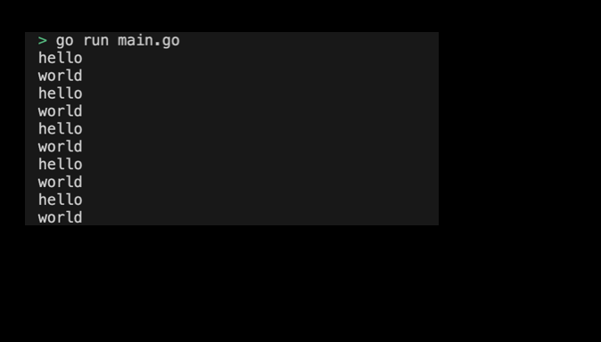
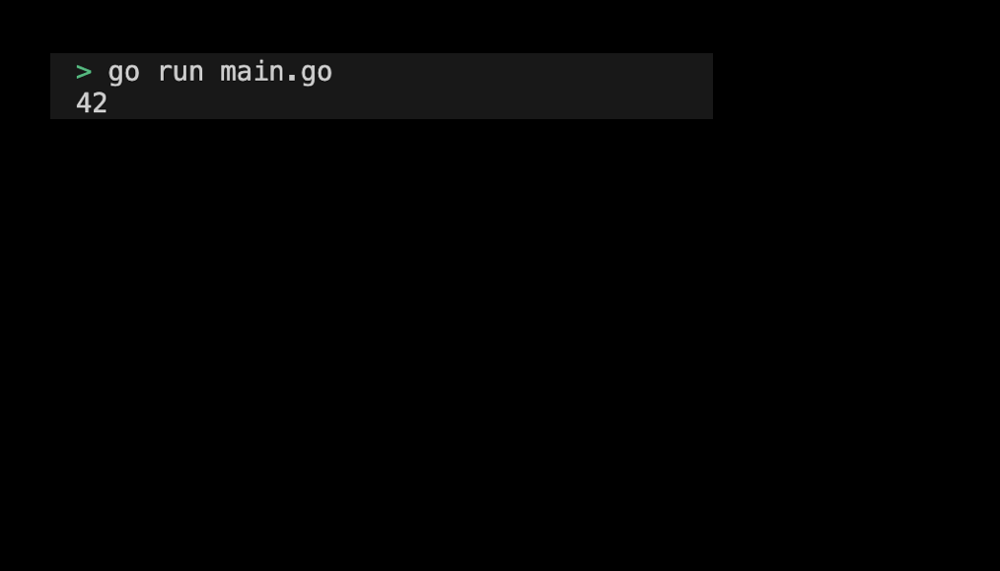
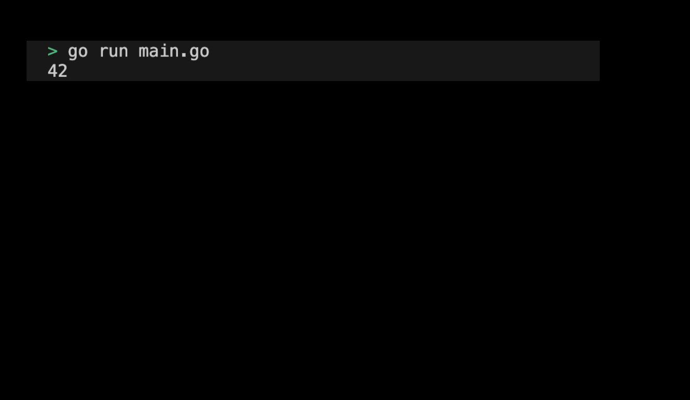

# 005. Go Concurrency 
> 이 아티클에서는 Go 언어의 동시성 프로그래밍에 대한 기초를 코드 위주로 설명한다. 고루틴(goroutine)과 채널(channel), select 문, sync 패키지 등을 사용하여 동시성을 제어하는 방법을 설명한다. 이 모듈은 선택 사항으로, 필요한 경우 추가 학습을 통해 동시성 프로그래밍 능력을 향상시킬 수 있다.

## 목차
1. 고루틴(goroutine)과 채널(channel)
   1. 고루틴(goroutine)
   2. channel
   3. 송신 전용 및 수신 전용 channel
2. channel을 이용한 동시성 제어
   1. 버퍼링된 channel
   2. channel을 이용한 작업 분배
3. select 문
4. sync 패키지 사용
   1. WaitGroup
   2. Mutex
5. 클로저(closure)와 동시성
   1. closure 없는 잘못된 고루틴
   2. closure 고루틴  

## 1. 고루틴(goroutine)과 채널(channel)
동시성 프로그래밍은 Cosmos SDK 애플리케이션 개발에서는 크게 다루지 않지만, 동시성 프로그래밍에서 기본적으로 필요한 지식이므로 학습하는 것을 추천한다. 

### 1. 고루틴(goroutine)
고루틴은 경량 스레드로, `go` 키워드를 사용하여 쉽게 생성할 수 있다. 고루틴은 매우 가볍고, 수천 개의 고루틴을 생성해도 성능에 큰 영향을 주지 않는다. 이러한 동시성 성능은 go의 인기에 한 몫을 하였다. 다음 예제에서는 say 함수를 고루틴으로 실행하여 "hello"와 "world"를 동시에 출력한다:
```go
package main

import (
	"fmt"
	"time"
)

func say(s string) {
	for i := 0; i < 5; i++ {
		fmt.Println(s)
		time.Sleep(100 * time.Millisecond)
	}
}

func main() {
	go say("world")
	say("hello")
}
```
> 예제 코드 확인하기: [05_goroutine](../code/05_goroutine/)

프로그램을 실행하여 출력된 결과는 다음과 같다:
<div style="text-align: center;">
   
</div>


### 3. 채널(channel)
채널은 고루틴 간의 통신을 위한 도구이다. 채널을 사용하면 고루틴 간에 데이터를 주고받을 수 있다. 채널은 타입을 지정하여 선언하며, make 함수를 사용하여 생성한다.
- 동기화: 채널을 통해 값을 주고받을 때 고루틴 간에 동기화가 이루어집니다.
- 방향성: 채널은 양방향이거나 송신 전용, 수신 전용으로 선언할 수 있습니다.


다음은 채널을 사용하여 고루틴 간에 데이터를 주고받는 예제 코드이다:
```go
package main

import (
	"fmt"
)

func main() {
	// 채널 생성
	ch := make(chan int)

	// 고루틴에서 채널에 값 보내기
	go func() {
		ch <- 42
	}()

	// 채널에서 값 받기
	val := <-ch
	fmt.Println(val) // 42
}
```
> 예제 코드 확인하기: [05_channel](../code/05_channel/)

프로그램을 실행하여 출력된 결과는 다음과 같다:
<div style="text-align: center;">
   
</div>

### 5. 송신 전용 및 수신 전용 channel
채널은 송신 전용 또는 수신 전용으로 선언할 수 있다. 송신 전용 채널은 값을 보내기만 할 수 있고, 수신 전용 채널은 값을 받기만 할 수 있다. 다음 예제는 송신 전용 채널과 수신 전용 채널을 사용하는 방법을 보여준다:
```go
package main

import (
	"fmt"
)

func send(ch chan<- int, val int) {
	ch <- val
}

func receive(ch <-chan int) int {
	return <-ch
}

func main() {
	ch := make(chan int)

	go send(ch, 42)
	val := receive(ch)
	fmt.Println(val) // 42
}
```
> 예제 코드 확인하기: [05_send_recv_channel](../code/05_send_recv_channel/)

프로그램을 실행하여 출력된 결과는 다음과 같다:
<div style="text-align: center;">
   
</div>

## 2. channel을 이용한 동시성 제어
### 1. 버퍼링된 channel
버퍼링된 채널은 정해진 크기의 버퍼를 가지며, 버퍼가 가득 차지 않은 한 송신은 블록되지 않는다. 버퍼 크기를 지정하여 생성할 수 있습니다. 다음 예제는 버퍼링된 채널을 사용하는 방법을 보여준다:
```go
package main

import (
	"fmt"
)

func main() {
	// 버퍼 크기 2인 채널 생성
	ch := make(chan int, 2)

	// 채널에 값 보내기
	ch <- 1
	ch <- 2

	// 채널에서 값 받기
	fmt.Println(<-ch) // 1
	fmt.Println(<-ch) // 2
}
```
> 예제 코드 확인하기: [05_buffer_channel](../code/05_buffer_channel/)

프로그램을 실행하여 출력된 결과는 다음과 같다:
<div style="text-align: center;">
   
</div>


### 3. channel을 이용한 작업 분배
채널을 사용하여 여러 고루틴에 작업을 분배할 수 있다. 작업자 패턴은 채널을 사용하여 여러 고루틴에 작업을 분배하는 방법이다. 여러 작업자 고루틴이 작업을 분배받아 동시에 처리할 수 있도록 한다. 다음 예제는 작업자 패턴을 사용하는 방법을 보여준다:
```go
package main

import (
	"fmt"
	"time"
)

// 작업자 함수
func worker(id int, jobs <-chan int, results chan<- int) {
	for j := range jobs {
		fmt.Printf("worker %d started job %d\n", id, j)
		time.Sleep(time.Second)
		fmt.Printf("worker %d finished job %d\n", id, j)
		results <- j * 2
	}
}

func main() {
	const numJobs = 5
	jobs := make(chan int, numJobs)
	results := make(chan int, numJobs)

	// 3개의 작업자 고루틴 생성
	for w := 1; w <= 3; w++ {
		go worker(w, jobs, results)
	}

	// 작업 채널에 작업 보내기
	for j := 1; j <= numJobs; j++ {
		jobs <- j
	}
	close(jobs)

	// 결과 받기
	for a := 1; a <= numJobs; a++ {
		fmt.Printf("result: %d\n", <-results)
	}
}
```
> 예제 코드 확인하기: [05_worker](../code/05_worker/)

프로그램을 실행하여 출력된 결과는 다음과 같다:
<div style="text-align: center;">
   
</div>


## 3. select 문
select 문은 여러 채널 작업을 기다리고, 그 중 하나가 준비되면 해당 작업을 실행한다. 이는 다중 채널 동작을 제어하는 데 유용하다. select 문에서 default 케이스를 사용하면 모든 채널이 준비되지 않은 경우에도 즉시 실행된다. 다음은 select문을 사용한 간단한 예제 코드이다:
```go
package main

import (
	"fmt"
)

func main() {
	ch := make(chan int, 1)
	ch <- 1
	select {
	case val := <-ch:
		fmt.Println("received", val)
	default:
		fmt.Println("no value received")
	}
}
```
> 예제 코드 확인하기: [05_select](../code/05_select/)

프로그램을 실행하여 출력된 결과는 다음과 같다:
<div style="text-align: center;">
   
</div>


## 4. sync 패키지 사용
Go의 sync 패키지는 동시성 프로그래밍을 위한 여러 도구를 제공한다. 여기에는 WaitGroup, Mutex, Once 등이 포함된다. WaitGroup은 여러 고루틴의 완료를 기다릴 때 사용한다.
```go
package main

import (
	"fmt"
	"sync"
	"time"
)

func worker(id int, wg *sync.WaitGroup) {
	defer wg.Done()
	fmt.Printf("Worker %d starting\n", id)
	time.Sleep(time.Second)
	fmt.Printf("Worker %d done\n", id)
}

func main() {
	var wg sync.WaitGroup

	for i := 1; i <= 3; i++ {
		wg.Add(1)
		go worker(i, &wg)
	}

	wg.Wait()
}
```
> 예제 코드 확인하기: [05_wait_group](../code/05_wait_group/)

프로그램을 실행하여 출력된 결과는 다음과 같다:
<div style="text-align: center;">
   
</div>


### 3. Mutex
Mutex는 임계 구역을 보호하여 동시 접근을 제어한다.
```go
package main

import (
	"fmt"
	"sync"
)

type SafeCounter struct {
	mu sync.Mutex
	v  map[string]int
}

func (c *SafeCounter) Inc(key string) {
	c.mu.Lock()
	c.v[key]++
	c.mu.Unlock()
}

func (c *SafeCounter) Value(key string) int {
	c.mu.Lock()
	defer c.mu.Unlock()
	return c.v[key]
}

func main() {
	c := SafeCounter{v: make(map[string]int)}
	var wg sync.WaitGroup

	for i := 0; i < 1000; i++ {
		wg.Add(1)
		go func() {
			defer wg.Done()
			c.Inc("somekey")
		}()
	}

	wg.Wait()
	fmt.Println(c.Value("somekey")) // 1000
}
```
> 예제 코드 확인하기: [05_mutex](../code/05_mutex/)

프로그램을 실행하여 출력된 결과는 다음과 같다:
<div style="text-align: center;">
   
</div>

## 5. 클로저(closure)와 동시성
[01_basic의 closure 파트](./01_basic.md#8-closure)에서 알아본 클로저는 고루틴과 채널을 사용할 때 매우 중요하다. 클로저는 함수 내에서 외부 변수에 접근할 수 있도록 하여 고루틴이 상태를 유지하거나 공유 상태를 안전하게 변경할 수 있게 한다.

### 1. closure 없는 잘못된 고루틴
고루틴 내에서 클로저를 사용할 때, 클로저가 외부 변수의 참조를 캡처한다는 점을 주의해야 한다. 이는 의도치 않은 동작을 초래할 수 있다:
```go
package main

import (
	"fmt"
	"time"
)

func main() {
	done := make(chan bool)

	for i := 0; i < 5; i++ {
		go func() {
            fmt.Printf("%d ", i) // 예상과 다르게 출력될 수 있음
			done <- true
		}()
	}

	for i := 0; i < 5; i++ {
		<-done
	}
}
```
예제에서는 i 변수가 고루틴 내에서 클로저로 캡처된다. 정상적이라면 0~4의 숫자가 임의로 출력되어야 한다. 그러나 실제 출력은 다음과 같다: 
```sh
5 5 5 5 5
```

이는 고루틴이 실제로 실행되는 시점이 문제를 일으키게 된다.
1. 메인 스레드에 있는 for 루프가 빠르게 실행된다.
2. 고루틴은 생성되자마자 실행되는 것이 아니라, 약간의 지연이 발생할 수 있다.
3. 고루틴은 클로저를 통해 i의 현재 값을 참조하지만, 이 값은 고루틴이 실행될 때의 i 값이다.

그래서 위의 예시에서는 i가 5가 되어 for 루프가 종료될 때까지 실제로 고루틴이  실행되지 않은 것이다. 이러한 버그는 공유되는 변수에 따라 예측할 수 없는 이상한 영향을 미칠 수 있다. 특히나 대부분 결정론적이어야 하는 블록체인 시스템 환경에서는 더 중요하게 다뤄져야 한다.

### 2. closure 있는 고루틴  
이러한 문제를 피하기 위해, 반복문 내에서 고루틴을 생성할 때 변수의 값을 명시적으로 캡처해야 한다:
```go
package main

import (
	"fmt"
	"time"
)

func main() {
	done := make(chan bool)

	for i := 0; i < 5; i++ {
		go func(num int) {
			fmt.Printf("%d ", num) // 예상한 대로 출력됨
			done <- true
		}(i)
	}

	for i := 0; i < 5; i++ {
		<-done
	}
}
```

이러면 예상한대로 0~4의 숫자가 임의로 출력되는 것을 확인할 수 있다. 

# Resources 
1. Go Docs, "The Go Programming Language Specification: Language version go1.22", Feb 6. 2024, https://go.dev/ref/spec
