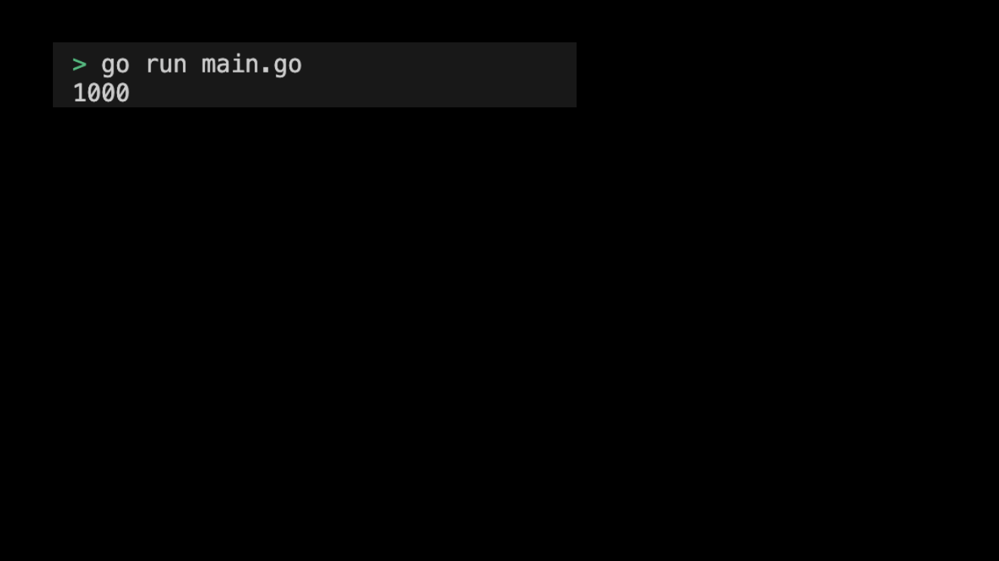

# 05m05. sync 패키지 사용해보기 - Mutex

## 목차
0. sync 패키지 사용해보기 - Mutex
1. 기본 설정하기
2. 코드 작성하기
3. Mutex 실행화면 제출 예시

## 0. sync 패키지 사용해보기 - Mutex
Mutex는 임계 구역을 보호하여 동시 접근을 제어한다. 이번 실습에서는 Go 언어의 `sync` 패키지를 사용하여 `Mutex`를 사용해보자.

## 1. 기본 설정하기
기본 설정은 다음과 같다:
```sh
# mutex 디렉토리 생성
$ mkdir mutex && cd mutex

# mutex go module 생성 
$ go mod init mutex
```

## 2. 코드 작성하기
전체 코드는 다음과 같다: 
```go
package main

import (
	"fmt"
	"sync"
)

type SafeCounter struct {
	mu sync.Mutex
	v  map[string]int
}

func (c *SafeCounter) Inc(key string) {
	c.mu.Lock()
	c.v[key]++
	c.mu.Unlock()
}

func (c *SafeCounter) Value(key string) int {
	c.mu.Lock()
	defer c.mu.Unlock()
	return c.v[key]
}

func main() {
	c := SafeCounter{v: make(map[string]int)}
	var wg sync.WaitGroup

	for i := 0; i < 1000; i++ {
		wg.Add(1)
		go func() {
			defer wg.Done()
			c.Inc("somekey")
		}()
	}

	wg.Wait()
	fmt.Println(c.Value("somekey")) // 1000
}
```
> 실습 코드 확인하기: [05_mutex](../code/05_mutex/)

## 3. Mutex 실행화면 제출 예시
프로그램을 실행하여 출력된 결과는 다음과 같다:
<div style="text-align: center;">
   
</div>
