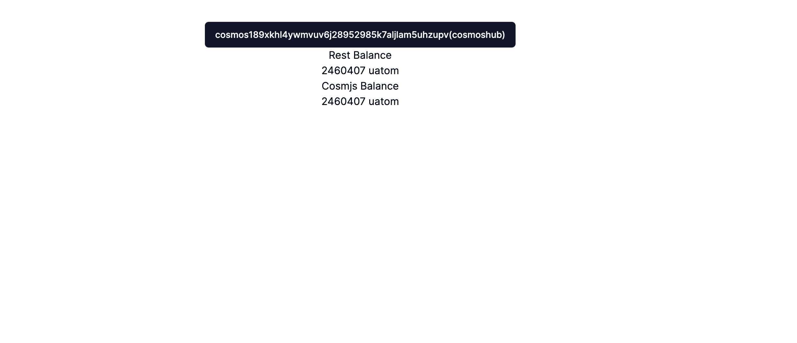

# Balance

Cosmos-SDK를 이용한 앱체인들의 State 조회를 하는 여러 방법들을 활용하여 연결된 지갑 Account의 Token Balance를 조회한다.

## 사전 준비

앱 체인의 데이터를 조회하는 방법은 `RPC Endpoint 호출` `REST Endpoint 호출` `Cosmjs 라이브러리 활용` 등 방법이 있다.

### cosmos-kit endpoint hooks

cosmos-kit에서는 https://github.com/cosmology-tech/chain-registry/tree/main/v2/chain-registry repository에 등록된 정보를 호출해가며 정상 응답이 오는 endpoint를 찾아 활용하는 기능을 제공한다.

미션에서는 Cosmjs와 REST API를 활용한 기능으로도 충분히 구현 가능하기 때문에, RPC 데이터 조회는 생략한다. 관련 코드 및 예제를 보고 싶으면 아래 RPC Endpoint를 찾아주는 hook과 Repository를 참고한다.

```ts
import { useChain } from "@cosmos-kit/react";
...

const { getRestEndpoint, getRpcEndpoint } =
    useChain("cosmoshubtestnet");
```

https://github.com/cosmology-tech/interchain

### cosmos-kit + cosmjs

cosmjs에서는 state 조회를 위해 client를 통해 다음과 같은 method를 제공한다.

`getChainId()`
`getHeight()`
`getAccount(searchAddress: string)`
`getSequence(address: string)`
`getBlock(height?: number)`
`getBalance(address: string, searchDenom: string)`
`getAllBalances(address: string)`
`getBalanceStaked(address: string)`
`getDelegation(delegatorAddress: string, validatorAddress: string)`
`getTx(id: string)`

## 구현

### 결과 화면을 위한 shadcn/ui badge 컴퍼넌트 추가
```bash
npx shadcn-ui@latest add badge
```

### cosmos-kit을 통한 데이터 조회

다음 예제를 통해 cosmoshubtestnet 체인의 현재 지갑에 연결된 address의 모든 Balance를 조회하는 기능을 구현해본다.

연결된 지갑의 주소, client를 구하기 위해 `useChain` 훅을 사용한다.

```ts
//import 및 hook
import { useChain } from "@cosmos-kit/react";
const { address, getStargateClient } = useChain("cosmoshubtestnet");
//cosmjs clinet 객채 생성 및 balance 조회
const client = await getStargateClient();
const result = await client.getAllBalances(address);
console.log(result);
```

### REST API를 통한 데이터 조회

Cosmos-SDK는 RPC 통신 외에도 LCD라 불리는 REST API Endpoint도 제공할 수 있다. 노드 구동시 설정에서 제어할 수 있다.(Swagger 포함)

다음은 Cosmos 체인에서 제공하는 REST API Endpoint를 볼 수 있는 Swagger 이다.
https://cosmos-rest.publicnode.com/swagger/

다른 체인들의 Swagger들을 살펴보면 각 체인마다 Custom Module들에따라 지원되는 REST API 들을 확인할 수 있다.

```ts
//import 및 hook
import { useChain } from "@cosmos-kit/react";
const { address, getRestEndpoint } = useChain("cosmoshubtestnet");
//Balance 조회 REST API 호출
const balances = await fetch(
  `${await getRestEndpoint()}/cosmos/bank/v1beta1/balances/${address}`
);
const result = await balances.json();
console.log(result);
```

### 미션 적용

#### **`components/balance.tsx`**

```ts
"use client";

import { useChain } from "@cosmos-kit/react";
import { useEffect, useState } from "react";
import { Badge } from "./ui/badge";

export default function Balance() {
  const { address, getRestEndpoint, getStargateClient } =
    useChain("cosmoshubtestnet");

  const [restBalances, setRestBalances] = useState<any>();
  const [cosmjsBalances, setCosmjsBalances] = useState<any>();

  useEffect(() => {
    if (!address) {
      return;
    }

    const fetchRestBalance = async () => {
      const balances = await fetch(
        `${await getRestEndpoint()}/cosmos/bank/v1beta1/balances/${address}`
      );
      const result = await balances.json();
      setRestBalances(result.balances);
    };
    fetchRestBalance();

    const fetchCosmjsBalance = async () => {
      const client = await getStargateClient();
      const result = await client.getAllBalances(address);
      setCosmjsBalances(result);
    };
    fetchCosmjsBalance();
  }, [address]);

  return (
    <div className="space-y-3">
      <h3 className="text-xl font-bold">Balance</h3>
      <h4>from LCD(REST API)</h4>
      {restBalances &&
        restBalances.map((balance: any) => (
          <Badge
            variant="secondary"
            className="text-md font-normal mr-3"
            key={balance.denom}
          >
            {balance.amount}
            {balance.denom}
          </Badge>
        ))}
      <h4 className="pt-2">from CosmJS</h4>
      {cosmjsBalances &&
        cosmjsBalances.map((balance: any) => (
          <Badge
            variant="secondary"
            className="text-md font-normal  mr-3"
            key={balance.denom}
          >
            {balance.amount} {balance.denom}
          </Badge>
        ))}
    </div>
  );
}
```

#### **`app/pages.tsx`**

```ts
import Balance from "@/components/balance";
import Wallet from "@/components/wallet";

export default function Home() {
  return (
    <main>
      <div className="m-10 grid gap-14 w-2/5 mx-auto">
        <h1 className="text-3xl font-bold">Cosmos dApp</h1>
        <Wallet />
        <Balance />
      </div>
    </main>
  );
}
```

## 결과


최초에는 위 Balance 부분이 노출되진 않는데, cosmostestnet faucet을 받아 balance가 노출되는 것을 확인한다.

참고. Cosmos-SDK의 decimal은 수정 가능하지만 기본은 6자리이다. (1000000uatom = 1ATOM)
