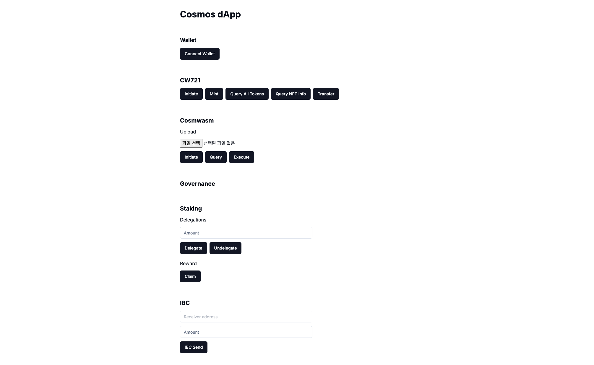
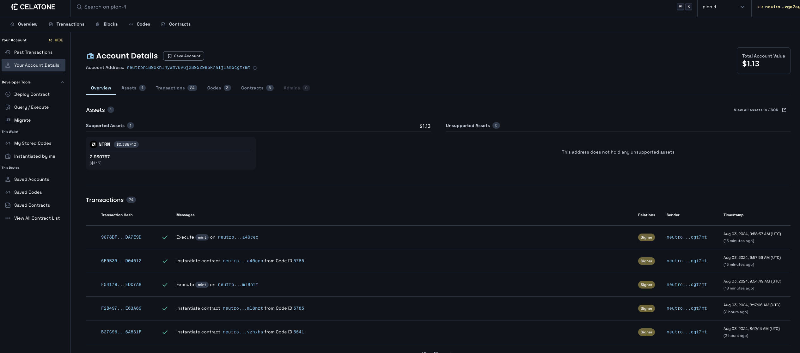

# NFT

Cosmwasm 스마트 컨트랙트인 CW721을 활용하여 NFT 민팅, 전송을 구현한다.

## 사전 준비

CW721 컨트랙트를 배포한다.
https://github.com/public-awesome/cw-nfts

### clone 및 build

```bash
git clone https://github.com/public-awesome/cw-nfts.git
cd cw-nfts
./build.sh
```

`Is the docker daemon running?` 혹시 도커 관련 오류가 발생한다면 docker를 실행해둔다.

컴파일이 완료되면 아래 폴더에 cw721_base.wasm이 생기게 된다.

```bash
cd artifacts
cw721_base.wasm
```

schema를 확인하기 위해선 아래의 명령어를 통해 스키마를 생성하고, schema디렉터리에 생긴 파일들을 확인한다.

```sh
cd contracts
cd cw721-base
cargo schema

cd schema

cat instantiate_msg.json #initiate 하기 위한 struct
cat query_msg.json #상태 조회 쿼리를 하기 위한 stru
cat execute_msg.json #상태 변경 하기 위한 struct
```

위 contract를 Neutron testnet에 배포한다. (미션#9 참고)

### schema

#### **`initiage_msg.json`**

```json
{
  "$schema": "http://json-schema.org/draft-07/schema#",
  "title": "InstantiateMsg",
  "type": "object",
  "required": ["name", "symbol"],
  "properties": {
    "minter": {
      "description": "The minter is the only one who can create new NFTs. This is designed for a base NFT that is controlled by an external program or contract. You will likely replace this with custom logic in custom NFTs",
      "type": ["string", "null"]
    },
    "name": {
      "description": "Name of the NFT contract",
      "type": "string"
    },
    "symbol": {
      "description": "Symbol of the NFT contract",
      "type": "string"
    },
    "withdraw_address": {
      "type": ["string", "null"]
    }
  },
  "additionalProperties": false
}
```

## 구현

Neutron Testnet에 Code ID `5785`로 cw721을 올려두었다. 직접 올려서 작성된 코드로 하는 것을 권장하지만 예제에서는 `5785`로 진행한다.

### Initiate

위에 `initiate_msg.json` 스키마를 확인하면, properties에 `name(*)`, `symbol(*)`, `minter`, `withdraw_address`가 필요하다. 미션에서는 minter를 현재 지갑주소로 해서 minting을 할 수 있도록 한다.

```ts
const client = await getSigningCosmWasmClient();
const init = await client.instantiate(
  address,
  5785,
  {
    name: "MY NFT",
    symbol: "MYNFT",
    minter: address,
  },
  "MY NFT TEST",
  "auto"
);
console.log(init);
const contractAddress = init.contractAddress;
```

위 initiate를 통해 `MY NFT` CW721 컬렉션이 생기게 되며 연결된 지갑을 통해 mint를 할 수 있다.

### Mint

생성된 contractAddress정보를 통해 NFT를 minting 해본다.

mint를 위한 schema 정보를 확인하여 해당 스펙에 맞게 구조를 만들어 호출하여 조회한다.

#### **`execute_msg.json` 중 `mint`**

```json
{
  "description": "Mint a new NFT, can only be called by the contract minter",
  "type": "object",
  "required": ["mint"],
  "properties": {
    "mint": {
      "type": "object",
      "required": ["owner", "token_id"],
      "properties": {
        "extension": {
          "description": "Any custom extension used by this contract",
          "anyOf": [
            {
              "$ref": "#/definitions/Metadata"
            },
            {
              "type": "null"
            }
          ]
        },
        "owner": {
          "description": "The owner of the newly minter NFT",
          "type": "string"
        },
        "token_id": {
          "description": "Unique ID of the NFT",
          "type": "string"
        },
        "token_uri": {
          "description": "Universal resource identifier for this NFT Should point to a JSON file that conforms to the ERC721 Metadata JSON Schema",
          "type": ["string", "null"]
        }
      },
      "additionalProperties": false
    }
  }
}
```

위 스키마를 바탕으로 execute시 전송할 msg를 생성하여 호출한다.

```ts
const client = await getSigningCosmWasmClient();
const execute = await client.execute(
  address,
  contractAddress,
  { mint: { owner: address, token_id: "1", token_uri: "ipfs://" } },
  "auto"
);
console.log(execute);
```

### NFT 토큰 정보 조회

아래는 CW721의 토큰 ID로 NFT 정보를 조회하는 `{ nft_info: { token_id: "1" } }` smart 쿼리를 호출 하는 예제이다.

아래 스키마 정보를 바탕으로 smart msg를 생성해서 호출하여 contract의 상태 정보를 가져온다.

#### **`query_msg.json` 중 `nft_info`**

```json
{
  "description": "With MetaData Extension. Returns metadata about one particular token, based on *ERC721 Metadata JSON Schema* but directly from the contract",
  "type": "object",
  "required": [
    "nft_info"
  ],
  "properties": {
    "nft_info": {
      "type": "object",
      "required": [
        "token_id"
      ],
      "properties": {
        "token_id": {
          "type": "string"
        }
      },
      "additionalProperties": false
    }
  },
  "additionalProperties": false
},
```

```ts
const client = await getSigningCosmWasmClient();
const query = await client.queryContractSmart(contractAddress, {
  nft_info: { token_id: "1" },
});
console.log(query);
```

### NFT 모든 토큰 정보 조회

아래는 CW721의 모든 토큰 ID를 조회하는 `{ all_tokens: {} }` smart 쿼리를 호출 하는 예제이다. 스키마 첨부는 생략한다.

```ts
const client = await getSigningCosmWasmClient();
const query = await client.queryContractSmart(contractAddress, {
  all_tokens: {},
});
console.log(query);
```

### NFT 전송

NFT를 전송 해본다.

를 위한 schema 정보를 확인하여 해당 스펙에 맞게 구조를 만들어 호출하여 조회한다.

#### **`execute_msg.json` 중 `transfer_nft`**

```json
{
  "description": "Transfer is a base message to move a token to another account without triggering actions",
  "type": "object",
  "required": [
    "transfer_nft"
  ],
  "properties": {
    "transfer_nft": {
      "type": "object",
      "required": [
        "recipient",
        "token_id"
      ],
      "properties": {
        "recipient": {
          "type": "string"
        },
        "token_id": {
          "type": "string"
        }
      },
      "additionalProperties": false
    }
  },
  "additionalProperties": false
},
```

위 스키마를 바탕으로 execute시 전송할 msg를 생성하여 호출한다. 이 예제에서는 본인에게 전송하지만, 다른 주소를 입력받아 전송하도록 개선해본다.

```ts
const client = await getSigningCosmWasmClient();
const execute = await client.execute(
  address,
  contractAddress,
  { transfer_nft: { recipient: address, token_id: "1" } },
  "auto"
);
console.log(execute);
```

### 미션 적용

위 내용들을 구현한 예제를 통해 NFT 민팅 및 구동 방식을 이해해본다.

#### **`components/nft.tsx`**

```ts
"use client";

import { useChain } from "@cosmos-kit/react";
import { Button } from "./ui/button";
import { useState } from "react";

export default function NFT() {
  const { address, getSigningCosmWasmClient } = useChain("neutrontestnet");
  const [contractAddress, setContractAddress] = useState(
    "neutron1g52kvc0y5s98q2walfwjtlk07h7mx8wnc4hsq0zrzelm0xlqezaqa40cec"
  );

  const initiate = async () => {
    if (!address) {
      return;
    }

    const client = await getSigningCosmWasmClient();
    const init = await client.instantiate(
      address,
      5785,
      {
        name: "MY NFT",
        symbol: "MYNFT",
        minter: address,
      },
      "MY NFT TEST",
      "auto"
    );
    console.log(init);
    setContractAddress(init.contractAddress);
  };

  const mint = async () => {
    if (!address) {
      return;
    }

    const client = await getSigningCosmWasmClient();
    const execute = await client.execute(
      address,
      contractAddress,
      { mint: { owner: address, token_id: "1" } },
      "auto"
    );
    console.log(execute);
  };

  const allTokens = async () => {
    if (!address) {
      return;
    }

    const client = await getSigningCosmWasmClient();
    const query = await client.queryContractSmart(contractAddress, {
      all_tokens: {},
    });
    console.log(query);
  };

  const nftInfo = async () => {
    if (!address) {
      return;
    }

    const client = await getSigningCosmWasmClient();
    const query = await client.queryContractSmart(contractAddress, {
      nft_info: { token_id: "1" },
    });
    console.log(query);
  };

  const transfer = async () => {
    if (!address) {
      return;
    }

    const client = await getSigningCosmWasmClient();
    const execute = await client.execute(
      address,
      contractAddress,
      { transfer_nft: { recipient: address, token_id: "1" } },
      "auto"
    );
    console.log(execute);
  };

  return (
    <div className="space-y-3">
      <h3 className="text-xl font-bold">CW721</h3>
      <div className="space-x-2 flex">
        <Button onClick={initiate}>Initiate</Button>
        <Button onClick={mint}>Mint</Button>
        <Button onClick={allTokens}>Query All Tokens</Button>
        <Button onClick={nftInfo}>Query NFT Info</Button>
        <Button onClick={transfer}>Transfer</Button>
      </div>
    </div>
  );
}
```

#### **`app/pages.tsx`**

```ts
import Balance from "@/components/balance";
import Gov from "@/components/gov";
import IbcSend from "@/components/ibc-send";
import NFT from "@/components/nft";
import Send from "@/components/send";
import Staking from "@/components/staking";
import Wallet from "@/components/wallet";
import Wasm from "@/components/wasm";

export default function Home() {
  return (
    <main>
      <div className="m-10 grid gap-14 w-2/5 mx-auto">
        <h1 className="text-3xl font-bold">Cosmos dApp</h1>
        <Wallet />
        <NFT />
        <Wasm />
        <Gov />
        <Staking />
        <IbcSend />
        <Send />
        <Balance />
      </div>
    </main>
  );
}
```

## 결과





전송, 민팅된 내용을 Neutron testnet 전용 explorer인 celaton에서 조회한다.

https://neutron.celat.one/pion-1/accounts/{address}
