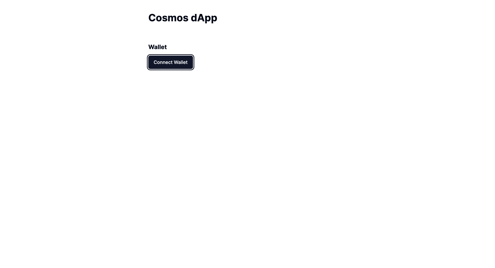

# cosmos-kit을 연동

cosmos-kit을 템플릿을 사용하지 않고 직접 연동한다.

Wallet 연결부터 State 조회, Transcation 전송 등 모든 기능을 Step-by-step으로 이해하며 따라한다.

## 프로젝트 생성 및 라이브러리 추가

아래 nextjs 프로젝트를 생성해서 빈 프로젝트부터 필요한 라이브러리 및 cosmos-kit을 추가한다.

### nextjs 프로젝트 생성

```bash
$ npx create-next-app@latest my-app --typescript --tailwind --eslint
$ ✔ Would you like to use `src/` directory? … No
$ ✔ Would you like to use App Router? (recommended) … Yes
$ ✔ Would you like to customize the default import alias (@/*)? … No
```

### shadcn/ui

UI를 쉽게 적용하기 위한 라이브러리
https://ui.shadcn.com/docs/installation

```bash
$ npx shadcn-ui@latest init
$ ✔ Which style would you like to use? › Default
$ ✔ Which color would you like to use as base color? › Slate
$ ✔ Would you like to use CSS variables for colors? … no / yes

> ✔ Writing components.json...
> ✔ Initializing project...
> ✔ Installing dependencies...
> Success! Project initialization completed. You may now add components.
```

프로젝트 실행

```bash
$ yarn dev
```

여기까지 잘 되었다면, 기본 nextjs 프로젝트에 shadcn/ui 테마가 적용된 화면이 나타난다.


### cosmos-kit

https://docs.cosmology.zone/cosmos-kit/get-started

```bash
$ yarn add @cosmos-kit/react @cosmos-kit/cosmostation chain-registry
# @cosmos-kit/react react/nextjs용 라이브러리
# @cosmos-kit/cosmostation 지갑 지원을 위한 라이브러리
# chain-registry 앱체인 정보를 가져오기 위한 라이브러리
```

연동을 위해 `provider.tsx` 클래스를 만들고, cosmos-kit을 위한 ChainProvider를 연결해준다.

#### **`app/provider.tsx 추가`**

```ts
"use client";
import React from "react";
import { wallets } from "@cosmos-kit/cosmostation";
import assets from "chain-registry/assets";
import { chains } from "chain-registry";
import { ChainProvider } from "@cosmos-kit/react";
import "@interchain-ui/react/styles";
export default function Providers({ children }: { children: React.ReactNode }) {
  return (
    <ChainProvider chains={chains} assetLists={assets} wallets={wallets}>
      {children}
    </ChainProvider>
  );
}
```

#### **`app/layout.tsx 수정`**

```ts
import type { Metadata } from "next";
import { Inter } from "next/font/google";
import "./globals.css";
//코드 추가
import Providers from "./provider";

const inter = Inter({ subsets: ["latin"] });

export const metadata: Metadata = {
  title: "Create Next App",
  description: "Generated by create next app",
};

export default function RootLayout({
  children,
}: Readonly<{
  children: React.ReactNode;
}>) {
  return (
    <html lang="en">
      <body className={inter.className}>
        //코드 수정
        <Providers>{children}</Providers>
      </body>
    </html>
  );
}
```

## 지갑 연결 기능 구현

shadcn 버튼 모듈 추가

```bash
npx shadcn-ui@latest add button
```

#### **`components/wallet.tsx 추가`**

```ts
"use client";

import { useChain } from "@cosmos-kit/react";
import { Button } from "./ui/button";

export default function Wallet() {
  const { chain, status, address, openView } = useChain("cosmoshubtestnet");
  return (
    <Button onClick={openView}>
      {status === "Connected" ? (
        <>
          {chain.chain_name} {address}
        </>
      ) : (
        <>Connect Wallet</>
      )}
    </Button>
  );
}
```

useChain 훅을 이용해 cosmoshubtestnet 체인과 지갑을 연결하게 되며, 만약 해당 체인 정보가 없다면 chain-registry에 있는 정보를 가지고 지갑에 앱 체인 정보를 자동으로 추가해 준다.

지갑 연결 상태, 체인 정보, 지갑 주소, 연결 팝업을 활용할 수 있다.

#### **`app/page.tsx 수정`**

```ts
import Wallet from "@/components/wallet";

export default function Home() {
  return (
    <main>
      <div className="mt-10 grid place-items-center">
        <Wallet />
      </div>
    </main>
  );
}
```

위 코드를 통해 지갑 연결이 정상적으로 되는지 확인한다.


