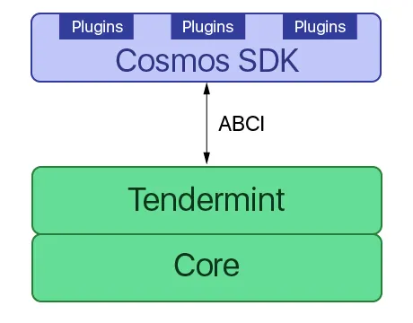

# 02. App chain architecture

이 그림을 반드시 이해야함. 매우 중요..

아! 여기선 굳이 컨센서스 레벨에 대해서는 건들지는 않을 거야. (오히려 공감하고 이해하는데 방해가 된다고 생각하거든)



```
                ^  +-------------------------------+  ^
                |  |                               |  |   Built with Cosmos SDK
                |  |  State-machine = Application  |  |
                |  |                               |  v
                |  +-------------------------------+
                |  |                               |  ^
Blockchain node |  |           Consensus           |  |
                |  |                               |  |
                |  +-------------------------------+  |   CometBFT
                |  |                               |  |
                |  |           Networking          |  |
                |  |                               |  |
                v  +-------------------------------+  v
```

https://youtu.be/1_ottIKPfI4?si=XstKA2YGi2-yYKzF
