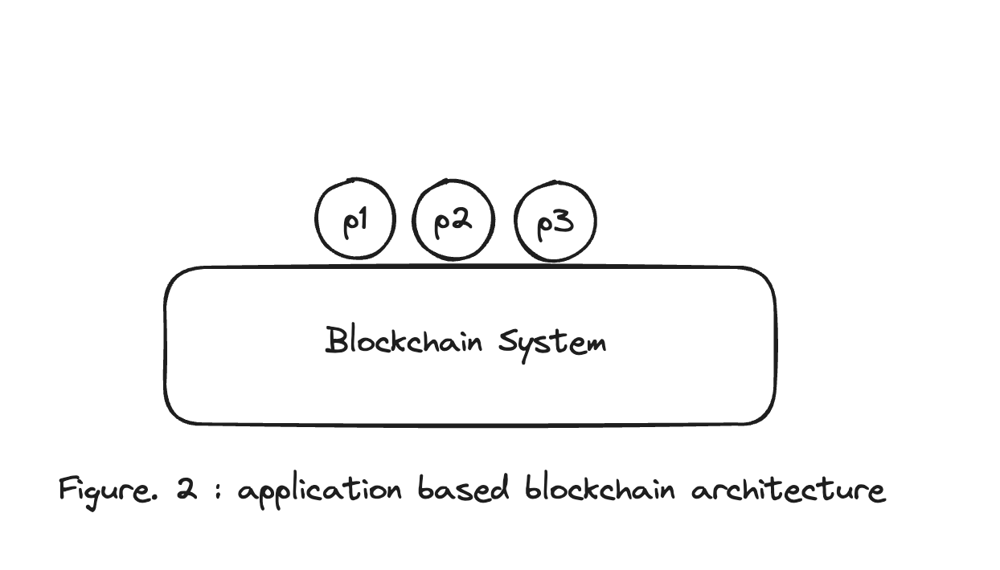
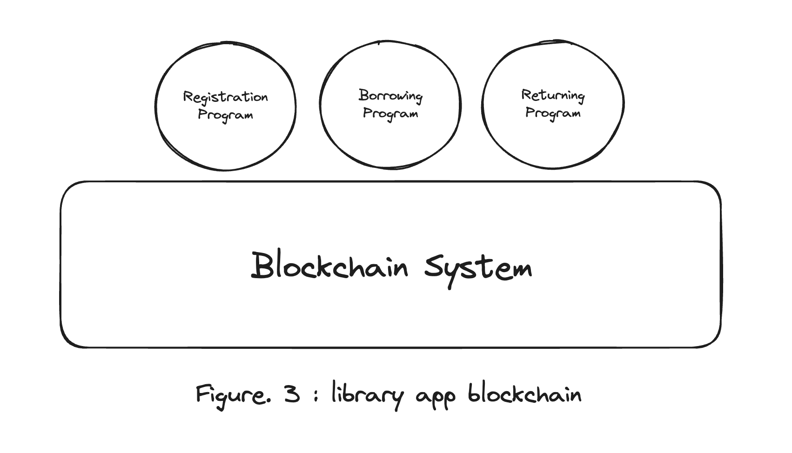

# 02. Understand App Chain Architecture

### Preview

**Hello Earth 🌏!, Welcome to Cosmos 🌌**, 코스모스 베이직 과정 두번째 챕터에 온 걸 환영한다.

두번째로 우리가 다룰 주제는 **'앱 체인 아키텍쳐 이해하기'** 이다.

지난 시간에는 왜 App-Specific Blockchain이라는 컨셉이 등장했는지 공감하고 이해하는 시간을 가졌었다.

이어서 우리가 이번 과정에서 배울 내용은 그 앱 체인(app-specific chain)이 어떻게 구성되어있는지 Cosmos-SDK 기반으로 알아보는 것이다.

### What Are Application-Specific Blockchain

Cosmos-SDK가 무엇인지 살펴보기 전에 우린 먼저 app specific chain이 어떤 느낌인지 다시 한번 살펴보자.

사실 참고문서인 cosmos sdk official docs에서는 아래와 같이 설명되어있다.

> Application-specific blockchains are blockchains customized to operate a single application. Instead of building a decentralized application on top of an underlying blockchain like Ethereum, developers build their own blockchain from the ground up. This means building a full-node client, a light-client, and all the necessary interfaces (CLI, REST, ...) to interact with the nodes.
> _(https://docs.cosmos.network/v0.50/learn/intro/why-app-specific)_

그렇지만, 다소 헷갈릴 수 있게 표현되어있다고 생각되기 때문에 지난 시간처럼 강의를 위해 보다 쉽게 재구성했으니, 지난번에 배웠던 예시와 그림들을 떠올리면서 이번 강의를 수강한다면 좀 더 쉽게 이해가능할 것이다.



우린 지난시간에 도서관이란 시스템을 예로 앱 체인에 대해서 이야기했다. 이렇게 도서관과 같이 **하나의 어플리케이션만을 위한 블록체인이 바로 application-specific blockchain(app-specific chain, 이하 앱체인)**이다.

공식문서에서는 single application. 이라고 표현되어 있어서 그러면 하나의 프로그램만이 올라가있냐고 착각하실 수도 있지만, 하나의 어플리케이션에는 여러 기능들이 존재할 수 있으니 하나의 서비스만을 위한 체인으로 생각하면 된다.

계속해서 도서관이란 시스템을 예로 들어서 도서관에는 회원가입기능, 대출기능, 반납기능 등이 필요하다고 보자.
(추가적인 기능들이 있을 수 있겠지만 생략한다)

다시 위의 말을 간추려본다면, **'도서관 앱 체인'**에는 다음과 같은 프로그램들이 올라갈 것이다.

1. 회원가입 프로그램 (Registration Program)
2. 대출 프로그램 (Borrowing Program)
3. 반납 프로그램 (Returning Program)

이제 그럼 위에서 보았던 application based blockchain 아키텍쳐를 예시로 든 '도서관 앱 체인'에 맞게 좀 더 구체적으로 표현해보도록 하자.



### Shortcut of Application-Specific Blockchains

강의를 이어가기 전에, 다시 한번 우리가 위에서 배운 내용을 짧게 요약한다면 우리는 이제 이렇게 말할 수 있을 것이다.

흔히 블록체인을 접하게 되면 가장 먼저 배우게 되는 VM based의 Ethereum(EVM)같이 general purpose를 위한 application blockchains이 아닌(하나의 블록체인 위에 여러 어플리케이션을 올리려는 목적) 도서관 예시와 같이 이렇게 **하나의 어플리케이션(=서비스)를 위한 블록체인이 바로 application-specific blockchains이다**라고 말이다.

### Application-Specific Blockchains Benefits

그럼 간단히 offical docs에 나와있는 앱 체인의 장점들에 대해서 알아보도록 하자.

앱체인에는 크게 4가지 장점(flexibility, performance, security, sovereignty)이 존재한다.

우린 모든 장점을 자세히 다루지는 않을 것이고 간단히만 훑어보도록 하자.
(당장의 교육과정과 개발과정엔 크게 중요하지 바로 와닿기도 힘들 것 같아서 이다)

다만, 추후에 좀 더 자세히 앱체인의 특장점에 대해 알고 싶으신 분들은 이 [링크](https://docs.cosmos.network/v0.50/learn/intro/why-app-specific#application-specific-blockchains-benefits)를 통해서 원문을 읽어보는 걸 권장한다.

##### 1. Flexibility

우리가 앞으로 배울 코스모스 생태계의 앱체인들은 기본적으로 Cosmos-SDK를 기반으로 만들어져있다.
(사실 앱체인이라고 해서 반드시 Cosmos-SDK를 써야하는 것은 아니지만)

해당 SDK 아키텍쳐에 대해서는 바로 다음 섹션에서 다룰 것이다. 걱정하지 말자!

하지만, 그걸 다루기 전에 간단히만 설명한다면 앱 체인은 크게

1. 어플리케이션 영역과
2. 컨센서스 엔진 영역으로 나뉜다고 볼 수 있다.

그리고 이 두 파트는 ABCI(Application BlockChain Interface)라고 불리는 인터페이스로 연결되어있다.

따라서, **이 인터페이스 표준만 맞춘다면 반드시 cosmos-sdk와 cometbft(전 tendermint)를 써야할 필요는 없다.** 그리고 이를 flexibility라고 표현한다.

> Application-specific blockchains give maximum flexibility to developers: In Cosmos blockchains, the state-machine is typically connected to the underlying consensus engine via an interface called the ABCI. This interface can be wrapped in any programming language, meaning developers can build their state-machine in the programming language of their choice.

이런 내용들에 대해 더 많이 궁금하다면,

- 정말 유명하고 잘하는 paradigm에서 적은 [DAG based의 Narwhal&Bullshark with Cosmos-sdk 아티클](https://www.paradigm.xyz/2022/07/experiment-narwhal-bullshark-cosmos-stack)을 읽어보시는 것도 좋고

- 최근 privacy asset transfer(shiled transfer)로 열심히 개발 중인 [namada](https://specs.namada.net/base-ledger/consensus)를 찾아보는 것도 좋을 것이다.

(여기서 다들 질문 하나씩을 해주길 바란다.. 🙏🙏🙏)

##### 2. Performance

퍼포먼스는 흔히들 말하는 TPS(transaction per seconds)를 뜻한다.
(혹시, 이 말을 이해못하겠다면 바로 손을 들기바란다 🙋‍♂️. 눈치보면 너만 바보다..)

따라서, 퍼포먼스란 얼마나 많은 트랜잭션들을 적은 시간 내에 효율적으로 처리할 수 있느냐를 의미한다.

우리가 배울 앱 체인은 당연히 general purpose체인들인 VM based 체인들과 달리 하나의 어플리케이션을 위해서 컴퓨팅 리소스를 소모하기 때문에 상대적으로 더 퍼포먼스가 좋다고 볼 수 있다.

> In order to optimize the performance of the decentralized application, it needs to be constructed as a block chain specific to the application. An application-specific blockchain only operates a single application, so that the application does not compete with others for computation and storage.

##### 3. Security

이 부분은 생략한다. 궁금하다면 레퍼런스 링크를 참고바란다.

##### 4. Sovereignty

마지막! 대망의 Sovereignty이다! 이 주권성? 이라고 표현해야하나? **이 Sovereignty는 사실상 앱 체인의 가장 큰 장점이자 특징**이라고 볼 수 있다.

일반적으로 general purpose 체인들은 여러 디앱이 하나의 체인 위에 올라가기 떄문에 특정 디앱만을 위한 온체인 레벨의 수정이나 제안을 하기 어려울 수 있다.

하지만, 앱 체인은 그 어플리케이션만을 위한 체인으로 디앱 파트인 어플리케이션의 UX를 개선하기 위해서 코어 레벨의 수정도 같이 제안하고 개선해나갈 수 있다는 말이다. 그래서, 이런 특징을 자기주권성과 같이 부른다. 이런 점들을 잘 살린 체인인 Injective랑 dYdX등이 있는데 나중에 같이 알아보면 좋겠다.

> One of the major benefits of application-specific blockchains is sovereignty. The fundamental issue here is that the governance of the application and the governance of the network are not aligned. This issue is solved by application-specific blockchains. Because application-specific blockchains specialize to operate a single application, stakeholders of the application have full control over the entire chain. This ensures that the community will not be stuck if a bug is discovered, and that it has the freedom to choose how it is going to evolve.

##### etc. Furthermore

그리고 공식문서에는 언급되지 않은 내용이지만, 간단히 ICS(Interchain Security)에 대해서도 추가적으로 언급하고자 한다.

위의 내용으로만 본다면 앱 체인은 나름의 방향성과 목적성을 가진 꽤나 괜찮은 블록체인의 방향성일 수 있다. 하지만, 위와 같이 여러 주권을 가진 각각의 앱 체인들은 체인마다의 주권을 가지고 있기 때문에 그로 인해 각자의 토큰의 TVL에 따른 **시큐리티를 분산된 형태로 가지게 된다.**

이는 여러 앱 체인들 중 상대적으로 TVL이 낮은 체인의 경우 보안에 좀 더 취약해질 수 있다는 말을 뜻한다.
(PoS 특정상 체인의 시큐리티를 Cash로 지키자는 것이 기본적인 내포된 의미이기 때문, 나중에 PoS와 PoW에 대해서도 장황하게 얘기할 기회가 있으면 좋겠는데 우선 현재 코스상에 방해만 되므로 생략한다. 이는 따로 질문 좀 🙋‍♂️!🙋‍♂️!🙋‍♂️! 하라는 말이다)

위의 이유로 현재 Cosmos 생택계에는 Interchain Security과 같은 새로운 Soveringn app chain들의 시큐리티를 Cosmos(ATOM) 와 같은 [큰 TVL](https://www.coingecko.com/en/coins/cosmos-hub)의 시큐리티를 상속받아서 운영하는 방식도 논의되고 생겨나고 있다. (ex: Stride & Neutron)

---

### Cosmos-SDK based App Chain Architecture

자! 이제 우리가 배울 코스모스 앱 체인의 아키텍쳐에 대해 설명할 차례이다.

하지만, 해당 내용은 다음 아티클로 미루도록 하겠다. 대신에 이번 시간에 배웠던 그림과 아래그림을 어떻게 매칭해야할지 많이 고민하는 것으로 시간을 마치려고 합니다.

```sh
              +---------------------+
              |                     |
              |     Application     |       -> Cosmos-SDK
              |                     |
              +--------+---+--------+
                       ^   |
                       |   | ABCI
                       |   v
              +--------+---+--------+
              |                     |
              |                     |
              |     Tendermint      |
              |                     |
              |                     |
              +---------------------+
```

```sh
                ^  +-------------------------------+  ^
                |  |                               |  |   Built with Cosmos SDK
                |  |  State-machine = Application  |  |
                |  |                               |  v
                |  +-------------------------------+
                |  |                               |  ^
Blockchain node |  |           Consensus           |  |
                |  |                               |  |
                |  +-------------------------------+  |   CometBFT
                |  |                               |  |
                |  |           Networking          |  |
                |  |                               |  |
                v  +-------------------------------+  v
```

### References

- https://docs.cosmos.network/v0.50/learn/intro/why-app-specific
