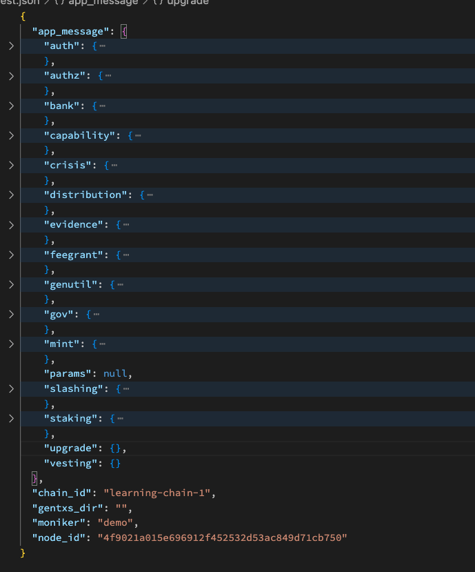
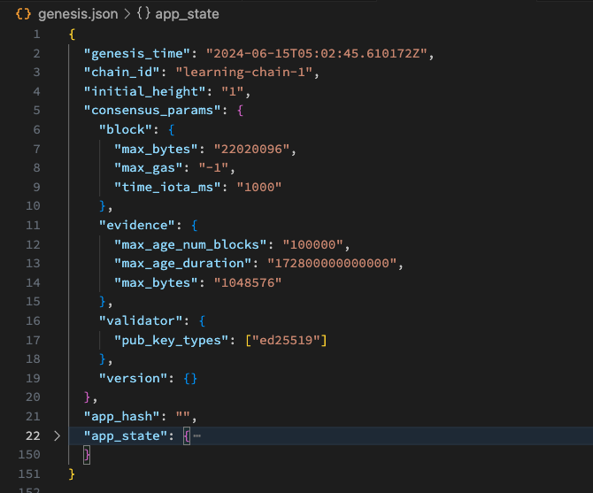
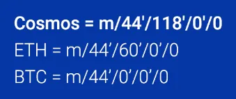
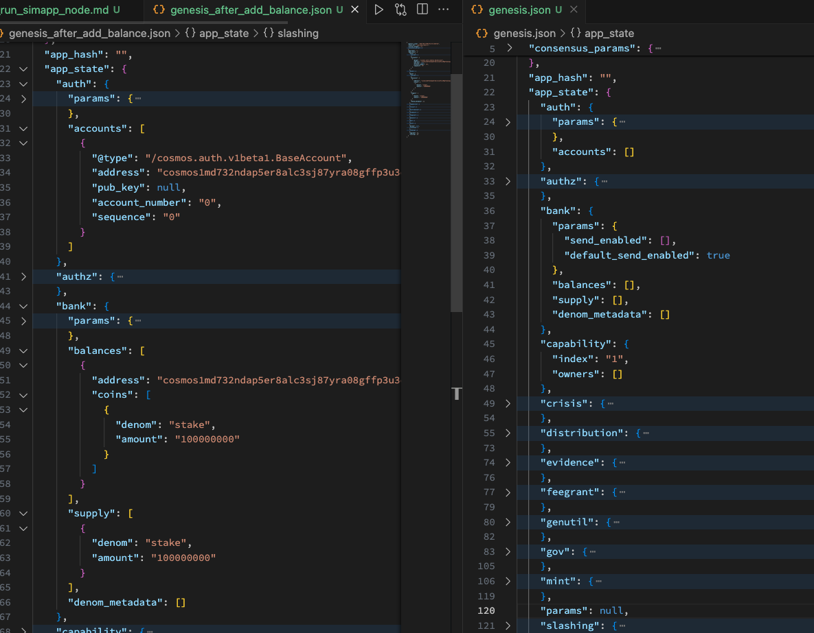
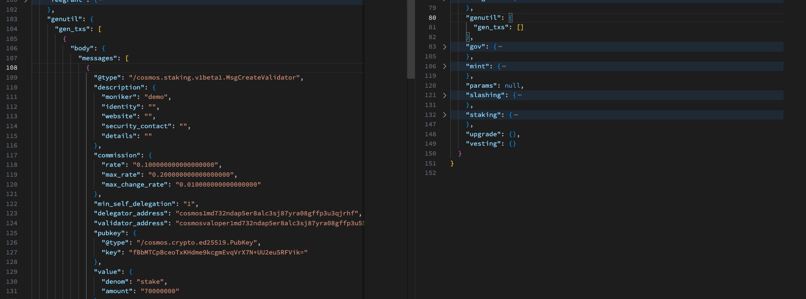

# 04. Run a Simapp (Simulation Appchain) Node

### Preview

**Hello Eearth 🌏!, Welcome to Cosmos 🌌**, 코스모스 베이직 과정 네번째 챕터에 온 걸 환영한다.

이번 시간부터는 이제 아티클 위주의 lecture가 아닌 실습을 병행할 것이다. 🧑‍💻🧑‍💻🧑‍💻

네번째 시간인 이번 강의에서는 코스모스 SDK로 만들어진 가장 기본적인 앱(앱체인)을 구동시켜볼 것인데, 바로 simapp에 대한 아키텍쳐를 공부하고 어떻게 cosmos-sdk로 appchain을 custom해서 앱체인을 개발하는 지를 기대하셨던 분들도 있었을테지만 !!!

개인적으로 **먼저 어플리케이션을 경험한 뒤에 '이건 어떻게 만들어졌을까?' 고민하고 생각하면서 깊게 배우는 방식**이 좀 더 효과적일 것 같아서 순서를 바꾸었으니 이해바란다.
(개인적으로 어떤 것을 이해하는데 있어서 다양한 방법들이 있겠지만, 직접 써보고 필요성과 흥미를 얻어야 좀 더 몰입이 잘될 것 같아서입니다)

그래서, 이번 강의에서 우리가 배우게 될 내용은 simapp이라고 하는 앱체인을 구동(operating)하는 것이다. 여기서 operating이란 0번째 블록인 제네시스 블록부터해서 블록 3,4개를 합의를 통해서 생성하고 이번 강의를 마무리할 것이다.

참고로, 이번 글은 이 [링크](https://tutorials.cosmos.network/tutorials/3-run-node/)를 재구성한 것이고, [영상](https://www.youtube.com/watch?v=wNUjkp2PFQI)도 있으니 필요하면 글로만 구성된 이번 강의가 부족한 사람들은 각자가 선호하는 컨텐츠에 맞춰서 참고하셔도 좋을 것이다.

### Build a Simapp

먼저 이번 강의를 진행하면서 사용할 작업 디렉토리(working directory)를 생성하고 cosmos-sdk git을 클론한다.

```bash
# make your own working directory
mkdir ~/cosmos-basic && cd cosmos-basic

# clone cosmos-sdk git
git clone https://github.com/cosmos/cosmos-sdk && cd cosmos-sdk
```

다음으로는 우린 v0.45.4 버젼에 맞춰서 앱체인 구조를 공부할 계획이기 때문에 `v0.45.4` branch로 switch 한다.

이제 `simd`라고 하는 simapp client를 build하고 version을 체크하자.

```bash
# switch to v0.45.4
git checkout v0.45.4

# build a simapp client
make build

# checking simapp version
./build/simd version

# >>> 0.45.4
```

그리고 이제 먼저 simapp 뒤에 `help`라는 명령어를 통해서 간단히 어떤 명령어들이 있는지 눈으로만 확인하자.

이번 강의에서는 해당 명령어 중 일부 명령어만 배울 예정이고, 다른 명령어들도 해보면 당연히 좋을 것이다.

(혼자서 공부하다가 헷갈리면 뒤에 그냥 `help`를 붙여보면 어느정도의 example들이 포함되어 있으니 참고하길 바란다)

```bash

# command help
./build/simd help


simulation app

Usage:
  simd [command]

Available Commands:
  add-genesis-account Add a genesis account to genesis.json
  collect-gentxs      Collect genesis txs and output a genesis.json file
  config              Create or query an application CLI configuration file
  debug               Tool for helping with debugging your application
  export              Export state to JSON
  gentx               Generate a genesis tx carrying a self delegation
  help                Help about any command
  init                Initialize private validator, p2p, genesis, and application configuration files
  keys                Manage your application's keys
  migrate             Migrate genesis to a specified target version
  query               Querying subcommands
  rollback            rollback cosmos-sdk and tendermint state by one height
  rosetta             spin up a rosetta server
  start               Run the full node
  status              Query remote node for status
  tendermint          Tendermint subcommands
  testnet             Initialize files for a simapp testnet
  tx                  Transactions subcommands
  validate-genesis    validates the genesis file at the default location or at the location passed as an arg
  version             Print the application binary version information

Flags:
  -h, --help                help for simd
      --home string         directory for config and data (default "/Users/jeongseup/.simapp")
      --log_format string   The logging format (json|plain) (default "plain")
      --log_level string    The logging level (trace|debug|info|warn|error|fatal|panic) (default "info")
      --trace               print out full stack trace on errors

Use "simd [command] --help" for more information about a command.
```

---

### Initialize Simapp

`help` 명령어를 통해서 여러 커맨드들을 구경했으니 이제 `init` 명령어를 통해서 다음과 같이 내 로컬에 simapp 체인에 필요한 기본적 것들을 초기화하자.

```bash
# initiate simapp node in local
./build/simd init demo \
 --home ./private/.simapp \
 --chain-id learning-chain-1 > init.json
```

명령을 한 뒤에 `--home` flag에 위치한 디렉토리로 이동해서 initial app state인 genesis이 생성되었을텐데 우선 genesis가 아닌 위의 명령어로 생성된 result json를 확인한다.

(jq와 같은 json syntax prettier가 없으면 그냥 vscode로 파일을 열어보셔도 무방하다)

굉장히 다양한 key-value 값들이 존재하는데 우선 간단히만 보고 넘어간다.

```json
// init command result
{
  "app_message": {
    "auth": {
      "accounts": [],
      "params": {
        "max_memo_characters": "256",
        "sig_verify_cost_ed25519": "590",
        "sig_verify_cost_secp256k1": "1000",
        "tx_sig_limit": "7",
        "tx_size_cost_per_byte": "10"
      }
    },
    "authz": {
      "authorization": []
    },
    "bank": {
      "balances": [],
      "denom_metadata": [],
      "params": {
        "default_send_enabled": true,
        "send_enabled": []
      },
      "supply": []
    },
    "capability": {
      "index": "1",
      "owners": []
    },
    "crisis": {
      "constant_fee": {
        "amount": "1000",
        "denom": "stake"
      }
    },
    "distribution": {
      "delegator_starting_infos": [],
      "delegator_withdraw_infos": [],
      "fee_pool": {
        "community_pool": []
      },
      "outstanding_rewards": [],
      "params": {
        "base_proposer_reward": "0.010000000000000000",
        "bonus_proposer_reward": "0.040000000000000000",
        "community_tax": "0.020000000000000000",
        "withdraw_addr_enabled": true
      },
      "previous_proposer": "",
      "validator_accumulated_commissions": [],
      "validator_current_rewards": [],
      "validator_historical_rewards": [],
      "validator_slash_events": []
    },
    "evidence": {
      "evidence": []
    },
    "feegrant": {
      "allowances": []
    },
    "genutil": {
      "gen_txs": []
    },
    "gov": {
      "deposit_params": {
        "max_deposit_period": "172800s",
        "min_deposit": [
          {
            "amount": "10000000",
            "denom": "stake"
          }
        ]
      },
      "deposits": [],
      "proposals": [],
      "starting_proposal_id": "1",
      "tally_params": {
        "quorum": "0.334000000000000000",
        "threshold": "0.500000000000000000",
        "veto_threshold": "0.334000000000000000"
      },
      "votes": [],
      "voting_params": {
        "voting_period": "172800s"
      }
    },
    "mint": {
      "minter": {
        "annual_provisions": "0.000000000000000000",
        "inflation": "0.130000000000000000"
      },
      "params": {
        "blocks_per_year": "6311520",
        "goal_bonded": "0.670000000000000000",
        "inflation_max": "0.200000000000000000",
        "inflation_min": "0.070000000000000000",
        "inflation_rate_change": "0.130000000000000000",
        "mint_denom": "stake"
      }
    },
    "params": null,
    "slashing": {
      "missed_blocks": [],
      "params": {
        "downtime_jail_duration": "600s",
        "min_signed_per_window": "0.500000000000000000",
        "signed_blocks_window": "100",
        "slash_fraction_double_sign": "0.050000000000000000",
        "slash_fraction_downtime": "0.010000000000000000"
      },
      "signing_infos": []
    },
    "staking": {
      "delegations": [],
      "exported": false,
      "last_total_power": "0",
      "last_validator_powers": [],
      "params": {
        "bond_denom": "stake",
        "historical_entries": 10000,
        "max_entries": 7,
        "max_validators": 100,
        "unbonding_time": "1814400s"
      },
      "redelegations": [],
      "unbonding_delegations": [],
      "validators": []
    },
    "upgrade": {},
    "vesting": {}
  },
  "chain_id": "learning-chain-1",
  "gentxs_dir": "",
  "moniker": "demo",
  "node_id": "4f9021a015e696912f452532d53ac849d71cb750"
}
```

위에서는 한번에 내용이 너무 많으니 이걸 좀 편하게 folding해서 보도록 하자.


우리가 init이란 명령어로 출력된 메세지에는 다음과 같이 크게 app_message, chain_id, moniker, node_id 값들이 존재하는 것을 볼 수 있다.

각각의 값들은 다시 아래와 같은 파일들로 분리되어 각각의 출력된 값들이 정리된다.

- app_message & chain_id -> genesis.json
- moniker -> config/config.toml
- node_id -> node_key.json

그리고 app_message 부분을 좀 더 살펴보면 다음과 같은 키들이 추가적으로 보일 것이다.

app_message 밑에 존재하는 각 키들은 simapp에서 사용되는 기본 모듈들에 대한 initial state가 담겨있고 각 키가 존재한다는 의미로 auth, authz 같은 모듈들이 simapp에 포함되어있다는 것을 의미한다.



이렇게 [README](https://github.com/cosmos/cosmos-sdk/blob/v0.45.4/x/README.md)를 통해서 각 기본모듈 listup과 설명을 보실 수도 있다.

### Understand Init Module State & Catch Up Genesis State

#### Understand Init Module State

많은 기본 모듈들 중에 우린 스테이킹 모듈만 한번 살펴본다.

각각의 모듈들은 사용성이 다르나, 기본적인 구조 자체는 비슷하므로 하나만 제대로 이해하시면 다른 모듈도 금방 이해가능할 것이다.

참고로 모든 앱체인들이 해당 사항을 준수하지는 않지만 cosmos-sdk에서 기본적으로 제공하는 모듈들은 각각이 spec 문서가 존재하기 때문에 자세한 모듈의 목적과 의미 사용성등은 [스펙 문서](https://github.com/cosmos/cosmos-sdk/blob/v0.45.4/x/staking/spec/README.md)를 살펴보는 것도 좋다.

```json
// staking module example init state
{
  "staking": {
    "delegations": [],
    "exported": false,
    "last_total_power": "0",
    "last_validator_powers": [],
    "params": {
      "bond_denom": "stake",
      "historical_entries": 10000,
      "max_entries": 7,
      "max_validators": 100,
      "unbonding_time": "1814400s"
    },
    "redelegations": [],
    "unbonding_delegations": [],
    "validators": []
  },
  "upgrade": {},
  "vesting": {}
}
```

#### Catch Up Genesis State

이제 위의 app_message가 포함된 genesis state를 살펴보자.

init command를 통해서, result로 보았던 app_message와 chain_id는 제가 genesis.json에 포함된다고 했으므로 해당 파일을 살펴보면 될 것이다.

```bash
# print initial app state
jq ./private/.simapp/config/genesis.json
```

역시나 너무나 많은 데이터들이 한번에 들어오는데 위에서 처럼 folding해서 보자. 구조만 눈에 들어오는게 익숙해지고 이해가 된다면 생각보다 간단하다고 생각될 것이다.

app_message에서 보았던 application state들은 app_state에 포함되어있고, 그 밖에 우리가 체크해보면 좋을 요소는 `init` 명령어에서 flag로 주입했던 `chain_id`가 잘 genesis에 포함되어있다는 걸 캐치하면 된다.



---

### Prepare to Create a New Block

#### Alice Account

그 다음으로는 account를 하나 만들 예정입니다. 제네시스 스테이트를 init한 뒤에 새로운 블록을 생성하기 위해서는 validator가 필요하기 때문입니다.

우린 간단히 밸리데이터 alice를 genesis state에 포함시켜서 simapp을 구동하도록 하겠습니다.

먼저, 현재 우리가 사용하고 있는 working directory에 initialized 된 key를 보겠습니다. 아마 아무런 결과도 출력되지 않을텐데, 그건 당연히 현재 우리가 사용하고 있는 home directory에는 아무런 키가 없기 때문입니다.

```bash
./build/simd keys list \
    --home ./private/.simapp \
    --keyring-backend test
```

이제 `alice`란 이름의 account를 생성합시다. 잘 생성했다면 아래와 같은 결과가 출력될 것입니다.

```bash
# create a alice account(mnemonic)
./build/simd keys add alice \
    --home ./private/.simapp \
    --keyring-backend test

# - name: alice
#   type: local
#   address: cosmos1md732ndap5er8alc3sj87yra08gffp3u3qjrhf
#   pubkey: '{"@type":"/cosmos.crypto.secp256k1.PubKey","key":"A6uTQ2JNyME5LpFz+LoT68nlg2a+Jxedsbs3mb8Scph8"}'
#   mnemonic: ""

# **Important** write this mnemonic phrase in a safe place.
# It is the only way to recover your account if you ever forget your password.

# <random... >
```

한 가지 알고 넘어갈 내용은 key-path입니다.

명령어로 생성된 니모닉(그냥 엄청나게 큰 숫자를 의미함, 시드값)을 통해서 우리의 address가 derive되기 까지는 이러한 path가 정해져야 하는데 이건 각 프로토콜 마다 조금씩 다릅니다.

저희가 배울 cosmos-sdk로 된 appchain에서는 주로 118 path를 사용합니다.

우선 해당 내용은 이런게 있다고만 하고 넘어가겠습니다. 더 자세한 내용은 제가 근무하고 있는 코스모스테이션에서 작성했던 이 [아티클](https://medium.com/cosmostation/mnemonic-phrase-hd-wallets-simplified-12b54f9e5031)를 참고바랍니다.

```bash
# default algorithm & key-path in simapp
  --algo string              Key signing algorithm to generate keys for (default "secp256k1")
  --coin-type uint32         coin type number for HD derivation (default 118)
```



**과제 BIP39 알아보기**

> Derive a new private key and encrypt to disk.
> Optionally specify a BIP39 mnemonic, a BIP39 passphrase to further secure the mnemonic,
> and a bip32 HD path to derive a specific account. The key will be stored under the given name
> and encrypted with the given password. The only input that is required is the encryption password.

다시 본론으로 돌아와서 저희의 home directory에 생성된 키를 이렇게 재확인할 수 있습니다.

```bash
/build/simd keys show alice \\
    --home ./private/.simapp \
    --keyring-backend test

# - name: alice
#   type: local
#   address: cosmos1md732ndap5er8alc3sj87yra08gffp3u3qjrhf
#   pubkey: '{"@type":"/cosmos.crypto.secp256k1.PubKey","key":"A6uTQ2JNyME5LpFz+LoT68nlg2a+Jxedsbs3mb8Scph8"}'
#   mnemonic: ""
```

마지막으로 우린 alice에게 validator로 bond할 수 있는 토큰을 제네시스 스테이트에 업데이트 해주면 어카운트 준비가 끝납니다.

```bash
# check bond denom for preparing alice validatror
grep bond_denom ./private/.simapp/config/genesis.json

# "bond_denom": "stake"

# add initial tokens into genesis
./build/simd add-genesis-account alice 100000000stake \
    --home ./private/.simapp \
    --keyring-backend test
```

<!-- TODO -->

genesis를 아래와 같이 비교해서 보면 어떤 것을 준비하는 단계인지 이해하기 더 쉬울 것입니다.



#### Validator

이제 키도 만들었고, 앨리스에게 initial token도 업데이트 해줬으니 다음은 제네시스로 블록체인이 실행되면서 앨리스가 밸리데이터가 될 수 있도록 genesis transaction(gentx)를 만들겠습니다.

이번 명렁어도 어떤 걸 의미하는지는 아래의 비교사진에서 다시 봅시다.

```bash
# Do not forget to use your own --chain-id.
./build/simd gentx alice 70000000stake \\
    --home ./private/.simapp \
    --keyring-backend test \
    --chain-id learning-chain-1
Genesis transaction written to "private/.simapp/config/gentx/gentx-b5c926d6bcacbf7803a47b90e5dcb2b4576a8724.json"
```

아래 json이 방금 생성한 gentx입니다. 해당 gentx는 alice account를 밸리데이터로 선언하는 transaction인 것을 볼 수 있습니다.

```json
{
  "body": {
    "messages": [
      {
        "@type": "/cosmos.staking.v1beta1.MsgCreateValidator",
        "description": {
          "moniker": "demo",
          "identity": "",
          "website": "",
          "security_contact": "",
          "details": ""
        },
        "commission": {
          "rate": "0.100000000000000000",
          "max_rate": "0.200000000000000000",
          "max_change_rate": "0.010000000000000000"
        },
        "min_self_delegation": "1",
        "delegator_address": "cosmos1md732ndap5er8alc3sj87yra08gffp3u3qjrhf",
        "validator_address": "cosmosvaloper1md732ndap5er8alc3sj87yra08gffp3u55xkm6",
        "pubkey": {
          "@type": "/cosmos.crypto.ed25519.PubKey",
          "key": "fBbMTCpBceoTxKHdme9kcgmEvqVrX7N+UU2eu5RFVik="
        },
        "value": {
          "denom": "stake",
          "amount": "70000000"
        }
      }
    ],
    "memo": "b5c926d6bcacbf7803a47b90e5dcb2b4576a8724@192.168.0.101:26656",
    "timeout_height": "0",
    "extension_options": [],
    "non_critical_extension_options": []
  },
  "auth_info": {
    "signer_infos": [
      {
        "public_key": {
          "@type": "/cosmos.crypto.secp256k1.PubKey",
          "key": "A6uTQ2JNyME5LpFz+LoT68nlg2a+Jxedsbs3mb8Scph8"
        },
        "mode_info": {
          "single": {
            "mode": "SIGN_MODE_DIRECT"
          }
        },
        "sequence": "0"
      }
    ],
    "fee": {
      "amount": [],
      "gas_limit": "200000",
      "payer": "",
      "granter": ""
    }
  },
  "signatures": [
    "bNFYCOIqle0q5sG9+Btxx+fUtNtfPJ6hkUPvH9N2phl9gb6dJVUxVJ4pjLpZrlagjmtGJAJEHQoQTRoXfZVEyQ=="
  ]
}
```

그리고 저희 환경에서는 앨리스만 밸리데이터로 세울 에정이니 아래의 collect-gentxs를 실행하겠습니다.

> collect-gentxs: After you have created this genesis transaction in its own file, collect all the genesis transactions with collect-gentxs to include them in your genesis file. Here you have only one anyway:

```bash
$ ./build/simd collect-gentxs \
    --home ./private/.simapp
```

자 그럼 텅 비었던 genutil이란 모듈에 새로운 스테이트가 업데이트 된 것을 볼 수 있습니다. 바로 앨리스가 밸리데이터로 선언되는 tx입니다. 이후에 체인이 가동될 때 해당 gentxs들이 실행되면서 0번째 블록에서부터 앨리스를 밸리데이터로서 블록을 생성하는데 합의할 수 있는 party로 만듭니다.



보다 자세한 내용은 (해당 부분)[https://tutorials.cosmos.network/tutorials/3-run-node/#make-yourself-a-proper-validator]를 참고하시면 좋습니다.

ps. tip! 실제 프로덕션 환경에서는 이렇게 하나의 어카운트로 밸리데이터 파티를 구성하는 것이 아니라, 탈중앙화된 특정 파티들을 구성하고 각 파티가 gentx를 제출하여 collect한 state를 genesis로 사용합니다.

### Run a node & Create new blocks

모든 준비는 끝났습니다. 이제 `start` 커맨드를 통해서 앨리스가 밸리데이터로서 합의에 참여해 저희가 만든 learning chain에 새로운 블록들을 생성합시다.

짜잔 아래 그림처럼 블록을 만든 것을 볼 수 있어!

```bash
./build/simd start \
    --home ./private/.simapp
```


**과제 : 만약 우리 체인이 여러명의 밸리데이터로 구성되어있다면 어떻게 될까? 블록이 생성되려면 몇 명이상이 합의에 동의해야할까?**

<!-- 과제 관련 내용

> As previously explained, a Cosmos SDK blockchain relies on identified validators to produce blocks. Initially there is no validator to generate blocks. You are in a catch-22 situation: your initialized and unstarted chain needs a genesis account and a validator for bootstrapping purposes.

> You must make your key, also known as an account, have an initial balance in the genesis file. For that, you need to know the staking denomination:
> In this scenario, for your network to even run you must meet the 2/3rds threshold of the weighted validators. -->

---

### Interaction state with our simapp

블록체인을 정상적으로 가동시켰으면 해당 체인에 우리가 처음에 넣었던 앨리스의 잔액이 남아있는지 확인해봅시다.

앨리스의 주소는 cosmos1md732ndap5er8alc3sj87yra08gffp3u3qjrhf 였으니 아래와 같이 커맨드를 구성합니다.

```bash
# query alice accont
./build/simd query bank balances cosmos1md732ndap5er8alc3sj87yra08gffp3u3qjrhf
```

```json
// query result
{
  "balances": [
    {
      "denom": "stake",
      "amount": "30000000"
    }
  ],
  "pagination": {
    "next_key": null,
    "total": "0"
  }
}
```

저희가 만든 로컬 체인을 구성하고 해당 체인과 인터랙션해보는 이번 강의는 여기까지입니다. 추가적으로 체인과 인터랙션을 하는 내용은 official docs에 더 내용이 있으니 해보고 싶으신 분들은 해보시길 추천드립니다.

그리고, 다음 시간에는 오늘 다룬 simapp의 architecture에 대해서 배우도록 하겠습니다.

ps. 오늘 배운 내용들에 대한 json file들은 assets에 다 올려놨으니 참고해도 좋습니다.

**과제 : 각자 로컬에서 simapp chain를 구동시켜볼 것**
