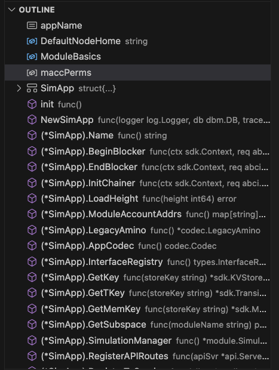

# Simapp 아키텍처의 이해-1

### Preview

**Hello Earth 🌏!, Welcome to Cosmos 🌌**, 코스모스 베이직 과정 다섯번째 챕터에 온 걸 환영한다.

우린 지난 세번째 시간에 앱 체인의 메인 컴포넌트에 대해 배웠고, 잘은 모르겠지만 지난 시간에는 그 구성요소들 포함된 어플리케이션 simapp을 구동시켰다.

그럼 이제는 일단은 돌아가던 그 메인 컴포넌트들이 어떻게 구현되어있는지 좀 더 자세히 알아보자.

우선 우리가 다시 생각해봐야할 포인트는 Cosmos SDK로 구현된 앱 체인은 여러 레이어로 구성되어 있으며, 개발자들이 주로 신경 쓰는 부분은 맨 위의 state-machine 레벨이라는 것이다.

그렇다고 개발자로서 컨센서스 레이어 파트를 전혀 안쓰이는 것은 아니고 대부분 인터페이스화가 되어있으니 어플리케이션에 레벨에서 개발을 하실 때 몇몇 특정 메소드가 ABCI란 인터페이스를 통해서 CometBFT레벨로 전달되는구나 정도만 우선 알고 넘어가도록 하자.

```sh
                ^  +-------------------------------+  ^
                |  |                               |  |
                |  |  State-machine = Application  |  |
                |  |                               |  |   Built with Cosmos SDK
                |  |            ^      +           |  |
                |  +----------- | ABCI | ----------+  v
                |  |            +      v           |  ^
                |  |                               |  |
Blockchain Node |  |           Consensus           |  |
                |  |                               |  |
                |  +-------------------------------+  |   CometBFT
                |  |                               |  |
                |  |           Networking          |  |
                |  |                               |  |
                v  +-------------------------------+  v
```

### Simapp 되돌아보기

우리는 이전 시간에 simapp이라는 어플리케이션을 다루어보았다.

해당 simapp의 데몬명칭은 simd였고, `simd start`란 명령어를 통해서 simapp 노드 운영을 실습해보았다.

그러면 이제 running해보았던 해당 simapp 노드의 코어가 어떻게 되었는지 조금 더 들여다보도록 하자.

**참고사항**

> Cosmos SDK based 블록체인 풀 노드는 일반적으로 -d로 끝나는 바이너리로 나타난다 (예: appd 또는 gaiad). 추가로, 이 바이너리는 ./cmd/appd/에 있는 main.go 파일을 실행하여 빌드된다. 이 작업은 일반적으로 Makefile을 통해 이루어진다.

### Simapp 아키텍쳐

먼저 simapp의 구조를 살펴보도록 하자!

뭔가 딱봐도 많이 복잡해보이는데 일단 golang이니 이 구조를 패키지(모듈) 단위로 묶어서 보는게 좀 더 심플하니

우선은 너무 걱정말고 두자.

```bash
.
├── README.md
├── app.go
├── app_test.go
├── config.go
├── encoding.go
├── export.go
├── genesis.go
├── genesis_account.go
├── genesis_account_test.go
├── helpers
│   └── test_helpers.go
├── params
│   ├── amino.go
│   ├── doc.go
│   ├── encoding.go
│   ├── params.go
│   ├── proto.go
│   └── weights.go
├── sim_bench_test.go
├── sim_test.go
├── simd
│   ├── cmd
│   │   ├── cmd_test.go
│   │   ├── genaccounts.go
│   │   ├── genaccounts_test.go
│   │   ├── root.go
│   │   ├── testnet.go
│   │   └── testnet_test.go
│   └── main.go
├── state.go
├── test_helpers.go
├── types.go
├── utils.go
└── utils_test.go
```

그럼 이제 위의 복잡한 파일들을 모듈 단위로 묶어보자. 아마 이전보다 더 눈에 확 잘 들어오게 될 것이다.

```bash
.
├── README.md
├── simapp (*.go)
├── helpers module
│   └── *.go
├── params module
│   ├── *.go
├── simd
│   ├── cmd module
│   │   ├── *.go
│   └── main.go (main module, entrypoint)
```

이 상태에서 우선 짚고 넘어가야할 부분은 **어디가 main module, 즉 entrypoint인지와 메인 블록체인 어플리케이션이 어디에서 정의되는 것인지**를 체크해보는 것이다.

아래에 구조들 중에 당연히 main module 하나이고, `simd/main.go`에서 정의되었다는 것을 알 수 있고. 나머지 root directory에 존재하던 `/*.go` 파일들을은 simapp 이란 module로 묶여서 다룰 실질적인 코어 어플리케이션 레벨이라는 것을 알 수 있다.

그리고 helpers, parasm, cmd 같은 모듈들은 각각 유틸리티나 cli의 커맨드를 위한 모듈이라는 것을 유추해볼 수 있다.

**참고사항**

> 그 중에 app.go란 파일에 있는 아래 코드를 보면 우리가 제네시스에서 사용했던 각 모듈들이 app.go라고 하는 app chain의 기본 구조체에서 참조하고 있다는 걸 알 수 있다. 👀 👀 👀

### Core application file, app.go

그럼 이제 제일 중요한 core application file인 app.go에 대해 배워보도록 하자.

#### 1. import modules

`app.go` 파일을 보면 제네시스에서 사용했던 각 모듈들이 이 파일에서 참조된다는 것을 알 수 있다. `app.go`에 정의된 모듈들이 결국 우리가 만들 혹은 만들고자 하는 어플리케이션 체인의 각 어플리케이션이 될 수 있음을 시사한다.

```go
package simapp

import (
	"encoding/json"
	"io"
	"net/http"
	"os"
	"path/filepath"

	"github.com/gorilla/mux"
	"github.com/rakyll/statik/fs"
	"github.com/spf13/cast"
	abci "github.com/tendermint/tendermint/abci/types"
	"github.com/tendermint/tendermint/libs/log"
	tmos "github.com/tendermint/tendermint/libs/os"
	dbm "github.com/tendermint/tm-db"

	"github.com/cosmos/cosmos-sdk/baseapp"
	"github.com/cosmos/cosmos-sdk/client"
	"github.com/cosmos/cosmos-sdk/client/grpc/tmservice"
	"github.com/cosmos/cosmos-sdk/client/rpc"
	"github.com/cosmos/cosmos-sdk/codec"
	"github.com/cosmos/cosmos-sdk/codec/types"
	"github.com/cosmos/cosmos-sdk/server/api"
	"github.com/cosmos/cosmos-sdk/server/config"
	servertypes "github.com/cosmos/cosmos-sdk/server/types"
	simappparams "github.com/cosmos/cosmos-sdk/simapp/params"
	"github.com/cosmos/cosmos-sdk/testutil/testdata"
	sdk "github.com/cosmos/cosmos-sdk/types"
	"github.com/cosmos/cosmos-sdk/types/module"
	"github.com/cosmos/cosmos-sdk/version"
	"github.com/cosmos/cosmos-sdk/x/auth"
	"github.com/cosmos/cosmos-sdk/x/auth/ante"
	authrest "github.com/cosmos/cosmos-sdk/x/auth/client/rest"
	authkeeper "github.com/cosmos/cosmos-sdk/x/auth/keeper"
	authsims "github.com/cosmos/cosmos-sdk/x/auth/simulation"
	authtx "github.com/cosmos/cosmos-sdk/x/auth/tx"
	authtypes "github.com/cosmos/cosmos-sdk/x/auth/types"
	"github.com/cosmos/cosmos-sdk/x/auth/vesting"
	vestingtypes "github.com/cosmos/cosmos-sdk/x/auth/vesting/types"
	"github.com/cosmos/cosmos-sdk/x/authz"
	authzkeeper "github.com/cosmos/cosmos-sdk/x/authz/keeper"
	authzmodule "github.com/cosmos/cosmos-sdk/x/authz/module"
	"github.com/cosmos/cosmos-sdk/x/bank"
	bankkeeper "github.com/cosmos/cosmos-sdk/x/bank/keeper"
	banktypes "github.com/cosmos/cosmos-sdk/x/bank/types"
	"github.com/cosmos/cosmos-sdk/x/capability"
	capabilitykeeper "github.com/cosmos/cosmos-sdk/x/capability/keeper"
	capabilitytypes "github.com/cosmos/cosmos-sdk/x/capability/types"
	"github.com/cosmos/cosmos-sdk/x/crisis"
	crisiskeeper "github.com/cosmos/cosmos-sdk/x/crisis/keeper"
	crisistypes "github.com/cosmos/cosmos-sdk/x/crisis/types"
	distr "github.com/cosmos/cosmos-sdk/x/distribution"
	distrclient "github.com/cosmos/cosmos-sdk/x/distribution/client"
	distrkeeper "github.com/cosmos/cosmos-sdk/x/distribution/keeper"
	distrtypes "github.com/cosmos/cosmos-sdk/x/distribution/types"
	"github.com/cosmos/cosmos-sdk/x/evidence"
	evidencekeeper "github.com/cosmos/cosmos-sdk/x/evidence/keeper"
	evidencetypes "github.com/cosmos/cosmos-sdk/x/evidence/types"
	"github.com/cosmos/cosmos-sdk/x/feegrant"
	feegrantkeeper "github.com/cosmos/cosmos-sdk/x/feegrant/keeper"
	feegrantmodule "github.com/cosmos/cosmos-sdk/x/feegrant/module"
	"github.com/cosmos/cosmos-sdk/x/genutil"
	genutiltypes "github.com/cosmos/cosmos-sdk/x/genutil/types"
	"github.com/cosmos/cosmos-sdk/x/gov"
	govkeeper "github.com/cosmos/cosmos-sdk/x/gov/keeper"
	govtypes "github.com/cosmos/cosmos-sdk/x/gov/types"
	"github.com/cosmos/cosmos-sdk/x/mint"
	mintkeeper "github.com/cosmos/cosmos-sdk/x/mint/keeper"
	minttypes "github.com/cosmos/cosmos-sdk/x/mint/types"
	"github.com/cosmos/cosmos-sdk/x/params"
	paramsclient "github.com/cosmos/cosmos-sdk/x/params/client"
	paramskeeper "github.com/cosmos/cosmos-sdk/x/params/keeper"
	paramstypes "github.com/cosmos/cosmos-sdk/x/params/types"
	paramproposal "github.com/cosmos/cosmos-sdk/x/params/types/proposal"
	"github.com/cosmos/cosmos-sdk/x/slashing"
	slashingkeeper "github.com/cosmos/cosmos-sdk/x/slashing/keeper"
	slashingtypes "github.com/cosmos/cosmos-sdk/x/slashing/types"
	"github.com/cosmos/cosmos-sdk/x/staking"
	stakingkeeper "github.com/cosmos/cosmos-sdk/x/staking/keeper"
	stakingtypes "github.com/cosmos/cosmos-sdk/x/staking/types"
	"github.com/cosmos/cosmos-sdk/x/upgrade"
	upgradeclient "github.com/cosmos/cosmos-sdk/x/upgrade/client"
	upgradekeeper "github.com/cosmos/cosmos-sdk/x/upgrade/keeper"
	upgradetypes "github.com/cosmos/cosmos-sdk/x/upgrade/types"

	// unnamed import of statik for swagger UI support
	_ "github.com/cosmos/cosmos-sdk/client/docs/statik"
)
```

가령 우리가 만들 앱 체인이 도서관 체인이라고 가정하였다면, 위에 있는 여러 import 된 모듈에는 지난번에 얘기했던 register module, borrow module, return module등이 존재할 것이다.

그에 따라서 우린 이렇게 표현해볼 수 있다.

> 그렇다면, '도서관 앱 체인'에는 다음과 같은 프로그램들 필요하다.
>
> 1. 회원가입 프로그램 (Registration Program)
> 2. 대출 프로그램 (Borrowing Program)
> 3. 반납 프로그램 (Returning Program)
>    그럼 위에서 보았던 application based blockchain 아키텍쳐를 예시로 든 '도서관 앱 체인'에 맞게 좀 더 구체적으로 표현하면 이렇게 그려질 것이다.


```go
import (
	// something code lines
	// ...
	// ..
	registerkeeper "github.com/cosmos/cosmos-sdk/x/register/keeper"
	registertx "github.com/cosmos/cosmos-sdk/x/register/tx"
	registertypes "github.com/cosmos/cosmos-sdk/x/register/types"

	borrowkeeper "github.com/cosmos/cosmos-sdk/x/borrow/keeper"
	borrowtx "github.com/cosmos/cosmos-sdk/x/borrow/tx"
	borrowtypes "github.com/cosmos/cosmos-sdk/x/borrow/types"

	returnkeeper "github.com/cosmos/cosmos-sdk/x/return/keeper"
	returntx "github.com/cosmos/cosmos-sdk/x/return/tx"
	returntypes "github.com/cosmos/cosmos-sdk/x/register/types"
)
```

#### 2. const & variables

그리고 다음으로는 const와 variable에 대해서 보자.

이 파트는 simapp이 표준은 아니고 각 체인마다 어떻게 정의하냐의 차이만 있다.

먼저, simapp에서 `app.go` 내에 사용된 전체 const & variables의 코드 블럭을 보겠다.

```go
const appName = "SimApp"

var (
	// DefaultNodeHome default home directories for the application daemon
	DefaultNodeHome string

	// ModuleBasics defines the module BasicManager is in charge of setting up basic,
	// non-dependant module elements, such as codec registration
	// and genesis verification.
	ModuleBasics = module.NewBasicManager(
		auth.AppModuleBasic{},
		genutil.AppModuleBasic{},
		bank.AppModuleBasic{},
		capability.AppModuleBasic{},
		staking.AppModuleBasic{},
		mint.AppModuleBasic{},
		distr.AppModuleBasic{},
		gov.NewAppModuleBasic(
			paramsclient.ProposalHandler, distrclient.ProposalHandler, upgradeclient.ProposalHandler, upgradeclient.CancelProposalHandler,
		),
		params.AppModuleBasic{},
		crisis.AppModuleBasic{},
		slashing.AppModuleBasic{},
		feegrantmodule.AppModuleBasic{},
		upgrade.AppModuleBasic{},
		evidence.AppModuleBasic{},
		authzmodule.AppModuleBasic{},
		vesting.AppModuleBasic{},
	)

	// module account permissions
	maccPerms = map[string][]string{
		authtypes.FeeCollectorName:     nil,
		distrtypes.ModuleName:          nil,
		minttypes.ModuleName:           {authtypes.Minter},
		stakingtypes.BondedPoolName:    {authtypes.Burner, authtypes.Staking},
		stakingtypes.NotBondedPoolName: {authtypes.Burner, authtypes.Staking},
		govtypes.ModuleName:            {authtypes.Burner},
	}
)

var (
	_ App                     = (*SimApp)(nil)
	_ servertypes.Application = (*SimApp)(nil)
)

// ... something code lines
// ...
// ...
```

대부분의 것들을 쉽게 넘어가면 되는데 `ModuleBasic`를 통해서 각 모듈이 cosmos-sdk 레벨에서 정의 모듈이란 기본 인터페이스를 만족하는지 체크하고 생성해주는 것은 알고 넘어가면 된다.

```go
func module.NewBasicManager(modules ...module.AppModuleBasic) module.BasicManager

// AppModuleBasic is the standard form for basic non-dependant elements of an application module.
type AppModuleBasic interface {
	Name() string
	RegisterLegacyAminoCodec(*codec.LegacyAmino)
	RegisterInterfaces(codectypes.InterfaceRegistry)

	DefaultGenesis(codec.JSONCodec) json.RawMessage
	ValidateGenesis(codec.JSONCodec, client.TxEncodingConfig, json.RawMessage) error

	// client functionality
	RegisterRESTRoutes(client.Context, *mux.Router)
	RegisterGRPCGatewayRoutes(client.Context, *runtime.ServeMux)
	GetTxCmd() *cobra.Command
	GetQueryCmd() *cobra.Command
}
```

그리고 아래와 같이 특정 인터페이스를 만족하는 core application struct가 될 수 있도록 타입 및 인터페이스 제한도 되어있다는 점도 알고 가면 좋다.

```go
var (
	_ App                     = (*SimApp)(nil)
	_ servertypes.Application = (*SimApp)(nil)
)
```

#### 3. simapp struct

이제 그럼 simapp 이라고 불리는 우리가 다뤄보았던 어플리케이션의 구조체와 메소드에 대해서 살펴보자.

이 구조체가 의미하는 것은 지난시간에 배웠던 run a node에서 `start` 명령어를 실행하면 app.go 파일에 정의된 state-machine 구조체가 인스턴스화가 되는 것을 뜻한다.

우선 app.go 파일 안에는 굉장히 많은 코드들이 있는데 이것들을 하나하나 다 살펴보기 전에 이렇게 outline을 잡아서 대강 어떤 내용들이 있을지 유추해보자.

아래의 그림은 vscode로 살펴본 `SimApp` 의 구조체와 Methods이다. 뭔가 여러 기능들이 존재할 것 같은데 하나씩 살펴보자.



먼저, 계속해서 강조하는 `app.go`에는 애플리케이션의 타입 정의와 초기화 함수가 포함되어있다. 우리가 보고 있는 simapp 같은 cosmos-sdk based application 의 타입 정의는 다음과 같다. (앱 체인의 기본 정의라고 보면 된다)

1. BaseApp 참조 : baseapp를 확장한 애플리케이션 정의로 baseapp은 대부분의 핵심 로직을 실현한다
2. storage key 리스트 : 각 모듈은 자신의 상태를 저장하기 위해 여러 스토리지를 사용한다
3. module manager 리스트 : 각 모듈은 자신의 keeper를 정의하여야 한다
4. appCodec 참조 : 데이터에 대한 코덱으로 tx-msg를 encode & decode합니다. 여기서의 코덱은 protobuf 코덱을 의미한다
5. legacyAmino 인코더 참조 : protobuf과 같은 코덱이 쓰이기 이전의 레거시 코덱이 amino이다
6. 모듈 관리자와 기본 모듈 관리자 : 모듈을 관리하고, 필요한 서비스와 쿼리 서비스 등을 등록한다

**(장황하게 많고 갑자기 어려운 단어들이 불쑥 튀어나왔다고 해서 걱정할 필요는 없다 어차피 계속해서 보다보면 점점 머릿속에서 개념들이 잡혀나갈 것이다 무리해서 이해하려하지 말고! 반드시 그냥 받아드려라)**

ref; https://docs.cosmos.network/v0.47/learn/beginner/overview-app

자, 그럼 위에 구성요소가 담긴 core application simapp의 app.go 를 살펴보자

```go
// SimApp extends an ABCI application, but with most of its parameters exported.
// They are exported for convenience in creating helper functions, as object
// capabilities aren't needed for testing.
type SimApp structure {
	*baseapp.BaseApp
	legacyAmino *codec.LegacyAmino
	appCodec codec.Codec
	interfaceRegistry types.InterfaceRegistry

	invCheckPeriod uint

	// keys to access the substores
	keys map[string]*storetypes.KVStoreKey
	tkeys map[string]*storetypes.TransientStoreKey
	memKeys map[string]*storetypes.MemoryStoreKey

	// keeps
	AccountKeeper authkeeper.AccountKeeper
	BankKeeper bankkeeper.Keeper
	CapabilityKeeper *capabilitykeeper.Keeper
	StakingKeeper stakingkeeper.Keeper
	SlashingKeeper slashingkeeper.Keeper
	MintKeeper mintkeeper.Keeper
	DistrKeeper distrkeeper.Keeper
	GovKeeper govkeeper.Keeper
	CrisisKeeper crisiskeeper.Keeper
	UpgradeKeeper upgradekeeper.Keeper
	ParamsKeeper paramskeeper.Keeper
	AuthzKeeper authzkeeper.Keeper
	EvidenceKeeper evidencekeeper.Keeper
	FeeGrantKeeper feegrantkeeper.Keeper
	GroupKeeper groupkeeper.Keeper
	NFTKeeper nftkeeper.Keeper

	// the module manager
	mm *module.Manager

	// simulation manager
	sm *module.SimulationManager

	// module configurator
	configurator module. Configurator
}
```

뭔가 내용이 많은데 한번에 다 안들어올테니 여기서는 이런 위에서 배운 6가지 컴포넌트들이 어떻게 배치되어있는지 눈으로 훑는 정도만 하고 넘어가보자.

### Appchain Initiate Method (NewSimApp)

위에서 배운 복잡한 구조체인 `SimApp` struct는 일단 instanciate 해줄 create method가 필요하다.

우리는 이걸 `NewSimApp`이란 함수로 정의한다. 이 NewSimApp과 같은 앱체인 구조체를 인스턴스화 시켜주는 함수는 cosmos-sdk에서 `AppCreator`라고 부른다.

AppCreator func을 통해서 실제 struct를 이제 instance시킬 수 있는 function의 signature를 만들어준거라고 볼 수 있다.

#### AppCreator Signature

> This function constructs a new application with the type defined in the previous section. It must meet the AppCreator signature to be used in the start order of the application guardian program order.

```go
// AppCreator is a function that allows us to lazily initialize an
// application using various configurations.
AppCreator func(log.Logger, dbm.DB, io.Writer, AppOptions) Application
```

### NewSimApp Method

위에서 정의한 simapp을 initiate 해주는 NewApp(AppCreator)를 다 만들고 보면 좀 복잡하기 때문에 이번 시간에는 간략히만 훑고 넘어가도록 하겠다.

다만 위에서 말했던 1~6번 기능들이 아래에 어떻게 구현되어있는지 정도만 살짝 맞춰보면 좋을 것 같다.

> 1. BaseApp 참조 : baseapp를 확장한 애플리케이션 정의로 baseapp은 대부분의 핵심 로직을 실현한다
> 2. storage key 리스트 : 각 모듈은 자신의 상태를 저장하기 위해 여러 스토리지를 사용한다
> 3. module manager 리스트 : 각 모듈은 자신의 keeper를 정의하여야 한다
> 4. appCodec 참조 : 데이터에 대한 코덱으로 tx-msg를 encode & decode합니다. 여기서의 코덱은 > protobuf 코덱을 의미한다
> 5. legacyAmino 인코더 참조 : protobuf과 같은 코덱이 쓰이기 이전의 레거시 코덱이 amino이다
> 6. 모듈 관리자와 기본 모듈 관리자 : 모듈을 관리하고, 필요한 서비스와 쿼리 서비스 등을 등록한다

```go
// NewSimApp returns a reference to an initialized SimApp.
func NewSimApp(
	logger log.Logger, db dbm.DB, traceStore io.Writer, loadLatest bool, skipUpgradeHeights map[int64]bool,
	homePath string, invCheckPeriod uint, encodingConfig simappparams.EncodingConfig,
	appOpts servertypes.AppOptions, baseAppOptions ...func(*baseapp.BaseApp),
) *SimApp {
	appCodec:= encodingConfig.Codec
	legacyAmino:= encodingConfig.Amino
	interfaceRegistry:= encodingConfig.InterfaceRegistry

	bApp:= baseapp.NewBaseApp(appName, logger, db, encodingConfig.TxConfig.TxDecoder(), baseAppOptions..)
	bApp. SetCommitMultiStoreTracer(traceStore)
	bApp.SetVersion(version.Version)
	bApp.SetInterfaceRegistry(interfaceRegistry)

	keys:= sdk.NewKVStoreKeys(
		authtypes.StoreKey, banktypes.StoreKey, stakingtypes.StoreKey,
		minttypes.StoreKey, districts.StoreKey, slashingtypes.StoreKey,
		govtypes.StoreKey, paramstypes.StoreKey, upgradetypes.StoreKey, feegrant.StoreKey,
		evidencepes.StoreKey, capabilitytypes.StoreKey,
		authzkeeper.StoreKey, nftkeeper.StoreKey, group.StoreKey,
	)
	tkeys:= sdk.NewTransientStoreKeys(paramstypes.TStoreKey)
	// NOTE: The testingkey is just mounted for testing purposes. Actual applications should
	// not include this key.
	memKeys:= sdk.NewMemoryStoreKeys(capabilitytypes.MemStoreKey, "testingkey")

	// configure state listening capabilities using AppOptions
	// we are doing nothing with the returned streaming Services and waitGroup in this case
	if _, _, err:= streaming.LoadStreamingServices(bApp, appOpts, appCodec, keys); err != nil {
		tmos.Exit(err.Error())
	}

	app:= &SimApp{
		BaseApp: bApp,
		legacyAmino: legacyAmino,
		appCodec: appCodec,
		interfaceRegistry: interfaceRegistry,
		invCheckPeriod: invCheckPeriod,
		keys: keys,
		tkeys: tkeys,
		memKeys: memKeys,
	}
	// set the BaseApp's parameter store

	// ..
	// ..
	// .. skipped some code bases
	// ..
	// 꽤 많은 코드들이 생략되었음.

	return app
}
```

### Appchain Method

그럼 위에서 보았던 다른 `SimApp` 구조체가 cosmos-sdk based baseapp이 되기 위한 인터페이스를 만족하기 위한 여러 메소드들을 살펴보자.

해당 메소드들은 보일러 플레이트 경향이 있긴 하나 그래도 일단 cosmos-sdk based 체인들이라면 반드시 구현해야하는 메소드들이다.

이런 메소드들은 저희는 이미 위에서 아래와 같은 outline으로 배웠다.


#### InitChainer

먼저, 첫번째로 다룰 메소드는 `InitChainer` 함수이다.

이 녀석이 해주는 역할은 결국에 0번째 블록을 실행시켜서 첫번째 블록은 block1을 위한 스테이트를 init해주는 걸 뜻한다.

우리가 지난 시간에 gentx를 만들어서 genesis에 넣었던게 그 파트의 연장으로, 만약 그 과정에서 staking을 안했다면 initChainer로부터 에러를 받게 될 것이다.

그리고 만약 제네시스에 올바르지 않은 signature txs가 있더라도 마찬가지다.

```go
// InitChainer application update at chain initialization
func (app *SimApp) InitChainer(ctx sdk.Context, req abci.RequestInitChain) abci.ResponseInitChain {
	var genesisState GenesisState
	if err:= json.Unmarshal(req.AppStateBytes, &genesisState); err != nil {
		panic(err)
	}
	app.UpgradeKeeper.SetModuleVersionMap(ctx, app.mm.GetVersionMap())
	return app.mm.InitGenesis(ctx, app.appCodec, genesisState)
}
```

#### BeginBlocker and EndBlocker

다음으로 다룰 메소드는 beginblocker & endblocker이다. 그 의미는 말 그대로 블록이 생성되기 전과 후에 동작하는 hook이라고 보면 된다. 가장 쉬운 예로 인플레이션이 존재하는 코스모스 체인은 beginblock에 mint란 모듈이 토큰을 생성하는 훅이 존재한다.

이 메소드들은 Cosmos-SDK에 있어서 굉장히 유니크하고 재미난 포인트이다.

사실 다른 ethereum과 같은 체인들에도 비슷한 logic이나 component가 있는지 정확히 모르겠지만! 이 파트가 매력적이어서 코스모스로 넘어온 체인들도 꽤 있기 때문이다.

([injective](https://youtu.be/p3rK4rBmy9U?si=vrXHiVzsTx-de-Dt)와 같은 체인이 이 endblocker를 통해서 재밌는 로직을 넣어서 dex application을 더 최적화 시켰던 것으로 기억한다, 아! 그리고 dydx도 있다)

말하고자 하는 의의는 결국 dapp들이 체인의 블록 프로듀싱과 같은 코어 레벨 단에서 각 어플리케이션이 니즈에 의해서 L2(Layer2)나 다른 ecocsytem의 general purpose vm application에서 soverign application으로 전환하는 경우가 있다는 것이다.

각 `BeginBlocker`와 `EndBlocker`는 아래와 같은 단순한 함수이지만 해당 함수들에 내포된 실질적인 로직들은 각 모듈레벨에 존재하기 때문에 일단 스킵하고 넘어가자.

단! 우리가 알아야할 점들은 cosmos-sdk로 구현된 앱체인들에는 각 체인마다의 비즈니스 로직에 맞춰서 블록 생성 전과 후의 어떠한 로직을 녹여낼 수 있다라는 점이 좋은 포인트로 알고 넘어가시면 좋겠다.

```go
// BeginBlocker application updates every begin block
func (app *SimApp) BeginBlocker(ctx sdk.Context, req abci.RequestBeginBlock) abci.ResponseBeginBlock {
	return app.mm.BeginBlock(ctx, req)
}

// EndBlocker application updates every end block
func (app *SimApp) EndBlocker(ctx sdk.Context, req abci.RequestEndBlock) abci.ResponseEndBlock {
	return app.mm.EndBlock(ctx, req)
}
```

#### Registered encoder

코덱은 말 그대로 코덱이다.

그렇지만 아마도 여기에 코덱의 의미자체가 크게 와닿지 않는 개발자분들도 있으실 것 같다.

쉽게 말해 블록체인은 계속해서 어떠한 상태값을 키-밸류로 저장해야하는 데이터베이스인데, 이 때문에 가급적이면 최소한의 비용(작은 크기)로 각각의 블록체인에 대한 statement를 구성하고 업데이트하려고 한다.

그래서 대부분의 블록체인에서는 전달받은 데이터를 그대로 저장하지 않고 각 체인마다의 코덱으로 인코딩하여 압축된 bytes array로 저장하게 된다.

cosmos-sdk에서는 이런 이유로 codec으로 protobuf en&decoder를 사용하는데
(protobuf이 무엇인지는 나중에 배울테니 넘어가면 된다!)

모든 타입의 메세지를 코덱으로 지원할 수도 없고, 악의적인 형태의 메세지가 요청될 수 있기도 하기 때문에 `InterfaceRegistry`란 Registry를 만들어 특정 메세지들만 요청될 수 있도록 한다.

> InterfaceRegistry. InterfaceRegistry is used by Protobuf encoder to handle the interface of using google.protobuf.Any for coding and decoding （ We also say “ unpacking ”）.

이런 부분 때문에 각 체인마다 `EncodingConfig` struct에는 registry와 codec이 같이 존재한다. 이때 코덱이 2개인 것을 보실 수 있는데 위에서도 말했다시피 Amino는 레거시 코덱이고, codec혹은 marshaler가 현재 주로 쓰이는 protobuf기반의 코덱이다.

- Codec: The default coder used by the entire Cosmos SDK. It consists of BinaryCodec for coding and decoding status and JSONCodec for exporting data to users （ for example ） in CLI. In the default case, SDK uses Protobuf as a encoder.

- TxConfig: TxConfig defines an interface where the client can use it to generate a specific transaction type defined by the application. Currently, SDK handles two types of transactions: SIGN_MODE_DIRECT（ uses Protobuf binary as an online code ） and SIGN_MODE_LEGACY_AMINO_JSON（ relies on Amino）.

```go
// EncodingConfig specifies the concrete encoding types to use for a given app.
// This is provided for compatibility between protobuf and amino implementations.
type EncodingConfig struct {
	InterfaceRegistry types. InterfaceRegistry
	Codec codec. Codec
	TxConfig client. TxConfig
	Amino *codec.LegacyAmino
}
```

**참고사항**
코스모스 생태계에는 EIP처럼 ADR이라고 하는 스탠다드 문서가 존재한다. 그리고 이 문서와 거버넌스를 통해서 이전에 protobuf를 코덱으로 사용하자는 [의견이 채택되어](https://github.com/cosmos/cosmos-sdk/blob/main/docs/architecture/adr-019-protobuf-state-encoding.md) 현재 사용되고 있는 것이다.

풀 네임은 Architecture Decision Records 를 ADR이라고 하고, 다른 프로토콜에서의 EIP 같은 거라고 보면된다.

### Baseapp

끝으로 baseapp 에 대해서만 간단히 얘기하고 이 렉쳐를 마무리하자.

BaseApp은 Cosmos SDK 애플리케이션을 구현하는 기본 구조체로, simapp도 해당 baseapp의 확장된 구조체이다.

이 baseapp 유형은 다음과 같은 기능을 한다.

```go
type App struct {
  // reference to a BaseApp
  *baseapp.BaseApp

  // list of application store keys

  // list of application keepers

  // module manager
}

```

- 1. 애플리케이션 블록 링크는 상태 머신과 하부 합의 엔진(예: Tendermint) 간의 통신을 위해 사용
- 2. 서비스 라우터는 메시지와 쿼리를 적절한 모듈로 라우팅
- 3. 다른 상태들, 상태 머신은 수신한 ABCI 메시지에 따라 다양한 변동 상태를 업데이트
- 4. BaseApp의 목표는 Cosmos SDK 애플리케이션의 기본 레이어를 제공하여, 개발자가 쉽게 확장하여 자신만의 사용자 정의 애플리케이션을 구축. 일반적으로 개발자는 자신의 애플리케이션을 위해 사용자 정의 타입을 생성.

마지막으로 아래는 BaseApp의 struct인데 해당 구조체에서 봤듯이, 이러한 반복되고 각 체인에서 보일러 플레이트로 이뤄져야할 과정들이 이미 BaseApp에 구현되어있거나 구현하도록 인터페이스가 정의되어 있기 때문에.

우리 개발자들은 ABCI 구현, 서비스 라우터, 상태 관리 로직에 대해 신경 쓰지 않고 자신이 원하는 모듈을 사용하여 쉽게 사용자 정의 애플리케이션을 구성할 수 있다.

```go
// BaseApp reflects the ABCI application implementation.
type BaseApp struct { // nolint: maligned
	// initialized on creation
	logger            log.Logger
	name              string               // application name from abci.Info
	db                dbm.DB               // common DB backend
	cms               sdk.CommitMultiStore // Main (uncached) state
	storeLoader       StoreLoader          // function to handle store loading, may be overridden with SetStoreLoader()
	router            sdk.Router           // handle any kind of message
	queryRouter       sdk.QueryRouter      // router for redirecting query calls
	grpcQueryRouter   *GRPCQueryRouter     // router for redirecting gRPC query calls
	msgServiceRouter  *MsgServiceRouter    // router for redirecting Msg service messages
	interfaceRegistry types.InterfaceRegistry
	txDecoder         sdk.TxDecoder // unmarshal []byte into sdk.Tx

	anteHandler    sdk.AnteHandler  // ante handler for fee and auth
	initChainer    sdk.InitChainer  // initialize state with validators and state blob
	beginBlocker   sdk.BeginBlocker // logic to run before any txs
	endBlocker     sdk.EndBlocker   // logic to run after all txs, and to determine valset changes
	addrPeerFilter sdk.PeerFilter   // filter peers by address and port
	idPeerFilter   sdk.PeerFilter   // filter peers by node ID
	fauxMerkleMode bool             // if true, IAVL MountStores uses MountStoresDB for simulation speed.

	// manages snapshots, i.e. dumps of app state at certain intervals
	snapshotManager    *snapshots.Manager
	snapshotInterval   uint64 // block interval between state sync snapshots
	snapshotKeepRecent uint32 // recent state sync snapshots to keep

	// volatile states:
	//
	// checkState is set on InitChain and reset on Commit
	// deliverState is set on InitChain and BeginBlock and set to nil on Commit
	checkState   *state // for CheckTx
	deliverState *state // for DeliverTx

	// an inter-block write-through cache provided to the context during deliverState
	interBlockCache sdk.MultiStorePersistentCache

	// absent validators from begin block
	voteInfos []abci.VoteInfo

	// paramStore is used to query for ABCI consensus parameters from an
	// application parameter store.
	paramStore ParamStore

	// The minimum gas prices a validator is willing to accept for processing a
	// transaction. This is mainly used for DoS and spam prevention.
	minGasPrices sdk.DecCoins

	// initialHeight is the initial height at which we start the baseapp
	initialHeight int64

	// flag for sealing options and parameters to a BaseApp
	sealed bool

	// block height at which to halt the chain and gracefully shutdown
	haltHeight uint64

	// minimum block time (in Unix seconds) at which to halt the chain and gracefully shutdown
	haltTime uint64

	// minRetainBlocks defines the minimum block height offset from the current
	// block being committed, such that all blocks past this offset are pruned
	// from Tendermint. It is used as part of the process of determining the
	// ResponseCommit.RetainHeight value during ABCI Commit. A value of 0 indicates
	// that no blocks should be pruned.
	//
	// Note: Tendermint block pruning is dependant on this parameter in conunction
	// with the unbonding (safety threshold) period, state pruning and state sync
	// snapshot parameters to determine the correct minimum value of
	// ResponseCommit.RetainHeight.
	minRetainBlocks uint64

	// application's version string
	appVersion string

	// recovery handler for app.runTx method
	runTxRecoveryMiddleware recoveryMiddleware

	// trace set will return full stack traces for errors in ABCI Log field
	trace bool

	// indexEvents defines the set of events in the form {eventType}.{attributeKey},
	// which informs Tendermint what to index. If empty, all events will be indexed.
	indexEvents map[string]struct{}
}
```

#### References

https://docs.cosmos.network/v0.50/learn/beginner/app-anatomy
https://docs.cosmos.network/v0.45/core/baseapp.html
