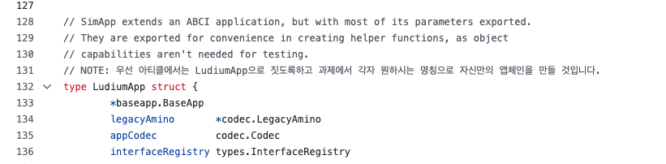
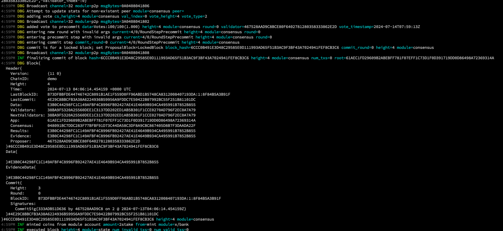

# 07. Make LudiumApp Chain

### Preview

<!-- TODO : preview 멘트 적을 것 -->

이제 저희는 simapp에 대해서 다 배웠습니다. 이제 그럼 simapp과 유사한 간단한 어플리케이션 체인을 만들어보려고 합니다. 이번 아티클은 직접 코드 레벨로 copy & paste를 하면서 어디에 어떤 코드들이 있는지부터 하나씩 배우는 것이 의미있을 것 같아서 글보다는 대부분 직접 실습하고 Q&A를 갖는 것으로 대체하려고 합니다. 바로 시작합시다!

---

<!-- TODO: go mod init부터 해야하나? -->

### 1. clone ludiumapp chain

먼저 제가 준비한 ludiumapp-chain repo를 클론합니다. (레포 위치는 추후 제 개인 깃허브 계정이 아닌 루디움쪽 public repo로 변경하려고 합니다) 이후에 클론을 하셨다면 간단히 바뀐 구조에 대해서만 설명하도록 하겠습니다.

```bash
git clone https://github.com/Jeongseup/ludiumapp-chain
```

우선 기존의 simapp의 code architecture입니다. 비록 저희가 app.go만을 배웠으나 제일 중요한 건 app.go와 main application chain struct를 잘 이해해야 이후에 모듈을 커스텀하거나 모듈파트를 배울 때 어떻게 연결되는지 이해하는데 큰 도움이 되기 때문에 그렇습니다.

나머지 코드들은 많이 보고 익숙해지면 되는 부분이 때문에 생략합니다. 다만 아직 개발 자체가 미숙하신 분들을 위해서 root 경로에서 `<appchain-name>/cmd/main.go`에 기본적으로 main function에 대한 엔트리포인트 및 빌드되는 부분이란 것만 설명드리겠습니다.

#### simapp architecture

기존에 저희가 배웠던 simapp은 app.go 및 기타 application 관련된 코드들이 루트경로에 simapp이란 패키지로 묶여있었습니다.

```sh
├── README.md
├── app.go
├── config.go
├── encoding.go
├── export.go
├── genesis.go
├── genesis_account.go
├── params
│   ├── amino.go
│   ├── doc.go
│   ├── encoding.go
│   ├── params.go
│   ├── proto.go
│   └── weights.go
├── simd
│   ├── cmd
│   │   ├── genaccounts.go
│   │   ├── root.go
│   └── main.go
├── state.go
├── types.go
├── upgrades.go
├── utils.go
```

#### ludiumapp chain

전 위에서 언급했던 어플리케이션 관련 파트들을 app directory로 몰아 넣어서 개발자분들이 좀 더 가시적으로 이해하기 쉽게 정도만 정리해놨습니다.

```sh
├── app
│   ├── app.go
│   ├── const.go
│   ├── default_app_methods.go
│   ├── encoding.go
│   ├── export.go
│   ├── genesis.go
│   ├── params
│   │   ├── config.go
│   │   ├── encoding.go
│   │   ├── params.go
│   │   └── proto.go
│   └── types
│       ├── address.go
│       ├── cointype.go
│       └── config.go
├── go.mod
├── go.sum
├── ludiumappd
│   ├── cmd
│   │   ├── app_creater.go
│   │   ├── genaccount.go
│   │   ├── query.go
│   │   ├── root.go
│   │   └── tx.go
│   └── main.go
```

그리고 참고로 아래와 같이 설명이 좀 필요한 부분에 `NOTE`라고 제가 한국어로 주석을 좀 달아놨습니다. 이해하시는데 도움이 되길 바랍니다.


이 글을 다 읽으셨으면 클론 및 개인 레포를 하나 만들어서 카피코딩을 하는 것으로 마무리합니다. 참고로 이와 비슷한 형태로 simapp 구조를 정리해둔 이 [chain-minimal repository](https://github.com/cosmosregistry/chain-minimal)도 도움이 될 수 있어서 올려드립니다.

### 2. start ludiumapp chain

클론을 하셨고 먼저 실행을 시켜보고 싶으시다면, README를 따라서 진행하시면 됩니다.

```bash
# install chain
make install

# init chain
./scripts/init.sh

# start chain
./scripts/start.sh
```



<!-- https://github.com/cosmosregistry/chain-minimal -->

<!-- TODO: ### 4. ignite cli 엿보기 -->

**과제**

마지막으로 현재 생성되는 ludiumapp chain의 account address prefix는 cosmos1xxx으로 되어있습니다. 이걸 각자 ludium1xxx로 바꾸는 걸 연습해봅시다.

```

- name: alice
  type: local
  address: cosmos1vu5kdedva5a5und43xuqxdru5msm4klmsu08hh
  pubkey: '{"@type":"/cosmos.crypto.secp256k1.PubKey","key":"A1SA9X5q6bzmrpJBEcq5Gpl4vBtas/5L7729511/nEUi"}'
  mnemonic: ""
- name: bob
  type: local
  address: cosmos1efyl2s5fut2c8r5n2yc09wxxyl87pgm2dtege4
  pubkey: '{"@type":"/cosmos.crypto.secp256k1.PubKey","key":"AmqoDI1g0cv01TjH9VDjljfcY4GFhKPIJykH3esIU3G+"}'
  mnemonic: ""

```

아래의 참고자료을 참고하신다면 충분히 하실 수 있을 것입니다.

- https://github.com/cosmostation/mintstation/blob/main/app/app.go#L141, https://github.com/cosmostation/mintstation/blob/main/cmd/mintstationd/cmd/config.go

- https://github.com/KYVENetwork/chain/blob/v1.0.0/app/app.go#L142

- https://github.com/neutron-org/neutron/blob/v1.0.0/app/config.go

- https://github.com/osmosis-labs/osmosis/blob/v10.2.0/app/params/config.go
