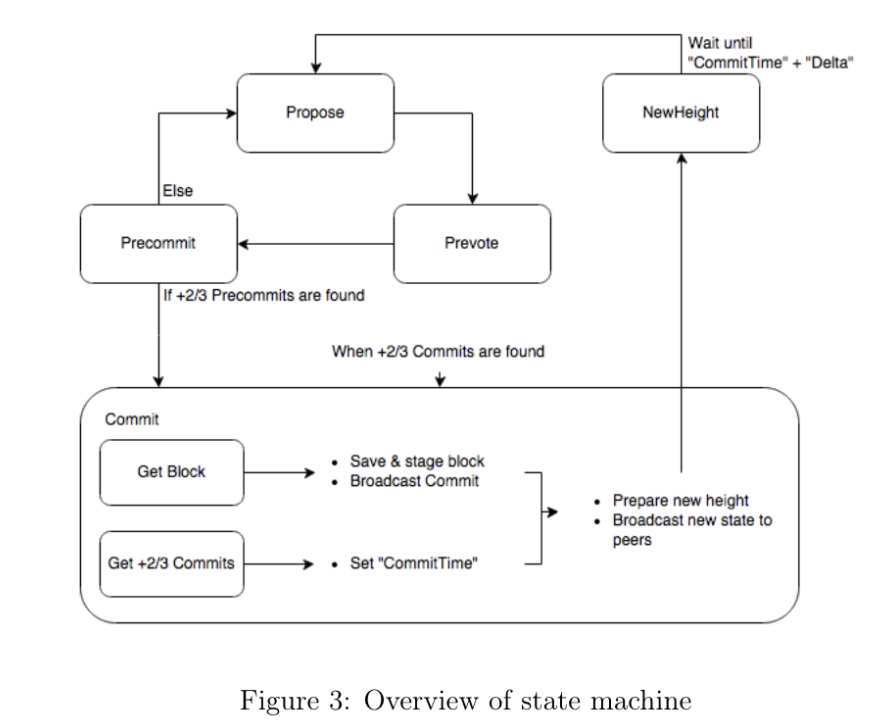

# 99c1. Tendermint with BFT(Byzantine Fault Tolerance)
## 목차
0. 텐더민트 w/ BFT
1. 라운드 기반 메커니즘 
   1. proposal
   2. 2단계 투표(Prevote, Precommit)
2. Lock
   1. Prevote-the-Lock
   2. Unlock-on-Polka
3. 2단계 투표와 Lock 메커니즘의 중요성
4. Next: Tendermint /w PoS 

## 0. 텐더민트 w/ BFT
### 텐더민트 
[텐더민트](https://github.com/tendermint/tendermint)는 비잔틴 장애 허용(BFT)과 합의 엔진을 갖춘 합의 알고리즘이다. 이를 통해 여러 노드가 애플리케이션 상태를 동기화하여 복제할 수 있다. 그리고 악의적인 노드가 존재하는 비잔틴 환경에서도 제대로 기능이 동작하도록 보장해준다. 그래서 이를 BFT를 갖춘 복제 상태 머신(Replicated Statem Machine)이라고도 한다. 텐더민트의 특징은 다음과 같다: 
- 텐더민트는 BFT 기반 합의 알고리즘과 네트워크 레이어를 포함한 합의 엔진이다.
- 텐더민트 자체는 프라이빗(또는 컨소시엄) 또는 특정 조직에 최적화된 솔루션이다. etcd, consul, zookeeper 등 현재 사용 가능한 주요 Non-BFT 합의 솔루션과 경쟁할 수 있을 만큼 고성능을 자랑한다. 그래서 해당 기능 자체만 사용한다면 프라이빗 블록체인 목적으로 운용할 수 있다. 
- 텐더민트를 사용한 첫 번째 퍼블릭 블록체인인 Cosmos Hub에서는 Cosmos-SDK의 [`x/staking`](./26_module_staking.md), [`x/slashing`](./27_module_slashing.md) 모듈을 활용하여 퍼블릭으로 운용할 수 있게 한다. 결과적으로 PoS 합의 메커니즘에 결정적인 Safety 기능이 더해져 강력한 블록체인 애플리케이션 환경을 제공하는 것이다. 대신에 PBFT 기반의 특성인 과도한 통신량의 문제가 있기 때문에 퍼블릭 블록체인으로 운용할 때는 최대 참여 검증자 수를 제한하거나 위임하도록 설계되었으니 주의하도록 하자. 이는 [tendermint_with_pos](./99c2_tendermint_with_pos.md)에서 자세히 다룬다. 

### BFT-based 체인 
[이전 아티클](./99c0_pbft_and_pow.md)에서 PoW와 PBFT에 대해서 간략하게 살펴보면서, PoW의 과도한 에너지 사용량에 대한 문제점으로 PoS와 같은 알고리즘이 고안되고 있었고, 텐더민트도 그 중 BFT 기반으로 설계된 하나의 줄기에 해당한다는 것을 알아보았다.  PBFT는 BFT 기반 합의 알고리즘 중 하나로, 악의적인 노드가 시스템을 방해하지 못하도록 설계되었다. 이를 통해 분산 네트워크 내에서 신뢰성을 확보하고, 네트워크 참여자 간의 합의를 효율적으로 이루어낼 수 있다. 텐더민트는 PBFT와 유사한 많은 특징을 공유하고 있다. PBFT와 마찬가지로 텐더민트는 비잔틴 장애 허용을 목표로 하며, 네트워크 참여자 간의 신뢰를 바탕으로 합의를 이끌어낸다. 텐더민트의 주요 특징을 다음과 같이 PBFT와 비교해 설명할 수 있다:
- 합의 프로세스: PBFT와 텐더민트 모두 여러 라운드를 통해 합의를 이루어낸다. 각 라운드마다 검증자들이 메시지를 교환하며 합의를 확인한다.
- 신뢰성: 두 알고리즘 모두 풀 노드 중 최대 1/3이 악의적일지라도 합의를 이룰 수 있도록 설계되었다.
- 성능: PBFT와 텐더민트는 높은 성능과 빠른 합의를 제공하지만, 네트워크의 통신 비용이 높아질 수 있는 단점이 있다. 텐더민트는 이러한 단점을 보완하기 위해 최적화된 통신 메커니즘을 포함하고 있다.

이렇게 텐더민트는 PBFT의 장점을 이어받아 BFT 기반으로 한 안전하고 신뢰할 수 있는 블록체인 합의 알고리즘을 제공한다. 이번 아티클에서는 텐더민트에서 BFT 문제를 어떻게 풀어내었는지에 대해서 알아보고자 한다. 

### 텐더민트 합의 프로토콜 
텐더민트 합의 프로토콜을 만드는 라운드 기반 투표 메커니즘으로 작동한다:
1. 라운드 시작: 검증자가 블록을 제안한다.
2. 투표 과정: 새로운 블록을 커밋하기 위해 서명하는 3단계 과정으로 나뉜다. 투표에는 prevote, precommit, commit의 세 가지 유형이 있다.

   

라운드 기반 메커니즘을 통해 책임성이 추가된 원자적 브로드캐스트(트랜잭션 순서 보장)를 위한 안전한 상태 복제 머신(SMR)을 생성하며, 강력한 Safety를 제공한다. 

### 합의에 필요한 최소 검증자 노드의 수: 3f+1
텐더민트는 PBFT와 같이 비잔틴 노드의 개수가 최대 f개일 때, 전체 네트워크 노드 수가 3f+1개라는 전제로 진행된다. [3f+1개가 필요한 이유](./99c0_pbft_and_pow.md#합의에-필요한-최소-노드-수-3f1)는 PBFT에서 다뤄보았다. 최악의 경우를 가정하면 결국 최소 3f+1개의 노드가 있어야 정상적인 합의를 달성할 수 있게 된다. 

## 1. 라운드 기반 메커니즘 
블록체인의 각 높이에서 Round 기반 프로토콜이 실행되어 다음 블록을 결정한다. 
- 각 라운드는 세 단계(propose, prevote, precommit)와 두 가지 특수 단계인 commit 및 NewHeight로 구성된다.
- 라운드의 결과는 두 특수 단계인 commit이 되거나 다음 라운드로 넘어가는 결정이 내려진다. 
- 새로운 라운드가 시작되면 다음 제안자가 등장한다. 여러 라운드를 사용하면 네트워크 비동기화 또는 검증자 장애 발생 시 검증자가 합의에 도달할 수 있는 기회가 여러 번 주어진다.

### 1. Proposal
각 라운드는 제안으로 시작된다. 주어진 라운드의 제안자는 [Mempool](./10_transaction_and_mempool.md#1-mempool)에서 최근에 수신한 트랜잭션의 배치를 가져와 블록을 구성하고 블록을 포함하는 서명된 ProposalMsg를 브로드캐스트한다. 
- 제안자가 비잔틴인 경우, 다른 검증자에게 다른 제안을 브로드캐스트할 수 있다. 
- 제안자는 단순하고 결정론적인 라운드 로빈을 통해 정렬되므로 주어진 라운드에는 단 하나의 제안자만 유효하며 모든 검증자는 올바른 제안자를 알 수 있다. 더 낮은 라운드 또는 잘못된 제안자로부터 제안이 접수되면 거부된다.

텐더민트는 투표와 잠금 메커니즘을 통해 안전성을 유지하고, 제안자를 순환시켜 활성도를 유지하므로 한 사람이 거래를 처리하지 않더라도 다른 사람이 거래를 처리할 수 있다. 더 흥미로운 점은 검증자가 [gov 모듈](./25_module_gov.md)을 통해 투표하여 비잔틴 검증자를 제거하거나 교체할 수 있다는 것이다.

#### 매 라운드 리더 선출 
비잔틴 허용을 위해서는 제안자의 순환이 필요하다. 먼역 비잔틴 환경이 고려되지 않은 raft 합의 과정에서 선출된 리더가 비잔틴이고 다른 노드와 강력한 네트워크 연결을 유지하면 시스템이 완전히 손상되어 모든 safety와 liveness 보장이 파괴될 수 있다. 그래서 텐더민트는 장애가 발생하면 새로운 리더 선출을 하던 Non-BFT 합의 알고리즘(ex. raft)들과는 다르게, 매 라운드마다 새로운 리더(제안자)가 선출된다. 검증자는 제안을 수락하는 투표와 동일한 방식으로 다음 라운드로 건너뛰기 위해 투표한다. 

#### 약한 동기화 (부분 동기)
텐더민트 합의 프로토콜에서 블록 제안은 약한 동기화와 함께 이뤄진다. 제안자는 로컬 시계에 의존하여 제안 시간을 결정하고 각 라운드는 비동기식으로 진행하기 떄문에 동기화된 시계나 제한된 네트워크 지연에 대한 의존성을 줄이면서도 네트워크의 safety와 liveness를 보장한다. 이는 다음과 같은 특징을 가진다:
- 제안자 건너뛰기: 검증자가 새 라운드에 진입하는 로컬로 측정된 TimeoutPropose 내에 제안을 받지 못하면 제안자를 건너뛰기 위해 투표할 수 있다.
- 비동기식 투표: 제안 후 라운드는 비동기식으로 진행되며, 검증자는 다른 검증자의 2/3 이상의 의견을 들어야만 진행할 수 있다. 이는 동기화된 시계나 제한된 네트워크 지연에 대한 의존성을 완화하지만, 검증인 중 1/3 이상이 응답하지 않을 경우 네트워크가 중단되어 liveness가 크게 훼손될 수 있다.

### 2. 2단계 투표(Prevote, Precommit)
#### 1. Prevote 단계
- 검증 및 투표: 각 검증자는 ProposalMsg를 받으면 블록을 검증하고, 해당 제안서에 대한 prevote에 서명한 후 이를 네트워크에 브로드캐스트한다. 검증자가 제안 시간 내에 올바른 제안을 받지 못하면 무효 prevote를 전송한다.
- Polka: 특정 라운드에서 단일 블록에 대한 2/3 이상의 prevote를 polka라고 한다. 검증자가 polka를 받으면 네트워크가 블록을 커밋할 준비가 되었다는 신호를 받게 된다.

#### 2. Precommit 단계
- 투표: 검증자는 polka를 바탕으로 precommit에 서명하고 이를 네트워크에 브로드캐스트한다.
- 커밋: 검증자가 단일 블록에 대해 2/3 이상의 precommit을 받으면 해당 블록을 commit한다. 만약 2/3 이상의 precommit이 모이지 않으면, 무효 precommit을 보내고 다음 라운드로 넘어간다.

## 2. Lock
Lock 메커니즘은 Prevote-the-Lock, Unlock-on-Polka 두 가지 규칙으로 이뤄진다. 검증자가 특정 블록에 대해 prevote한 후 그 블록을 잠그고, precommit 단계에서 이 잠금을 확인함으로써 블록체인의 일관성을 유지해준다. Lock 메커니즘의 중요성은 다음과 같다:
- Safety 보장: 검증자가 prevote한 블록을 잠그고 precommit 단계에서 이 잠금(Prevote-the-Lock)을 확인함으로써, 네트워크는 두 개 이상의 다른 블록을 동시에 커밋하는 상황을 방지할 수 있다. 이는 비잔틴 검증자가 존재하더라도 네트워크의 안전성을 보장하는 데 중요한 역할을 한다.
- Liveness 유지: Lock 메커니즘은 검증자가 일정한 조건을 충족했을 때만 잠금을 해제(Unlock-on-Polka)할 수 있도록 하여, 네트워크가 교착 상태에 빠지지 않고 계속해서 새로운 블록을 생성할 수 있도록 한다. 이는 네트워크의 Liveness를 유지하는 데 중요한 역할을 한다.
- 정보 확인: 단일 투표로는 검증자들이 제안에 대해 알고 있는 정보를 확인할 수 있지만, 다른 검증자가 제안에 대해 알고 있다고 공언한 내용을 확인하기 어렵다. Lock 메커니즘을 통해 검증자는 다른 검증자가 어떤 블록을 잠갔는지를 확인할 수 있어, 네트워크의 일관성을 유지할 수 있다.

### 1. Prevote-the-Lock
검증자는 자신이 잠긴 블록에 대해 prevote를 해야 하며, 제안자인 경우 제안해야 한다. 이는 검증자가 한 라운드에서 한 블록을 precommit한 후 다음 라운드에서 다른 블록의 polka에 기여하여 safety을 손상시키는 것을 방지한다.

#### Prevote-the-Lock 시나리오
Prevote-the-Lock이 필요한 이유를 예시를 통해 더 쉽게 이해해보도록 하자. 
- 검증자: a, b, c, d
- 라운드 R: 블록 B1 제안
- 초기 상황 시나리오:
   - B1에 대한 polka가 2/3 이상의 찬성으로 성립된다.
   - a는 이를 보지 못하고 nil을 precommit한다. 
   - b, c, d는 B1을 정상적으로 precommit한다. 
   - 이제 d만 모든 precommit을 볼 수 있고, 다른 검증자들은 d의 precommit을 보지 못한다고 가정한다. (자신의 precommit과 a의 nil precommit만 볼 수 있다)

진행 시나리오: 
- d는 블록 B1을 커밋하고 다른 검증자들은 R+1 라운드로 이동함.
- 새로운 라운드에서는 새로운 제안자가 B2 블록을 제안하고 투표할 수 있음.

이 시나리오에서 잠금은 검증자들이 precommit을 기반으로 커밋했을 수 있으므로, 검증자가 precommit한 블록을 고수하도록 강제한다. 이는 한 라운드에서 2/3 이상이 블록을 precommit하면 네트워크는 해당 블록에 고정되며, 더 높은 라운드에서 다른 블록에 대해 유효한 polka를 생성하는 것이 불가능하다는 것을 의미한다. 이것이 Prevote-the-Lock의 직접적인 동기이다.

### 2. Unlock-on-Polka
검증자는 잠긴 라운드보다 더 높은 라운드에서 polka를 확인한 후에만 잠금을 해제할 수 있다. 이를 통해 검증자는 네트워크의 나머지 구성원이 원하지 않는 것을 precommit한 경우 잠금을 해제할 수 있으므로 liveness를 보호할 수 있다. 하지만 검증자가 잠긴 라운드 이후에 polka가 있는 경우에만 잠금 해제를 허용하여 safety을 손상하지 않는 방식으로 잠금을 해제할 수 있다. 이는 검증자가 이전 높이에서 잠겨 Unlokc-on-polka는 검증자가 polka를 볼 때까지 새로운 높이에서 precommit할 수 없음을 의미한다.

#### Unlock-on-Polka 시나리오 
Unlock-on-Polka이 필요한 이유를 예시를 통해 더 쉽게 이해해보도록 하자. 
- 검증자: a, b, c, d
- 라운드 R: 블록 B1 제안
- 초기 상황 시나리오:
   - a와 b는 B1을 precommit한다. 
   - c와 d는 nil을 precommit한다.
   - 모든 검증자는 다음 라운드로 이동하고, c와 d가 prevote한 블록 B2가 제안된다. 

진행 시나리오:
- a가 비잔틴 노드로, 블록 B1에 잠겨 있음에도 불구하고 블록 B2에도 투표하여 polka를 발생시킨다.
- b는 polka를 보지 못하고 nil을 precommit한다.
- a는 오프라인 상태가 되고, c와 d는 블록 B2를 precommit한다. 

이들은 다음 라운드로 이동하지만 b는 여전히 블록 B1에 잠겨 있고, c와 d는 블록 B2에 잠겨 있으며, a는 오프라인 상태이므로 polka를 얻을 수 없다. 이로 인해 비잔틴 검증자가 1/3 미만(여기서는 a 단 한 명)임에도 불구하고 liveness가 손상된다.

해결 시나리오: 
- b가 블록 B2에 대한 polka(c와 d가 블록 B2에 대한 precommit을 정당화하기 위해 사용한 것)를 확인하면, B1에서의 잠금을 해제할 수 있어야 하며, 따라서 b는 블록 B2를 precommit해야 한다.

이것이 검증자가 현재 잠긴 라운드보다 더 큰 라운드에서 polka를 발견한 경우 잠금을 해제하고 새로운 블록을 precommit할 수 있도록 하는 Unlock-on-Polka의 동기이다. 

## 3. 2단계 투표와 Lock 메커니즘의 중요성
텐더민트 합의 프로토콜에서 2단계 투표와 Lock 메커니즘은 네트워크의 안전성(Safety)과 활성도(Liveness)를 보장하는 핵심 요소이다. 비잔틴 검증자가 존재하는 비동기 환경에서 단일 투표만으로는 충분한 안전성을 보장할 수 없기 때문에, 두 번의 투표가 필요한 이유에 대해서 더 자세히 알아보도록 하자.

### 단일 투표의 문제점
prevote, precommit으로 총 2번을 걸쳐서 투표를 진행하는 메커니즘은 PBFT에서부터 고안된 내용이다. 비잔틴 환경에서는 각 검증자가 한 번만 투표하는 단일 투표 단계만으로는 강력한 Safety를 보장하기에 충분하지 않다. 단일 투표 메커니즘은 다음과 같은 문제점을 야기할 수 있다:
1. 비잔틴 노드의 거짓 정보: 비잔틴 노드가 잘못된 블록 정보를 네트워크에 전파하여, 다른 검증자들이 잘못된 블록을 커밋하게 할 수 있다.
2. 비동기 메시지 전달로 인한 중복 합의: 메시지 전달 지연으로 인해 일부 검증자가 블록을 커밋하고, 다른 검증자는 동일한 블록에 대해 다시 투표를 시작할 수 있다.
> 단일 투표로 발생하는 문제들은 비트코인의 PoW나 이더리움의 Gasper에서 첫 합의를 이루면서 발생하는 확률적인 Safety 문제와 비슷하다고 볼 수 있다. 두 번째 투표에 대해서는 PoW는 The Longest Chain 룰을 통해서 가정적으로 결론 지어지는 것 뿐이고, 이더리움은 PoS와 함께 도입된 Checkpoint 개념을 통해 시간이 어느정도 흐르고 나서 한 번 더 투표를 진행한다는 차이점만 있다고 보면 된다. 텐더민트는 이를 한번에 많은 통신량을 통해 prevote, precommit을 통해 확실한 safety(또는 즉각적인 finality)를 바로 보장해준다. 

### 비잔틴 노드의 거짓 정보 시나리오 
비잔틴 노드가 잘못된 블록 정보를 네트워크에 전파하여 희생자 노드들이 잘못된 블록에 투표하게 되어 잘못된 블록이 커밋될 수 있다.
1. 노드1이 블록 B1을 생성하고 모든 네트워크에게 제안한다.
2. 노드1과 노드2는 이에 대해 투표하고, 이를 네트워크에 전파한다. 
3. 알 수 없는 이유로 노드3과 노드4는 이 메시지를 받지 못한다. 
4. 비잔틴 노드인 노드2가 블록 B2가 유효하다는 거짓 정보를 노드3과 노드4에 전파한다.
5. 노드3과 노드4는 노드2의 정보를 신뢰하고 블록 B2에 대해 투표한다.
> 텐더민트는 Lock 메커니즘을 통해 새로운 블록에 대한 투표를 진행하기 전에 이전 라운드에서 잠긴 블록(B1)에 대해 계속 투표하고, 새로운 블록(B2)에 쉽게 투표할 수 없다. 이는 비잔틴 노드가 잘못된 정보를 전파하여도, 네트워크가 안정성을 유지하도록 도와준다.

### 비동기 메시지 전달로 인한 중복 합의 시나리오 
비동기 네트워크에서는 메시지 전달 지연으로 인해 타임아웃이나 기타 이유로 일부 검증자는 블록을 커밋하고, 다른 검증자는 동일한 블록에 대해 다시 투표를 시작할 수 있다.
1. 노드1이 블록 B1을 생성하고 모든 네트워크에게 제안한다.
2. 노드1과 노드2는 이에 대해 투표하고, 이를 네트워크에 전파한다.
3. 메시지 전달 지연으로 인해 노드3과 노드4는 메세지를 늦게 받는다. 그 사이에 노드1과 노드2는 블록 B1을 커밋한다.
5. 노드3과 노드4는 블록 B1의 커밋을 확인하지 못하고, 새로운 블록 B2를 제안한다.
> 텐더민트는 Lock 메커니즘을 통해 검증자들은 현재 잠긴 블록에 대해 계속 투표하며, 네트워크가 다시 동기화되면 이전 잠긴 블록을 기반으로 합의를 이어나간다. 정상적인 prevote가 정해진 시간 동안 이루어지지 않으면, 검증자들은 해당 블록에 대해 precommit을 하지 않고 다음 라운드로 넘어간다.

## Next: Tendermint /w PoS 
텐더민트는 BFT 기반 합의 알고리즘으로, 다양한 블록체인 환경에서 안정적이고 신뢰할 수 있는 합의를 이끌어낸다. 이를 통해 퍼블릭 및 프라이빗 블록체인 모두에서 효과적으로 활용될 수 있으며, 특히 Cosmos와 같은 생태계에서 중요한 역할을 하고 있다. 다음은 코스모스 네트워크의 첫 번째 허브인 Cosmos Hub에서 사용하는 [텐더민트와 동작하는 PoS 메커니즘](./99c2_tendermint_with_pos.md)에 대해서 알아 볼 예정이다. 

## Resources
- Cosmos Whitepaper, https://cosmos.network/whitepaper
- Jae Kwon, 'Tendermint: Consensus without Mining', 2014, https://tendermint.com/static/docs/tendermint.pdf
- Ethan Buchman, "Tendermint: Byzantine Fault Tolerance in the Age of Blockchains", Juen. 2016, https://atrium.lib.uoguelph.ca/items/5459099e-67aa-4a23-83ae-d3471d8d8336
