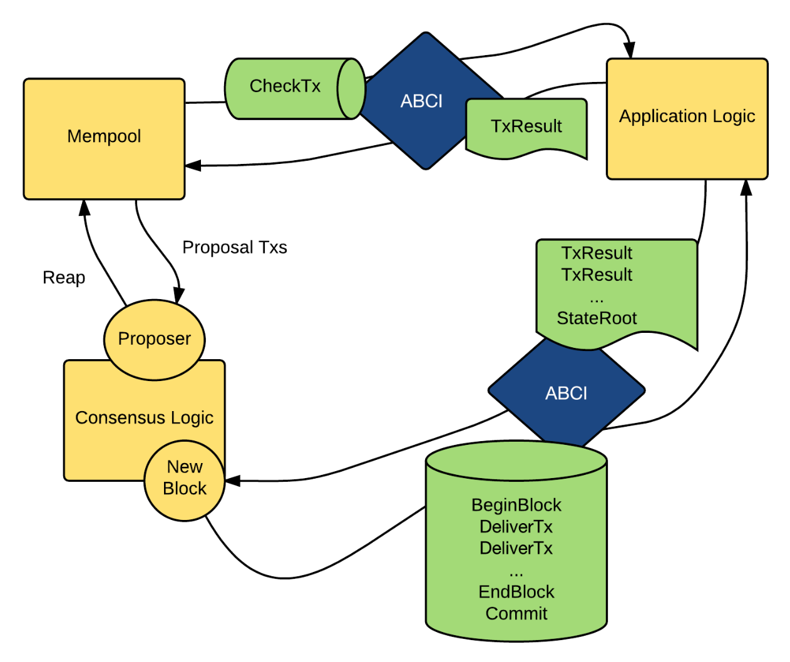

# 99c3. Tendermint Core And ABCI
## 목차
0. 텐더민트 코어 
1. ABCI(Application Blockchain Interface)
2. ABCI Client-Server 구조
   1. Client
   2. Server
   3. ABCI Server 구현
   4. Sync vs Async 
2. ABCI 메서드
   1. CheckTx 메서드
   2. DeliverTx 메서드
   3. Query 메서드

## 0. 텐더민트 코어
[텐더민트 코어](https://github.com/tendermint/tendermint)는 [99c1에서 소개한 BFT 기반 합의 알고리즘](./99c2_tendermint_with_pos.md)의 go 구현체이다. 텐더민트 코어는 두 가지 주요 기술 구성 요소로 이루어져 있다: BFT(비잔틴 장애 허용) 기반 합의 알고리즘과 ABCI(Application Blockchain Interface)이다.
- 텐더민트 합의 엔진: 모든 노드가 동일한 거래를 동일한 순서로 기록하도록 보장하는 atomic한 성질을 가지고 있다. 이를 통해 블록체인의 일관성을 유지한다.
- ABCI(Application Blockchain Interface): 합의 엔진이 구현된 텐더민트 코어와 Cosmos SDK와 같은 애플리케이션 간의 통신을 담당한다. ABCI를 통해 합의 계층과 애플리케이션 계층을 분리할 수 있다. 이는 개발자들이 합의 알고리즘과 독립적으로 애플리케이션 로직을 구현할 수 있게 한다.

```
              +---------------------+
              |                     |
              |     Application     |
              |                     |
              +--------+---+--------+
                       ^   |
                       |   | ABCI
                       |   v
              +--------+---+--------+
              |                     |
              |                     |
              |     Tendermint      |
              |                     |
              |                     |
              +---------------------+
```
이번에 자세히 알아 볼 내용은 바로 ABCI이다. 

## 1. ABCI(Application Blockchain Interface) 
ABCI는 텐더민트 코어와 애플리케이션 간의 통신 인터페이스이다. ABCI는 텐더민트 코어와 동일한 프로세스 내에서 실행하거나 별도의 프로세스로 실행할 수 있다.
- 동일한 프로세스 내에서 실행: 이 경우 텐더민트는 ABCI 애플리케이션의 메서드를 Go 메서드 호출로 직접 호출한다. 이는 성능 측면에서 유리하며 구현이 간단하다.
- 별도의 프로세스로 실행: 이 경우 텐더민트 코어와 ABCI 애플리케이션은 독립적인 프로세스로 실행된다. 텐더민트는 ABCI 애플리케이션과 통신하기 위해 네 개의 커넥션을 연다. 이러한 커넥션은 각기 다른 목적을 가지고 있으며, 다음과 같은 종류가 있다:
   - Consensus connection
   - Mempool connection
   - Info connection
   - Snapshot connection

이 구조를 통해 텐더민트는 애플리케이션과 효율적으로 통신하며, 다양한 상황에서 유연하게 대처할 수 있다.

## 2. ABCI Client-Server 구조
ABCI는 본질적으로 텐더민트 코어에서 request을 시작하는 클라이언트 역할을 하고 Cosmos SDK와 같은 애플리케이션에서 response으로 응답하는 서버 역할을 Client-Server 구조이다. 단순히 말해, request/response 형태를 가진 메서드이다. 

### 1. Client
ABCI 통신에서 텐더민트는 클라이언트로서 서버인 애플리케이션을 호출하는 방식으로 작동한다. 텐더민트 코어에는 [gRPC 클라이언트](https://github.com/tendermint/tendermint/blob/main/abci/client/grpc_client.go)와 [소켓 클라이언트](https://github.com/tendermint/tendermint/blob/main/abci/client/socket_client.go)가 구현되어 있으며, 초기 설정을 어떻게 하느냐에 따라 어떤 클라이언트로 통신할 것인지를 결정할 수 있다.

현재 ABCI 클라이언트에는 두 가지 사용 사례가 있다:
- 하나는 abci-cli와 같은 테스트 도구로, 명령줄을 통해 ABCI 요청을 전송할 수 있다. 
- 다른 하나는 텐더민트 코어와 같은 합의 엔진으로, 새로운 트랜잭션이 수신되거나 블록이 커밋될 때마다 애플리케이션에 요청을 보낼 수 있다. 

### 2. Server
텐더민트에서는 ABCI 클라이언트를 구현하였으니 이를 요청받는 Cosmos SDK와 같은 애플리케이션 계층에서는 ABCI 서버를 구현해야 한다. 애플리케이션에서는 이를 통해 상태 머신을 구동하기 위한 입력으로 사용된다. 만약 합의 과정을 이룬다면 다음과 같이 ABCI 클라이언트로부터 입력받는다:
1. `CheckTx`를 통해 트랜잭션 유효성을 검사한다.
2. 텐더민트 코어에서 새로운 블록이 확정되면 블록 메타데이터와 함께 `BeginBlock`이 호출된다.
3. 블록의 각 트랜잭션에 대해 `DeliverTx`를 호출한다.
4. 다시 블록 메타데이터와 함께 `EndBlock`을 호출한다. 
5. 결과 상태를 영구적으로 디스크에 유지하기 위해 `Commit`이 호출된다. 
> 애플리케이션에서 이 요청에 대한 자세한 동작 과정은 [10_transaction_and_mempool](./10_transaction_and_mempool.md)에서 확인할 수 있다. 

Cosmos SDK에 구현되어 있는 `simapp`을 기준으로 애플리케이션의 ABCI 서버가 어떻게 정의되어있는지 확인해보자.

### 3. ABCI Server 구현
ABCI는 인터페이스에 불과하기 때문에 실제로 이를 어떤 방식으로 구현할 것인지는 자유롭게 만들어도 된다. 텐더민트에서는 기본적으로 3가지 방식의 구현을 제안하고 있다.
1. In-Process
2. gRPC
3. TSP(Tendermint Socket Protocol)
> FYI) Paradigm에서 [Cosmos without Tendermint(Exploring Narwhal and Bullshark)](https://www.paradigm.xyz/2022/07/experiment-narwhal-bullshark-cosmos-stack)라는 주제로 ABCI를 직접 커스텀하여 Narwhal and Bullshark 합의 엔진으로 커스텀한 사례도 있다. 

#### 1. In-Process
Go 언어로 작성된 애플리케이션과 텐더민트 코어를 같은 프로세스 내에서 실행한다. 가장 간단한 방식이다. 
>  Cosmos SDK에 구현된 [startInProcess cli 메서드](https://github.com/cosmos/cosmos-sdk/blob/v0.45.4/server/start.go#L211-L421) 참고

#### 2. gRPC
gRPC를 사용하여 클라이언트와 서버가 통신한다. [gRPC](./14_rpc_basic.md#3-grpc)를 사용하면 성능 오버헤드가 있을 수 있지만, 다양한 언어로 쉽게 구현할 수 있다.
>  Cosmos SDK에 구현된 [startStandAlone cli 메서드](https://github.com/cosmos/cosmos-sdk/blob/v0.45.4/server/start.go#L171-L209) 참고

#### 3. TSP(Tendermint Socket Protocol)
TSP는 비동기식 [원시 소켓 서버](./14_rpc_basic.md#1-1-socket)로, 유닉스 또는 TCP를 통해 메시지를 전달한다. 더 높은 성능이 필요하거나 프로그래밍을 즐기는 경우, TSP를 사용하여 ABCI 서버를 구현할 수 있다. 기본적인 구현 예시는 다음과 같다: 
- 메시지는 Protobuf3로 직렬화되고, 길이 접두사가 붙는다.
- proto3로 인코딩된 메시지에는 길이 접두사가 추가된다.

### 4. Sync vs Async 
#### 동기(Synchronous) 통신
동기 통신은 요청을 보내고 응답을 받을 때까지 기다리는 방식이다. 이 방식에서는 한 번에 하나의 요청만 처리할 수 있으며, 응답을 받기 전까지 다른 작업을 수행할 수 없다. 동기 통신은 순차적으로 진행되기 때문에, 요청과 응답의 순서가 보장된다.

### 비동기(Asynchronous) 통신
비동기 통신은 요청을 보내고 응답을 기다리지 않고 다른 작업을 계속할 수 있는 방식이다. 여러 요청을 동시에 보낼 수 있으며, 각 요청은 별도로 처리된다. 이 방식은 응답이 언제 도착할지 알 수 없기 때문에, 순서가 보장되지 않을 수 있다.

메인 ABCI 서버(즉, non-gRPC)는 정렬된 비동기 메시지를 제공하며, 이는 텐더민트가 이전 트랜잭션 처리가 완료되기 전에 애플리케이션에 새로운 트랜잭션을 전달할 수 있게 한다. 이는 특히 `DeliverTx`와 `CheckTx` 메시지에 매우 유용하게 적용된다. 이 두 메시지는 비동기적으로 전송되어 텐더민트가 동시에 여러 트랜잭션을 애플리케이션에 전달할 수 있다. 이렇게 하면 트랜잭션 처리 속도가 빨라지고, 성능이 향상된다.


## 2. ABCI 메서드
ABCI 애플리케이션은 각 구현에 맞게 소켓 프로토콜을 통해 애플리케이션 계층과 통신한다. 통신에 사용되는 [ABCI 메서드](https://github.com/tendermint/tendermint/blob/main/spec/abci/abci.md)는 Request, Response 타입을 가지며 다음과 같이 구성되어 있다:
- 합의 메서드: `InitChain`, `BeginBlock`, `DeliverTx`, `EndBlock`, `Commit` 메서드
- 트랜잭션 검증을 위한 메서드: `CheckTx`
- 쿼리 메서드:  `Info`, `Query`, 
- 스냅샷 메서드: `ListSnapshots`, `LoadSnapshotChunk`, `OfferSnapshot`, `ApplySnapshotChunk`

<div style="text-align: center;">
  
</div>

해당 메서드들의 [인터페이스](https://github.com/tendermint/tendermint/blob/main/abci/types/application.go#L7-L32)는 다음과 같이 정의되어 있다: 
```go
type Application interface {
	// Info/Query Connection
	Info(RequestInfo) ResponseInfo                // Return application info
	SetOption(RequestSetOption) ResponseSetOption // Set application option
	Query(RequestQuery) ResponseQuery             // Query for state

	// Mempool Connection
	CheckTx(RequestCheckTx) ResponseCheckTx // Validate a tx for the mempool

	// Consensus Connection
	InitChain(RequestInitChain) ResponseInitChain    // Initialize blockchain w validators/other info from TendermintCore
	BeginBlock(RequestBeginBlock) ResponseBeginBlock // Signals the beginning of a block
	DeliverTx(RequestDeliverTx) ResponseDeliverTx    // Deliver a tx for full processing
	EndBlock(RequestEndBlock) ResponseEndBlock       // Signals the end of a block, returns changes to the validator set
	Commit() ResponseCommit                          // Commit the state and return the application Merkle root hash

	// State Sync Connection
	ListSnapshots(RequestListSnapshots) ResponseListSnapshots                // List available snapshots
	OfferSnapshot(RequestOfferSnapshot) ResponseOfferSnapshot                // Offer a snapshot to the application
	LoadSnapshotChunk(RequestLoadSnapshotChunk) ResponseLoadSnapshotChunk    // Load a snapshot chunk
	ApplySnapshotChunk(RequestApplySnapshotChunk) ResponseApplySnapshotChunk // Apply a shapshot chunk
}
```

#### 에러 핸들링
여기서 `Query`, `CheckTx` 및 `DeliverTx` 메서드에는 에러 핸들링을 위해 응답에 `Code` 필드가 포함된다. 응답 코드가 0(`OK`)이면 오류가 없음을 나타낸다. 다른 응답 코드는 오류가 발생했음을 나타낸다. 또한 `Code`의 네임스페이스 역할을 하는 `Codespace` 문자열을 텐더민트 합의 엔진에 같이 반환한다. 이 필드는 애플리케이션의 여러 도메인에서 반환된 `Code` 값을 구분하는 데 사용된다. 

`Echo`, `Info`, `InitChain`, `BeginBlock`, `EndBlock`, `Commit` 메서드는 오류를 반환하지 않는다. 이러한 메서드 중 하나에서 오류가 발생하면 텐더민트에서 처리할 수 있는 합리적인 방법이 없는 심각한 문제이다. 만약 발생한다면 앱이 충돌하고 나서 운영자가 이를 직접적으로 처리해야 한다. 

에러 핸들링을 하는 세 가지 메서드 `Query`, `CheckTx` 및 `DeliverTx`를 더 자세히 살펴보도록 하자. 트랜잭션을 검사하고 실행하는 `CheckTx`와 `DeliverTx`는 ABCI에서 가장 중요한 역할을 하는 핵심 메서드이다.

### 1. CheckTx 함수
`CheckTx` ABCI 메서드는 텐더민트에서 애플리케이션으로 블록에 포함할 트랜잭션 전달하여 유효성을 검사한다. 텐더민트가 `Code`가 `Ok` 타입이 아닌 `ResponseCheckTx`를 수신하면 관련 트랜잭션은 텐더민트의 멤풀에 추가되지 않거나 이미 포함되어 있는 경우 제거된다. [구현된 코드](https://github.com/tendermint/tendermint/blob/main/abci/types/application.go#L58-L60)는 다음과 같다:
```go
// /abci/types/application.go
func (BaseApplication) CheckTx(req RequestCheckTx) ResponseCheckTx {
	return ResponseCheckTx{Code: CodeTypeOK}
}

// /abci/types/types.pb.go
type ResponseCheckTx struct {
	Code      uint32  `protobuf:"varint,1,opt,name=code,proto3" json:"code,omitempty"`
	Data      []byte  `protobuf:"bytes,2,opt,name=data,proto3" json:"data,omitempty"`
	Log       string  `protobuf:"bytes,3,opt,name=log,proto3" json:"log,omitempty"`
	Info      string  `protobuf:"bytes,4,opt,name=info,proto3" json:"info,omitempty"`
	GasWanted int64   `protobuf:"varint,5,opt,name=gas_wanted,proto3" json:"gas_wanted,omitempty"`
	GasUsed   int64   `protobuf:"varint,6,opt,name=gas_used,proto3" json:"gas_used,omitempty"`
	Events    []Event `protobuf:"bytes,7,rep,name=events,proto3" json:"events,omitempty"`
	Codespace string  `protobuf:"bytes,8,opt,name=codespace,proto3" json:"codespace,omitempty"`
	Sender    string  `protobuf:"bytes,9,opt,name=sender,proto3" json:"sender,omitempty"`
	Priority  int64   `protobuf:"varint,10,opt,name=priority,proto3" json:"priority,omitempty"`
	// mempool_error is set by Tendermint.
	// ABCI applictions creating a ResponseCheckTX should not set mempool_error.
	MempoolError string `protobuf:"bytes,11,opt,name=mempool_error,json=mempoolError,proto3" json:"mempool_error,omitempty"`
}
```

### 2. DeliverTx 함수
`DeliverTx` ABCI 메서드는 텐더민트에서 애플리케이션으로 트랜잭션을 전달한다. 트랜잭션을 전달받은 애플리케이션은 `CheckTx`와 마찬가지로, `DeliverTx` 메시지와 함께 수신된 각 트랜잭션을 현재 상태, 애플리케이션 프로토콜, 트랜잭션 암호화 자격 증명과 비교하여 유효성을 검사해야 한다. 그리고 `DeliverTx`는 검사가 정상적으로 이뤄지면 이를 직접 실행한다. 텐더민트가 `Ok`가 아닌 `Code`가 포함된 `ResponseDeliverTx`를 수신하면 응답 코드가 기록된다. 트랜잭션은 이미 블록에 포함되었으므로 코드는 텐더민트 합의에 영향을 미치지 않는다. [구현된 코드](https://github.com/tendermint/tendermint/blob/main/abci/types/application.go#L54-L56)는 다음과 같다:
```go
// /abci/types/application.go
func (BaseApplication) DeliverTx(req RequestDeliverTx) ResponseDeliverTx {
	return ResponseDeliverTx{Code: CodeTypeOK}
}

// /abci/types/types.pb.go
type ResponseDeliverTx struct {
	Code      uint32  `protobuf:"varint,1,opt,name=code,proto3" json:"code,omitempty"`
	Data      []byte  `protobuf:"bytes,2,opt,name=data,proto3" json:"data,omitempty"`
	Log       string  `protobuf:"bytes,3,opt,name=log,proto3" json:"log,omitempty"`
	Info      string  `protobuf:"bytes,4,opt,name=info,proto3" json:"info,omitempty"`
	GasWanted int64   `protobuf:"varint,5,opt,name=gas_wanted,proto3" json:"gas_wanted,omitempty"`
	GasUsed   int64   `protobuf:"varint,6,opt,name=gas_used,proto3" json:"gas_used,omitempty"`
	Events    []Event `protobuf:"bytes,7,rep,name=events,proto3" json:"events,omitempty"`
	Codespace string  `protobuf:"bytes,8,opt,name=codespace,proto3" json:"codespace,omitempty"`
}
```

### 3. Query 함수
`Query` ABCI 메서드는 애플리케이션 상태에 대한 정보를 쿼리하는 데에 사용한다. 텐더민트가 `Ok`가 아닌 `Code`가 포함된 `ResponseQuery`를 받으면 이 코드는 쿼리를 시작한 클라이언트에 직접 반환된다. [구현된 코드](https://github.com/tendermint/tendermint/blob/main/abci/types/application.go#L66-L68)는 다음과 같다:
```go
// /abci/types/application.go
func (BaseApplication) Query(req RequestQuery) ResponseQuery {
	return ResponseQuery{Code: CodeTypeOK}
}

// /abci/types/types.pb.go
type ResponseQuery struct {
	Code uint32 `protobuf:"varint,1,opt,name=code,proto3" json:"code,omitempty"`
	// bytes data = 2; // use "value" instead.
	Log       string           `protobuf:"bytes,3,opt,name=log,proto3" json:"log,omitempty"`
	Info      string           `protobuf:"bytes,4,opt,name=info,proto3" json:"info,omitempty"`
	Index     int64            `protobuf:"varint,5,opt,name=index,proto3" json:"index,omitempty"`
	Key       []byte           `protobuf:"bytes,6,opt,name=key,proto3" json:"key,omitempty"`
	Value     []byte           `protobuf:"bytes,7,opt,name=value,proto3" json:"value,omitempty"`
	ProofOps  *crypto.ProofOps `protobuf:"bytes,8,opt,name=proof_ops,json=proofOps,proto3" json:"proof_ops,omitempty"`
	Height    int64            `protobuf:"varint,9,opt,name=height,proto3" json:"height,omitempty"`
	Codespace string           `protobuf:"bytes,10,opt,name=codespace,proto3" json:"codespace,omitempty"`
}
```


## Resources
- Cosmos Whitepaper, https://cosmos.network/whitepaper
- Ethan Buchman, "Tendermint: Byzantine Fault Tolerance in the Age of Blockchains", Juen. 2016, https://atrium.lib.uoguelph.ca/items/5459099e-67aa-4a23-83ae-d3471d8d8336
- https://github.com/tendermint/tendermint/tree/main/spec/abci