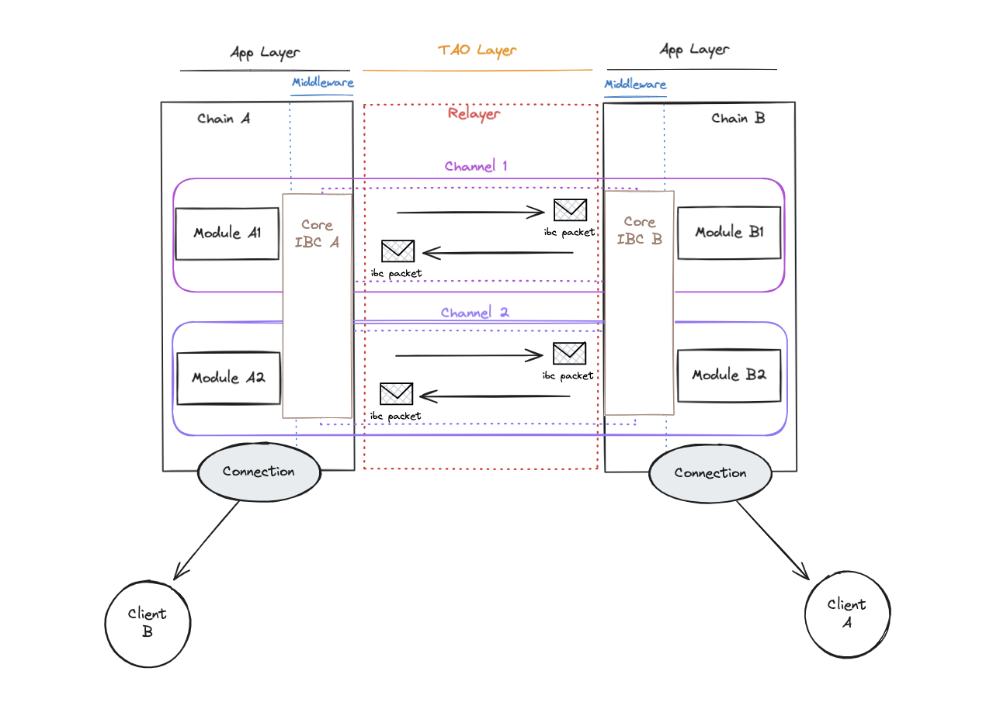
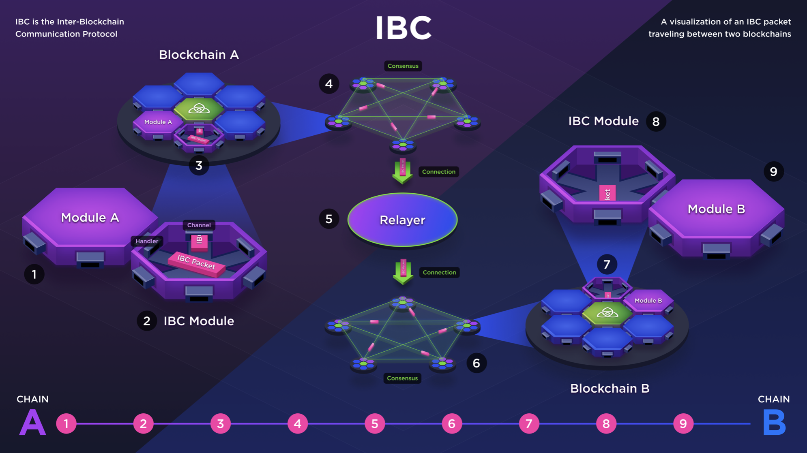

# 99i. IBC Overview
## 목차
0. IBC(Inter-Blockchain Communication) 프로토콜
1. 전송 계층 (Transport Layer)
   1. 범용 메시지 전달 프로토콜(Transport)
   2. 신뢰 최소화(Authentication)
   3. 안전하고 질서정연한 통신(Ordering)
2. 전송 계층 핵심 구성 요소 
   1. 라이트 클라이언트 (Light Client)
   2. 릴레이어 (Relayer)
   3. 연결 (Connection)
   4. 채널 (Channel)
2. 애플리케이션 계층 (Application Layer)
3. IBC 주요 사용 사례
   1. 인터체인 계정(ICA)
   2. 인터체인 보안(ICS)

## 0. IBC(Inter-Blockchain Communication) 프로토콜
비트코인의 탄생 이후 블록체인 기술은 다양한 설계와 사용 사례로 폭발적으로 성장했다. 이러한 분산 원장은 여러 용도로 사용되지만, 서로 다른 블록체인 간의 상호 작용은 제한적이었다. 인터넷이 전 세계의 다양한 컴퓨터를 연결하여 혁신을 가져온 것처럼, 블록체인도 진정한 가치를 창출하기 위해서는 서로 간의 연결을 통해 여러 플랫폼에서 자유롭게 이동할 수 있는 상호 운용성의 필요성을 느꼈다. 그래서 등장한 것이 IBC(Inter-Blockchain Communication) 프로토콜이다. 

IBC(Inter-Blockchain Communication) 프로토콜은 서로 다른 두 블록체인이 안전하고 신뢰할 수 있는 방식으로 통신할 수 있도록 설계된 범용 상호 운용성 프로토콜이다. 이는 현재 블록체인 상호 운용성의 대표적인 기술 중 하나로 자리잡았으며, 블록체인 간의 연결을 통해 다양한 사용 사례를 만들어내었다. 예를 들어, 사용자는 한 블록체인의 스테이블코인을 다른 블록체인의 탈중앙화 거래소에(DEX)에서 사용하거나, 다양한 블록체인의 개인정보 보호 기능을 활용할 수 있다. 

### IBC 동작하는 방식 
IBC의 작동 방식을 이해하려면 다음 두 가지 계층을 구분하는 것이 중요하다.
1. 전송 계층(Transport Layer)
2. 애플리케이션 계층(Application Layer)

전체적인 구조는 다음과 같다:

   

 

ibc에서 제공하는 이미지는 이를 더 입체적으로 표현하고 있다:

   

 

해당 기술을 이해하는 데 도움이 될 수 있는 간단한 비유는 우편 배달 시스템이다:
1. 누군가에게 편지를 보낼 때 편지가 담긴 봉투를 수거하여 수신자의 우편함에 넣는 우편 서비스를 통해 편지를 보낸다. 
2. 이 봉투에는 수신자의 주소를 지정한다.
	1. 이는 IBC 패킷에 패킷을 보낸 사람(채널 ID로 지정)과 대상(상대방 채널 ID로 지정)에 관한 정보가 포함된 방식과 유사하다. 
	2. 결국 봉투(데이터 패킷)를 열고 편지의 내용을 해석하는 것은 수신자(애플리케이션)의 책임이다.
3. 그러면 수신자는 해당 봉투를 열어 편지를 읽는다. IBC의 전송 계층은 우편 서비스로 생각할 수 있다. 
	1. 우편 서비스는 편지의 내용이나 수신자가 메시지를 어떻게 해석해야 하는지 알려주지 않으며, 봉투의 내용물도 알지 못한다. 
	2. 봉투 자체는 한 체인에서 다른 체인으로 전송되는 IBC 패킷으로 생각할 수 있으며, A 지점에서 봉투를 수거하여 B 지점으로 보내는 작업만 수행한다. 

## 1. 전송 계층 (TAO Layer)
TAO는 Transport, Authentication, Ordering의 의미를 포함하고 있다. 이를 간단히 전송 계층(TAO Layer)이라고 부른다. 

### 1. 범용 메시지 전달 프로토콜(Transport)
IBC는 단순한 토큰 전송을 넘어서 다양한 형태의 데이터를 전달할 수 있는 범용 메시지 전달 프로토콜이다. FT/NFT, 계정 정보, 앱 체인 상태 등 모든 형태의 데이터가 IBC를 통해 전달될 수 있다.

### 2. 신뢰 최소화(Authentication)
IBC의 가장 중요한 속성 중 하나는 신뢰 최소화이다. 대부분의 브릿징 솔루션과 달리, IBC는 신뢰할 수 있는 제3자를 사용하지 않는다. 두 블록체인이 서로의 기능과 합의 메커니즘을 신뢰한다면, IBC를 통해 상호작용하는 동안 추가적인 신뢰 가정이 필요하지 않다.

### 3. 안전하고 질서정연한 통신(Ordering)
IBC는 신뢰할 수 있고 질서정연하며 인증된 통신을 보장한다. 이는 기존 웹 환경의 HTTPS와 비교할 수 있지만, HTTPS가 신뢰할 수 있는 제3자를 통해 보안을 유지하는 반면, IBC는 블록체인의 분산된 합의 메커니즘을 통해 신뢰를 확보한다. IBC는 다음과 같은 방식으로 질서정연한 통신을 유지하고 데이터의 무결성을 검증한다:
- 패킷 순서 보장: 패킷 시퀀스 넘버를 통해 송수신되는 패킷들이 올바른 순서로 처리되도록 보장한다. 
- 패킷 인증: 패킷이 올바르게 서명되고 인증되었는지를 확인하여 위변조를 방지한다.
- 데이터 무결성 검증: Merkle 트리와 라이트 클라이언트를 사용하여 데이터의 무결성을 증명하고 각 체인의 상태를 추적하고 확인한다. Merkle 트리는 패킷 커밋 증명을 제공하며, 라이트 클라이언트는 양쪽 블록체인에서 상태를 검증한다.

## 2. 전송 계층 핵심 구성 요소 
전송 계층의 핵심 구성 요소는 라이트 클라이언트, 릴레이어, 연결, 채널이다. 이러한 요소들을 통해 제공하는 기능은 다음과 같다:
- IBC를 통해 전달되는 메시지는 데이터 패킷 내에서 전송된다. 
- 이러한 데이터 패킷을 전송, 인증 및 순서 지정하는 역할을 담당한다. 
- 패킷의 데이터 내용이나 수신 체인에서 패킷을 어떻게 해석해야 하는지에 대해 아무것도 지정하지 않는다. 그저 데이터 패킷 내의 정보는 전송 계층에서는 무작위 바이트에 불과한다. 

### 1. 라이트 클라이언트 (Light Client 또는 Client)
라이트 클라이언트(Light Client)는 블록체인의 경량화된 표현이다. 간단히 클라이언트(Client)라고도 한다. 풀 노드와 달리 라이트 클라이언트는 블록체인에 포함된 모든 메시지의 전체 기록을 저장하지 않는다. 트랜잭션을 실행하지도 않는다. 대신 라이트 클라이언트는 풀 노드에 연결하여 블록 헤더(블록에 포함된 데이터의 요약)를 확인하도록 설계되었다. 이로 인해 라이트 클라이언트는 저장 공간과 연산 자원 측면에서 효율적이다.

IBC를 통해 상호 작용하는 두 개의 독립적인 블록체인 A와 B가 있다고 해보자. 이들은 상대방 체인의 라이트 클라이언트를 가지고 있다. 즉, 체인 A는 자신의 블록체인에 체인 B의 블록체인을 가볍게 표현하는 역할을 하는 라이트 클라이언트를 가지고 있다. 여기서 라이트 클라이언트는 상대 블록체인의 상태를 간략하게 표현하여 검증할 수 있는 역할을 한다. 이러한 과정을 간단히 설명하면 다음과 같다:
1. 라이트 클라이언트 설정: 체인 A,B는 각각 상대방 라이트 클라이언트를 자신의 체인에 설정해두고 있다.
2. 메시지 전달: 체인 A가 체인 B에게 특정 메시지 'X'를 전달하고자 한다. 
3. 메시지 검증 준비: 체인 A는 메시지 'X'가 포함된 블록의 헤더와 해당 메시지의 커밋 증명을 준비한다.
   - 블록 헤더: 블록에 포함된 데이터의 요약 정보이다. 여기에는 블록 번호, 타임스탬프, 이전 블록의 해시, 머클 루트 등이 포함된다.
   - 커밋 증명: 메시지 'X'가 실제로 블록에 포함되어 있음을 증명하는 암호학적 증명이다. 주로 머클 증명(Merkle Proof)이라는 방식을 사용한다. 머클 증명은 머클 트리(Merkle Tree)라는 데이터 구조를 통해 특정 데이터가 블록에 포함되어 있는지를 효율적으로 검증할 수 있게 한다.
4. 메시지 전송: 체인 A는 준비한 블록 헤더와 커밋 증명을 체인 B에게 전송한다.
5. 메시지 검증: 체인 B는 받은 블록 헤더와 커밋 증명을 사용하여 미리 구축한 체인 A의 라이트 클라이언트를 통해 체인 A가 실제로 메시지 'X'를 수행했는지를 검증한다.
   - 블록 헤더 검증: 블록체인 B는 블록 헤더가 유효한지를 확인한다. 이는 블록체인 A의 라이트 클라이언트를 통해 A의 상태를 검증하는 것이다.
   - 커밋 증명 검증: 블록체인 B는 머클 증명을 통해 메시지 'X'가 실제로 해당 블록에 포함되어 있는지를 확인한다.

이 과정을 통해 블록체인 B는 블록체인 A가 트랜잭션 'X'를 실제로 발생시켰다는 것을 확신할 수 있게 된다. 이렇게 하면 두 블록체인 간의 신뢰를 제3자 없이도 구축할 수 있다. 체인 A와 B는 이러한 메시지나 데이터 패킷을 직접 주고받는 대신, 메시지가 포함된 데이터 패킷의 해시를 자신의 상태 머신에 커밋하거나 저장한다. 그리고 상대방이 직접 자신의 라이트 클라이언트를 통해 상태에 접근하여 검증을 할 수 있도록 한다.

이전에도 알아보았지만 다시 한번 강조하자면, IBC의 라이트 클라이언트 기반 검증 방식은 HTTPS 프로토콜과 비교해볼 때 인증 절차가 간소화된다는 이점이 있다.
- HTTPS 프로토콜: 제3자 기관을 통해 비대칭 암호화를 사용하여 인증을 수행한다. 
- IBC 프로토콜: 라이트 클라이언트를 통해 블록체인 간 직접적인 검증을 통해 신뢰를 획득한다.

그러나 통신하려는 외부 체인의 수가 증가할수록 관리해야 할 요소가 늘어나는 단점이 있다. 이는 향후 추가된 미들웨어 계층에서 해결할 수 있다. 이는 다음 제안과 packet-forward-middleware를 참고해보자: 
- [proposal 56: Add IBC Router to Hub](https://www.mintscan.io/cosmos/proposals/56)
- [strangelove-ventures/packet-forward-middleware repository](https://github.com/strangelove-ventures/packet-forward-middleware)

### 2. 릴레이어 (Relayer)
오프체인 프로세스인 릴레이어(Relayer)는 블록체인 간의 메시지 전달을 지속적으로 관찰하고 중계하는 역할을 한다. 이를 정리하면 다음과 같다:
- 릴레이어는 권한이 없는 프로세스이므로 누구나 실행할 수 있다.
- 릴레이어는 체인 A에서 체인 B로 메시지를 커밋한 것을 상태 머신에서 확인하면, 이를 받아 체인 B에게 전달한다.

릴레이어는 패킷 검증을 수행하지 않으므로 신뢰할 필요가 없지만, 패킷 제출을 통한 IBC 네트워크 Liveness 외에도 IBC 설정에서 릴레이어는 특히 중요한 역할을 담당한다. 이유는 다음과 같다:
- 릴레이어는 새 클라이언트를 생성하기 위해 초기 메시지를 제출하고, 각 체인에서 클라이언트 상태를 업데이트하여 제출된 패킷에 대한 증명 검증이 성공적으로 이루어지도록 하는 역할을 담당한다. 
- 릴레이어는 체인 간의 연결과 채널을 설정하기 위해 연결 및 채널 핸드셰이크를 전송하는 역할도 담당한다.  
- 릴레이어는 연결의 다른 쪽 끝에 있는 체인이 포크를 시도하거나 다른 유형의 악의적인 행동을 시도하는 경우 잘못된 행동의 증거를 제출할 수 있다.

### 3. 연결 (Connection)
연결(Connection)은 각 체인에 있는 라이트 클라이언트를 통해 설정된다. 위의 구조 예시 이미지를 보면 체인 A의 연결은 체인 B의 라이트 클라이언트를 사용하고, 체인 B의 연결은 체인 A의 라이트 클라이언트를 사용한다. 연결을 통해 두 체인은 서로의 상태를 확인하고 동기화할 수 있다.

### 4. 채널(Channel)
채널(Channel)은 서로 다른 체인의 모듈 간에 패킷을 전송하는 통로이다. 각 체인의 어플리케이션 모듈에서 채널을 통해 데이터 패킷을 전송한다. 채널을 통해 전달된 데이터 패킷은 릴레이어(Relayer)에 의해 다른 체인으로 전달된다. 

따라서 연결은 체인에 따라 다르지만 채널은 모듈에 따라 다르다. 각 채널 끝에는 두 모듈 간에 패킷을 정확하게 라우팅하는 데 사용되는 고유한 채널 ID(및 포트 ID)가 있다.

## 2. 애플리케이션 계층 (Application Layer)
애플리케이션 계층은 최종 사용자가 상호 작용하는 계층이다. 앞서 알아봤듯이 전송 계층에서는 유선을 통해 전송되는 데이터를 신경쓰지 않는다. 패킷 데이터 바이트를 디코딩하고 적절한 상태 전환 로직을 적용하는 비즈니스 로직을 처리하는 것은 애플리케이션 계층의 책임이다.

애플리케이션 계층에서는 FT/NFT 토큰 전송, 크로스체인 오라클 피드, 인터체인 계정(ICA), 인터체인 쿼리(ICQ), 수수료 미들웨어(릴레이어 인센티브)등과 같은 애플리케이션 모듈이 포함된다.
- 예를 들어, [ICS 20](https://github.com/cosmos/ibc/blob/main/spec/app/ics-020-fungible-token-transfer/README.md)이라고 하는 토큰 전송을 위한 IBC 수준의 애플리케이션은 데이터 패킷을 구조화하는 방법과 수신 체인에서 이를 해석하는 방법을 명시하고 있다. 
- FT 토큰 전송의 경우, 데이터 패킷에는 발신자, 수신자, 금액, 액면가(IBC denom)에 관한 정보가 포함된다.
	- 액면 필드는 특정 토큰이 특정 체인에 도달하기 위해 거쳐온 경로를 추적한다. 
	- 패킷을 어떻게 처리할지에 관한 로직도 ICS 20에 명시되어 있다.

이러한 애플리케이션 모듈은 기본 패킷 수신, 승인, 타임아웃, 콜백 및 미들웨어를 사용하여 함께 구성할 수 있다. 개발자는 여러 앱을 레고 블록처럼 쌓아 올려 새로운 최종 사용자 제품을 만들 수 있는 유연성이 제공된다.

## 3. IBC 주요 사용 사례
단순한 토큰 전송 외에도 두 가지 다른 IBC 수준의 애플리케이션은 인터체인 계정(ICA)과 인터체인 보안(ICS)이다. 

### 1. 인터체인 계정(ICA)
- 단일 인터페이스를 유지하면서 체인 간 상호 작용을 촉진한다. 이는 사실상 B('호스트 체인'이라고 함)에서 수행할 수 있는 전송, 스테이킹, 거버넌스 제안에 대한 투표와 같은 모든 작업을 A('컨트롤러 체인'이라고 함)에서 수행할 수 있다는 것을 의미한다. 
- 인터체인 계정은 사용자 경험을 개선하여 인터체인 내 구성 가능성을 크게 향상시킨다. 

### 2. 인터체인 보안(ICS)
- 코스모스 생태계의 공유 보안 버전이다. 이를 통해 블록체인은 완전한 opt-in 방식으로 다른 체인으로부터 보안을 임대할 수 있다. 
- 이는 코스모스 허브와 같이 이미 구축된 네트워크에서 제공하는 보안을 활용할 수 있는 신규 체인에 특히 유용하다. 
- 인터체인 보안을 사용하면 체인이 자체 검증자 세트를 부트스트랩할 필요가 없다.

IBC를 핵심 프리미티브로 사용해 수행할 수 있는 애플리케이션의 범위는 지속적으로 증가하고 있다. 현재 크로스체인 NFT 전송과 인터체인 쿼리(한 체인이 다른 체인에서 상태를 읽을 수 있는 기능, ICQ)도 가능하다.
- https://medium.com/@quasar.fi/introducing-interchain-queries-d6243e7b45cf
- https://github.com/strangelove-ventures/async-icq

## Resources
- https://github.com/cosmos/ibc
- https://github.com/cosmos/ibc-go
- https://medium.com/the-interchain-foundation/eli5-what-is-ibc-def44d7b5b4c