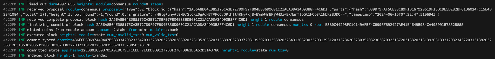

# 04. Run Simapp Node

#### Description

이번 과제는 [4번 아티클](../04_run_simapp_node.md)을 읽고, 각자의 로컬PC에서 simapp chain를 구동시켜보고, 블록을 찍은 사진과 체인과 인터랙션하는 모습을 담은 사진을 담은 블로그 글을 작성하여 제출한다.

#### Example

아래 사진은 로컬 simapp chain을 구동시켜본 사진을 의미한다.

각자의 블로그 링크 [이와 같이](https://blog.naver.com/jeongseup/222449849432)를 첨부하는 것으로 과제 완료를 체크한다.
