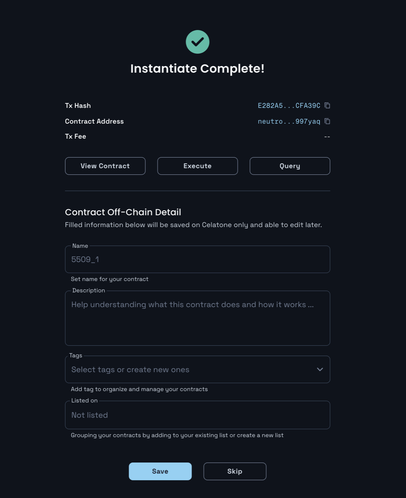

# 00. Cosmwasm 컨트랙트 초기화하기  
## 목차
0. namespace 컨트랙트 초기화하기 


## 0. namespace 컨트랙트 초기화
cosmwasm 컨트랙트는 evm 컨트랙트와는 다르게 업로드와 초기화 부분이 분리되어 있다. 그래서 한 번 업로드하면 배포할 때의 설정에 따라 권한이 있는 사람들은 초기화를 할 수 있어서 코드 재사용성이 좋다. 

## 1. Instantiate
https://neutron.celat.one/pion-1/instantiate

이전에 컨트랙트를 배포헀으면 다음과 같이 Instantiate하는 화면이 나온다. 만약 이전에 배포한 것이 있거나 남이 배포한 컨트랙트를 초기화하려면 code id를 입력하면 된다. 

다음 사진과 같이 입력을 채워넣으면 된다: 
1. 컨트랙트의 라벨과 admin address를 채워 넣는다. admin address는 추후 migrate나 update를 하기 위해서 필요한 optional 요소이다. 
2. InstantiateMsg 내용으로 `purchase_price`, `transfer_price`를 입력해야 한다. neutron 테스트넷이므로 간단하게 amount는 100, denom은 `untrn`으로 둘 다 넣어준다.
3. Transaction Fee가 계산되어 나오면 실행이 완료되었다는 뜻이다. 따라서 `Instantiate` 버튼을 눌러 컨트랙트 초기화를 위한 트랜잭션을 전송한다. 


### Initate 완료 
트랜잭션이 성공적으로 실행되었을 경우 다음과 같다:



## config 쿼리하기 
[interact contract](https://neutron.celat.one/pion-1/interact-contract) 페이지에 들어가면 방금 초기화된 컨트랙트를 직접 쿼리해 볼 수 있다. 쿼리 자체는 수수료가 따로 발생하지 않기 때문에 우리가 초기화한 config 정보를 쿼리해볼 수 있다. 다음과 같이 쿼리 메세지를 보내보자:
```json
{
  "config": {}
}
```

그러면 다음과 같은 결과를 받을 수 있다: 
```json
{
  "data": {
    "purchase_price": {
      "denom": "untrn",
      "amount": "100"
    },
    "transfer_price": {
      "denom": "untrn",
      "amount": "100"
    }
  }
}
```
우리가 초기화할 때 보낸 메세지의 정보가 컨트랙트 내부 상태에 잘 보관되어 있는 것을 확인할 수 있다. 

